<a href="https://github.com/imaginevid-ai/Awesome-seedream-5-pro-prompts-and-skills">
  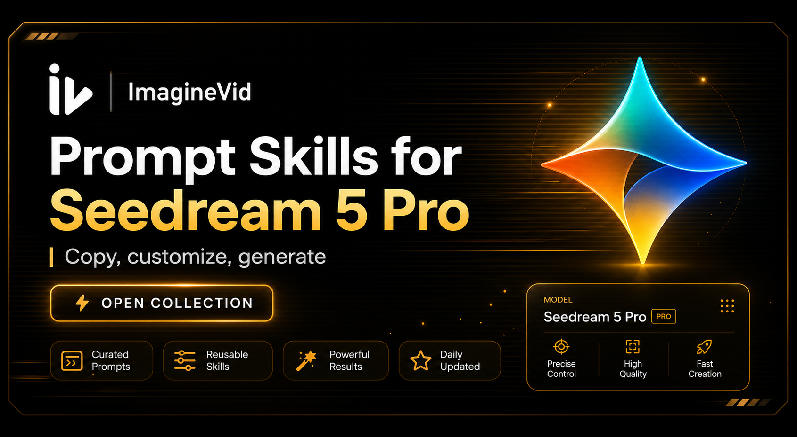
</a>

> ImagineVid のワークフローで、プロンプト設計を制作に使えるビジュアルへ変換します。
# Awesome Seedream 5 Pro プロンプト＆スキル

[](https://github.com/sindresorhus/awesome)
[](https://github.com/imaginevid-ai/Awesome-seedream-5-pro-prompts-and-skills)
[](https://creativecommons.org/licenses/by/4.0/)
[](https://github.com/imaginevid-ai/Awesome-seedream-5-pro-prompts-and-skills/actions)
[](docs/CONTRIBUTING.md)

> ImagineVid が厳選した Seedream 5 Pro プロンプト、再利用できるプロンプトスキル、ビジュアル事例集

> **著作権について**：収録内容は教育・創作の参考として出典付きで整理しています。削除が必要な場合は issue でお知らせください。

---

[](README.md) [](README_zh.md) [](README_zh-TW.md) [](README_ja-JP.md) [](README_ko-KR.md) [](README_th-TH.md) [](README_vi-VN.md) [](README_hi-IN.md) [](README_es-ES.md) [-Click%20to%20View-lightgrey)](README_es-419.md)
[](README_de-DE.md) [](README_fr-FR.md) [](README_it-IT.md) [-Click%20to%20View-lightgrey)](README_pt-BR.md) [](README_pt-PT.md) [](README_tr-TR.md) [](README_ar-SA.md) [](README_bn-BD.md) [](README_ur-PK.md) [](README_id-ID.md)
[](README_ms-MY.md) [](README_ru-RU.md) [](README_nl-NL.md) [](README_pl-PL.md) [](README_sv-SE.md) [](README_da-DK.md) [](README_nb-NO.md) [](README_fi-FI.md) [](README_el-GR.md) [](README_cs-CZ.md)
[](README_hu-HU.md) [](README_ro-RO.md) [](README_uk-UA.md) [](README_he-IL.md) [](README_fa-IR.md) [](README_fil-PH.md) [](README_sw-KE.md) [](README_ta-IN.md) [](README_te-IN.md) [](README_mr-IN.md)
[](README_pa-IN.md) [](README_gu-IN.md) [](README_kn-IN.md) [](README_ml-IN.md) [](README_my-MM.md) [](README_jv-ID.md)

---

## キュレーションを見る

**[ImagineVid Seedream 5 Pro プロンプト集を開く](https://imaginevid.io/ja/seedream-5-pro)**

このコレクションを使う理由

| 機能 | GitHub README | ImagineVid コレクション |
|---------|--------------|---------------------|
| ビジュアル構成 | リスト表示 | 厳選ビジュアルセクション |
| 検索 | Ctrl+F のみ | 構造化カテゴリ |
| プロンプトワークフロー | - | 再利用できるプロンプトスキル |
| モバイル | 基本対応 | 各 README 言語で読みやすい構成 |
| カテゴリ | - | カテゴリ閲覧 |


### カテゴリ別に見る

- [**指示編集と入力制御**](#workflow-directed-editing-input-control) - Prompts that modify an existing image or use regions, sketches, references, and positional instructions to control the result.
- [**商用デザイン・UI・ポスター**](#workflow-commercial-design-ui-posters) - Production briefs for advertisements, product campaigns, interfaces, posters, typography, and other designed assets.
- [**図解・技術ビジュアル・絵コンテ**](#workflow-diagrams-technical-storyboards) - Structured visuals where information order matters: diagrams, technical drawings, multi-panel sequences, and storyboards.
- [**キャラクター・映画表現・ビジュアルスタイル**](#workflow-characters-cinema-visual-styles) - Character, portrait, fashion, cinematic-frame, and style-exploration prompts centered on visual direction and image language.
- [**環境・建築・世界観構築**](#workflow-environments-architecture-worldbuilding) - Environment, architecture, landscape, concept-art, and worldbuilding prompts where the place itself carries the idea.
- [**ベンチマークとモデル比較**](#workflow-benchmarks-model-comparisons) - Controlled tests and comparisons used to evaluate prompt following, editing behavior, consistency, typography, or visual quality.

---

## 目次

- [キュレーションを見る](#)
- [Seedream 5 Pro とは？](#seedream-5-pro)
- [Official Capability Cases](#official-capability-cases)
- [統計](#)
- [Community · 注目プロンプト](#community-featured-prompts)
- [Community · すべてのプロンプト](#community-prompt-cases)
- [貢献方法](#)
- [ライセンス](#)
- [謝辞](#)
- [スター履歴](#)

---

## Seedream 5 Pro とは？

**Seedream 5.0 Pro** is ByteDance's professional image-generation and editing model, available as Image 5.0 Pro inside Dreamina's multimodal image workflow. It combines text prompts and a reference image for structured visual production rather than limiting creation to one-shot text-to-image output:

- **Deep Prompt Understanding** - Interpret subjects, spatial relationships, camera language, composition, and layered constraints in complex instructions
- **Production-Oriented Generation** - Create polished campaign visuals, product imagery, concept art, posters, and cinematic frames
- **Reference-Driven Creation** - Use a reference image to guide identity, structure, materials, style, and composition
- **Text and Layout Rendering** - Build typography-heavy posters, diagrams, interfaces, and multilingual visual designs
- **Localized and Layered Editing** - Target regions, objects, text, materials, or positions while preserving the wider composition
- **Reasoning-Assisted Creation** - Use deeper prompt interpretation and context-aware generation for structured creative tasks

**ImagineVid リソース:** [Seedream 5 Pro on ImagineVid](https://imaginevid.io/ja/seedream-5-pro) · [Best Dreamina alternatives](https://imaginevid.io/blog/best-dreamina-alternatives)

### プロンプトスキル引数

一部のプロンプトは Raycast Snippets 風の `{argument ...}` 動的引数に対応しています。Raycast Friendly バッジを目印にしてください。

**例：**
```
「{argument name="product" default="ガラス質感の AI カメラ"}」の映画風ポスター、雰囲気は {argument name="mood" default="深夜のスタジオ照明"}
```

引数を差し替えるだけで、小さなクリエイティブスキルとして再利用できます。

---

<a id="official-capability-cases"></a>

## Official Capability Cases

> Source-backed launch examples collected as official capability cases. The Twitter/X entries below are treated separately as community prompt cases.

<a id="official-interaction-control"></a>

### Interaction Control

Use boxes, arrows, annotation marks, or coordinates to specify the target region.

<a id="official-case-1"></a>

#### Case 1: Arrows and annotation boxes for spatial intent

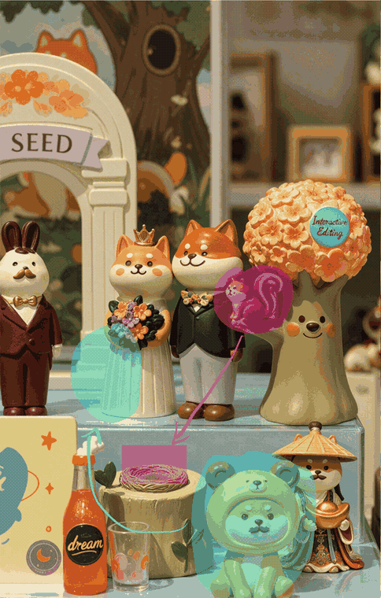

---

<a id="official-case-2"></a>

#### Case 2: Region-box object description for targeted editing

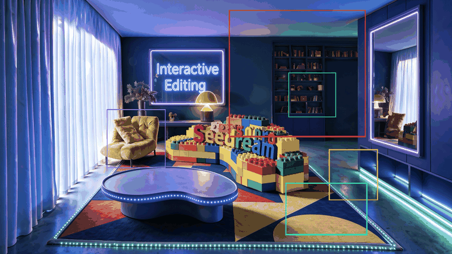

**Prompt:**

```
Red box: A huge blue-furred head with a ferocious squished expression, gazing at the bubble ahead. Green box: A transparent bubble reflecting the indoor lights. Yellow box: A large warm gray-beige yarn ball. Blue box: A stack of building blocks including a warm dark gray arch, a warm light gray half-cylinder, a lake blue cylinder, a deep lake blue ramp, and a cobalt blue half-disc. Purple box: A grass green tasseled blanket draped over the sofa.
```

---

<a id="official-sketch-editing"></a>

### Sketch Editing

Use doodles, color blocks, lines, or rough sketches as visual guidance.

<a id="official-case-3"></a>

#### Case 3: Doodle-guided object generation

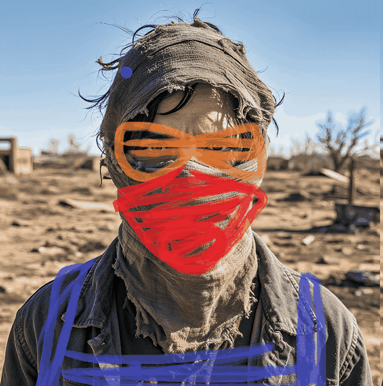

---

<a id="official-case-4"></a>

#### Case 4: Color-block guided editing

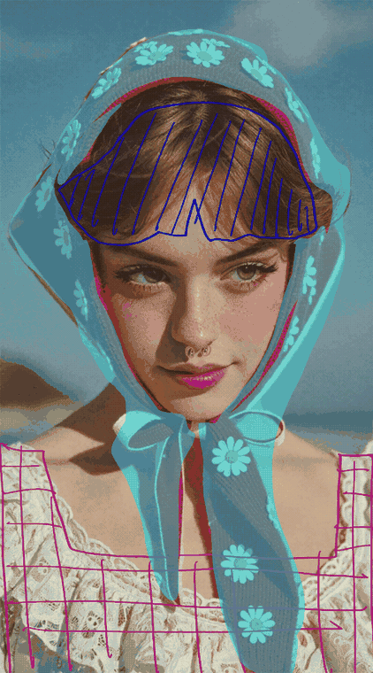

---

<a id="official-case-5"></a>

#### Case 5: Line-guided detail editing

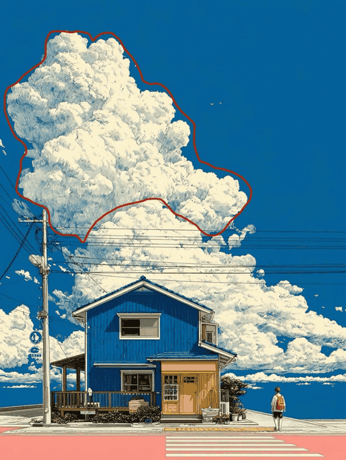

---

<a id="official-case-6"></a>

#### Case 6: Simple sketch to refined image

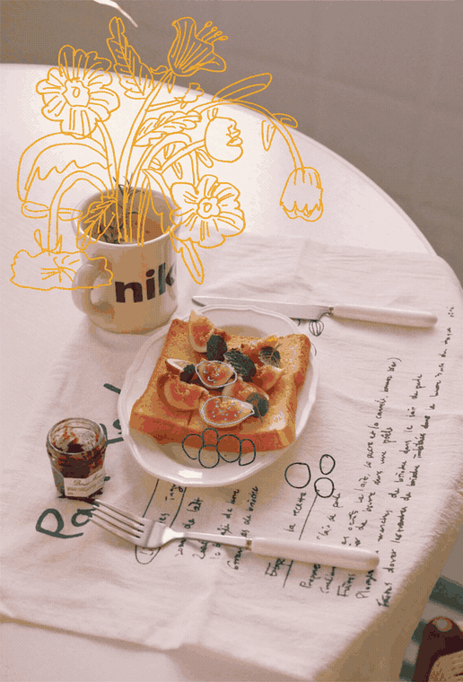

---

<a id="official-layer-editing"></a>

### Layer Editing

Edit poster, graphic, text, material, or surface layers while preserving the broader composition.

<a id="official-case-7"></a>

#### Case 7: Poster text and graphic layer edit: Avery Turns


---

<a id="official-case-8"></a>

#### Case 8: Poster offer layer edit: Happy Hour

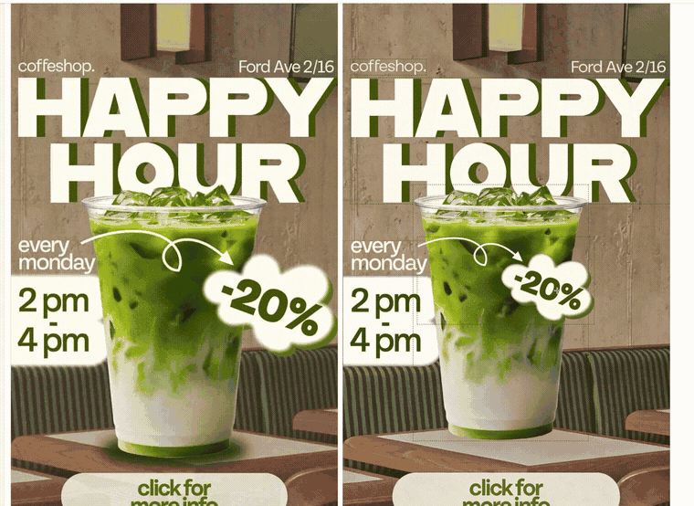

---

<a id="official-case-9"></a>

#### Case 9: Fashion image layer edit inside a design layout


---

<a id="official-case-10"></a>

#### Case 10: Sports poster graphic layer edit

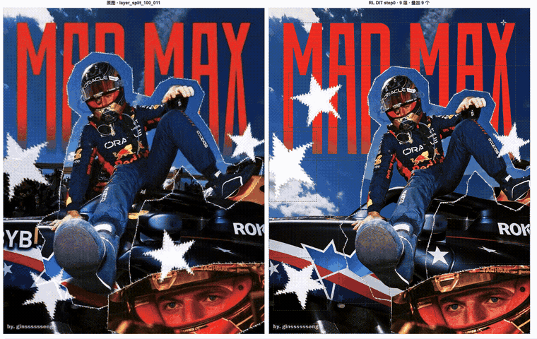

---

<a id="official-case-11"></a>

#### Case 11: Poster element edit: Public Joy

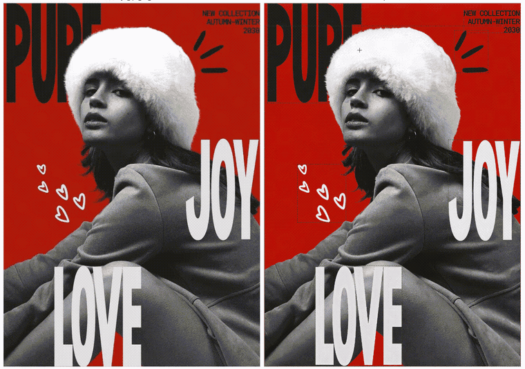

---

<a id="official-case-12"></a>

#### Case 12: Material surface swap with precise texture response

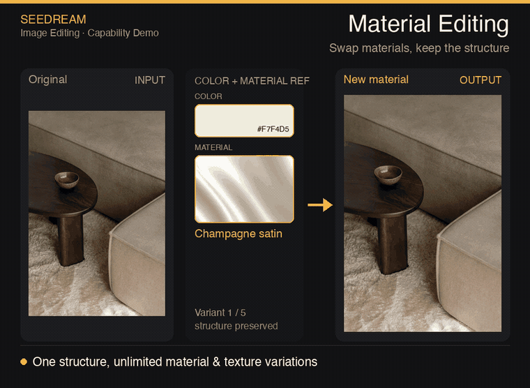

---

<a id="official-anchor-position-editing"></a>

### Anchor / Position Editing

Use grid-like anchors or relative positions to move a target precisely.

<a id="official-case-13"></a>

#### Case 13: Grid-position object movement

<table>
<tr>
<td width="50%" valign="top">

**Before:**


</td>
<td width="50%" valign="top">

**After:**

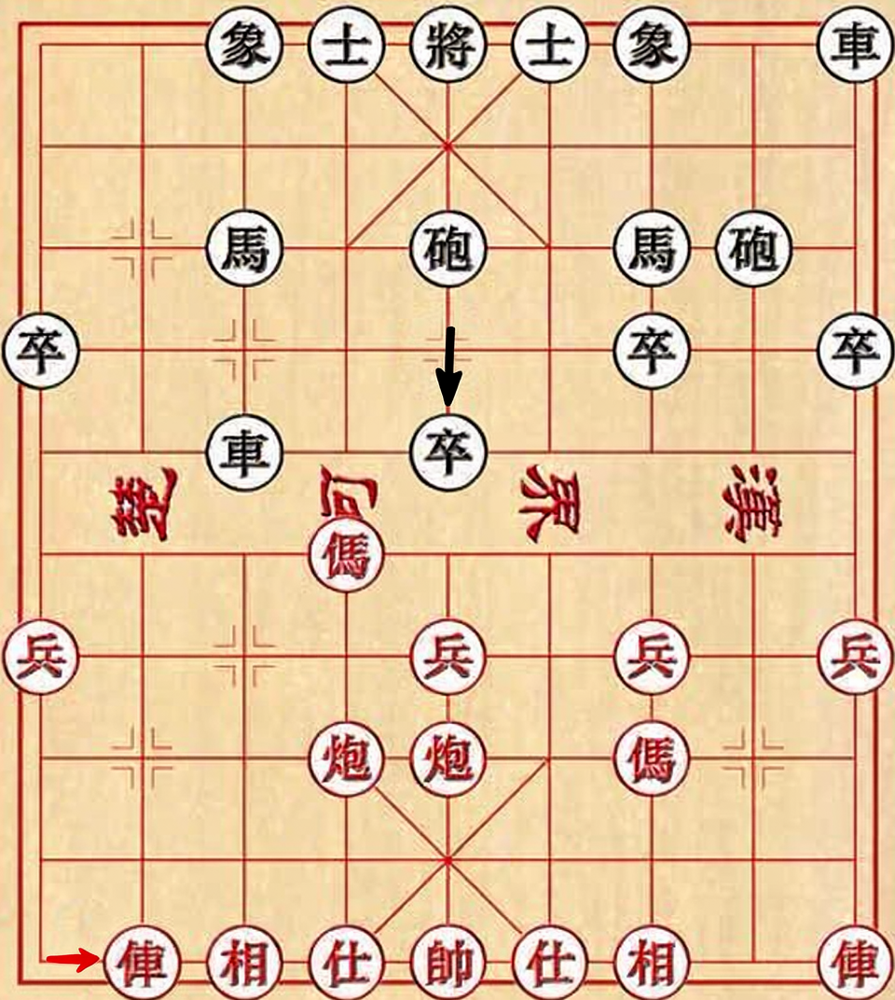

</td>
</tr>
</table>

**Prompt:**

```
Move the red car in the lower-left corner one grid cell to the right, and move the black pawn in the second column from the left of the black-square position one grid cell downward.
```

---

<a id="official-layer-separation"></a>

### Layer Separation

Separate foreground, background, and reusable components for downstream editing.

<a id="official-case-14"></a>

#### Case 14: Foreground/person layer separation

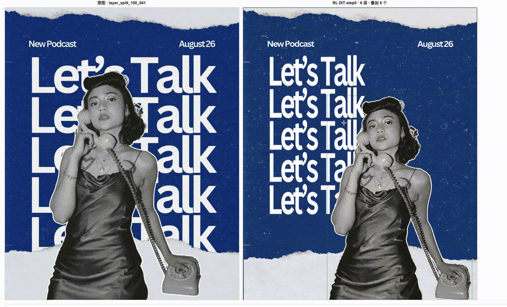

---

<a id="official-multi-image-fusion-editing"></a>

### Multi-image Fusion Editing

Combine multiple reference images into one coherent composition under a single instruction.

<a id="official-case-15"></a>

#### Case 15: Seven-reference still-life input/output composition

<table>
<tr>
<td width="50%" valign="top">

**Input:**

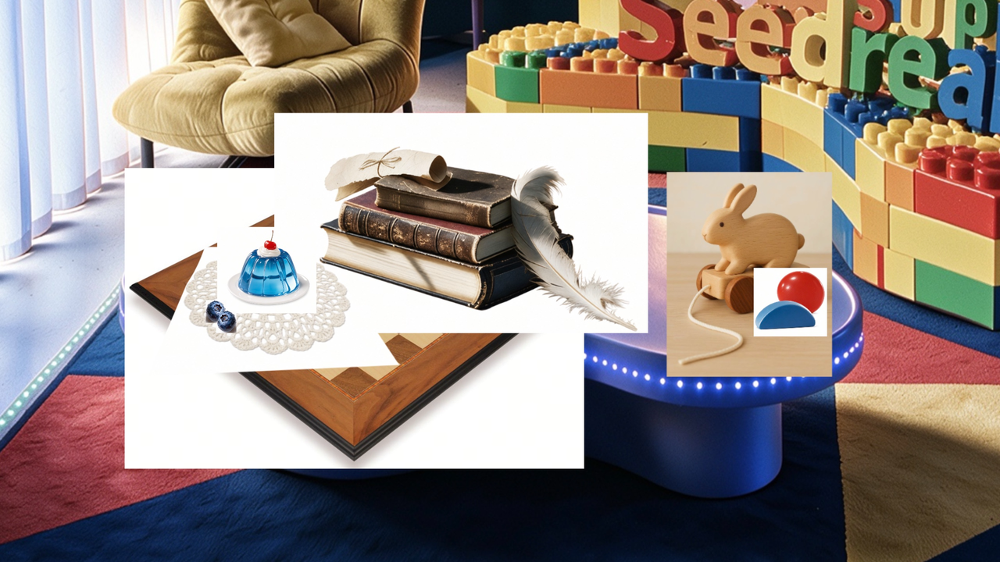

</td>
<td width="50%" valign="top">

**Output:**


</td>
</tr>
</table>

**Prompt:**

```
Precisely cut out the objects from my seven white-background reference photos and arrange them into a realistic still-life photography image according to the specified layout. Make sure the perspective, lighting, and spatial relationships are correct. Faithfully preserve material details such as wood grain, leather, lace, jelly glass, and feathers, creating a high-quality image that feels realistic and playful, with a blend of vintage and modern aesthetics.
```

---

<a id="official-visual-quality-narrative"></a>

### Visual Quality & Narrative

Group effect samples by cinematic action, animation style, concept art, and game-scene output.

<a id="official-case-16"></a>

#### Case 16: Cinematic tennis glass shatter


---

<a id="official-case-17"></a>

#### Case 17: Cinematic boxing action


---

<a id="official-case-18"></a>

#### Case 18: 3D animation style scene


---

<a id="official-case-19"></a>

#### Case 19: Visual concept art


---

<a id="official-case-20"></a>

#### Case 20: Game scene visual


---

<a id="official-multilingual-text-rendering"></a>

### Multilingual Text Rendering

Group multilingual samples by rendered language and local-text use case.

<a id="official-case-21"></a>

#### Case 21: Arabic and English welcome sign

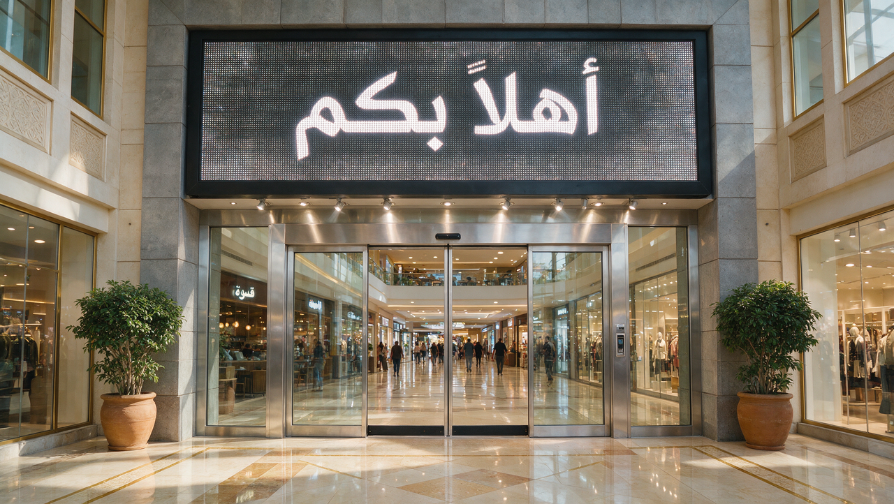

---

<a id="official-case-22"></a>

#### Case 22: Korean open-24-hours sign

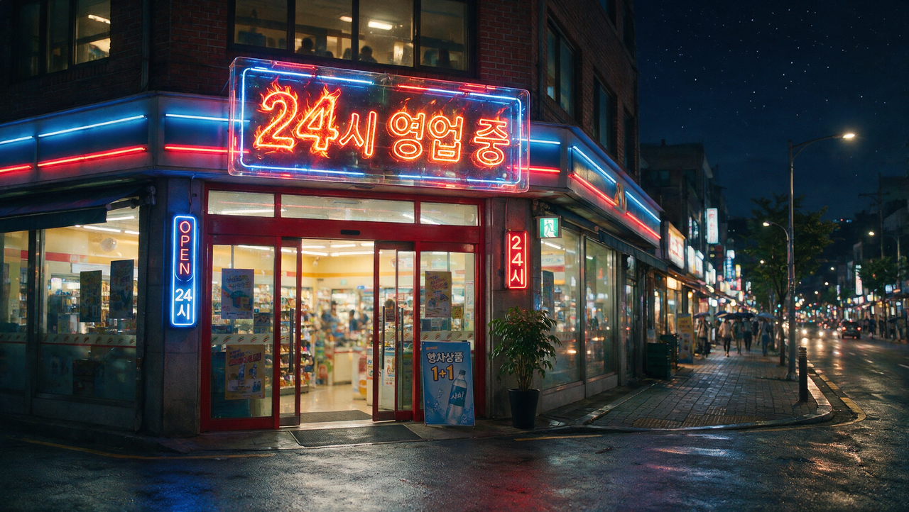

---

<a id="official-case-23"></a>

#### Case 23: Thai cleanliness sign

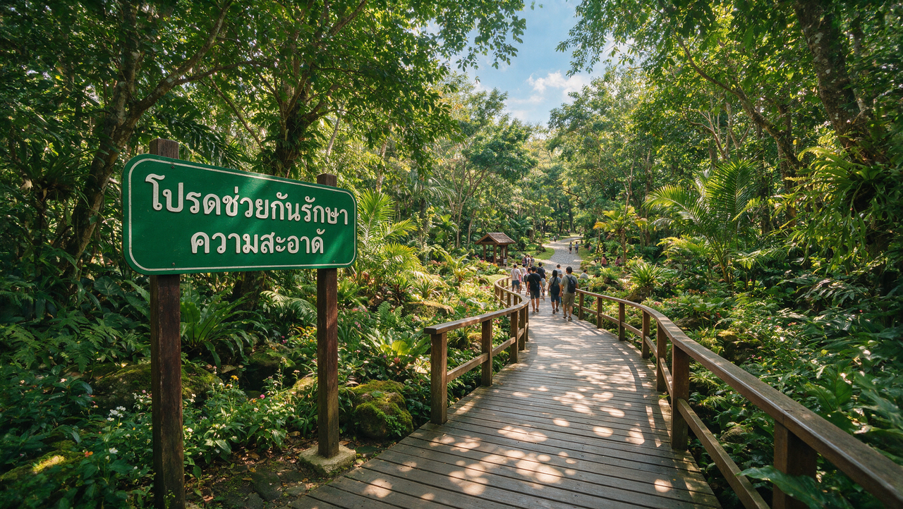

---

<a id="official-case-24"></a>

#### Case 24: French creation poster


---

<a id="official-case-25"></a>

#### Case 25: Russian future poster

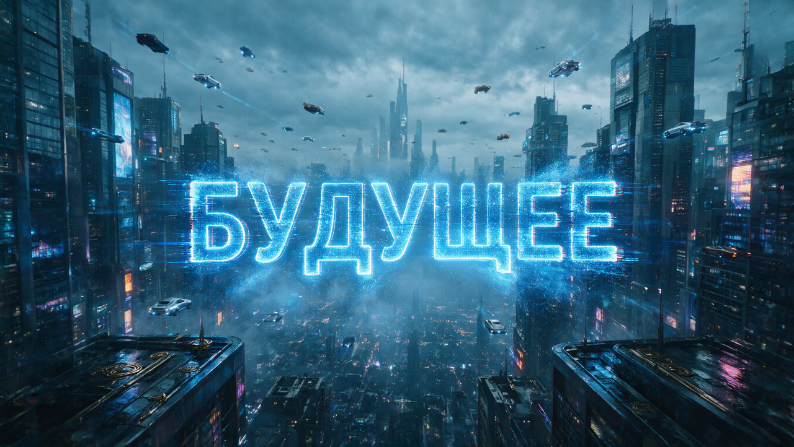

---

## 統計

<div align="center">

| 項目 | 数 |
|--------|-------|
| プロンプト総数 | **128** |
| 注目 | **10** |
| 最終更新 | **2026年7月17日金曜日 9:52:25 UTC** |

</div>

---

<a id="community-featured-prompts"></a>

## Community · 注目プロンプト

> 再利用性、視認性、表現の幅を基準に厳選

<a id="prompt-1"></a>

### No. 1: Hard sci-fi airlock film still


#### 説明

A high-negative-space cinematic still pattern, normalized from a public X prompt, for testing scale, isolation, black voids, and hard solar lighting.

#### プロンプト

```
Create a hard sci-fi movie still titled AIRLOCK. Frame one white EVA-suit astronaut drifting far from a tiny space station, with a loose tether trailing behind and the body angled as if slowly rotating. Let near-total black space dominate the composition, with no stars or nebulae. Use one harsh solar key light that burns the lit side of the suit white-silver while the opposite side drops into deep shadow. Keep the palette cold and desaturated, add subtle 35mm film grain, and compose in an anamorphic 2.39:1 frame with overwhelming negative space and realistic photographic detail.
```

#### 生成画像

<table>
<tr>
<td width="100%" valign="top" align="center"></td>
</tr>
</table>

#### 詳細

- **作者:** [@karim_yourself](https://x.com/karim_yourself)
- **出典:** [出典](https://x.com/karim_yourself/status/2075165434827989207)
- **公開日:** 2026年7月9日
- **言語:** en

**[このプロンプトを使う · ImagineVid](https://imaginevid.io/ja/seedream-5-pro)**

---

<a id="prompt-2"></a>

### No. 2: 1970s Dutch romantic drama camera memory


#### 説明

A cinematic language pattern, normalized from a public X prompt, that turns mood, lens behavior, and exposure notes into coherent film stills.

#### プロンプト

```
Generate a 1970s European romantic-drama still set inside a tense private moment. Use handheld framing that feels reactive and imperfect: close shots when the emotion tightens, wider distance when the scene fractures. Mix harsh daylight, blown windows, uneven room exposure, and very little artificial fill. Start with warm intimate golds but let the palette cool and desaturate as the mood becomes unstable. Preserve tactile skin, hair, and fabric texture, soft film grain, imperfect glass, and a documentary sense of emotional volatility.
```

#### 生成画像

<table>
<tr>
<td width="33%" valign="top" align="center"></td>
<td width="33%" valign="top" align="center"></td>
<td width="33%" valign="top" align="center"></td>
</tr>
</table>

#### 詳細

- **作者:** [@UnityEagle](https://x.com/UnityEagle)
- **出典:** [出典](https://x.com/UnityEagle/status/2075191214601572606)
- **公開日:** 2026年7月9日
- **言語:** en

**[このプロンプトを使う · ImagineVid](https://imaginevid.io/ja/seedream-5-pro)**

---

<a id="prompt-3"></a>

### No. 3: Anime kunoichi portrait with fine identity details


#### 説明

A Seedream 5 Pro portrait pattern, normalized from public ALT text, focused on facial details, pose, costume, and clean splash-art style.

#### プロンプト

```
Create a half-body modern anime splash-art portrait of a young woman in a black kunoichi-inspired outfit without a headband. Give her short black hair, dark eyes, a confident narrowed-eye expression, subtle red eyeliner, and a small beauty mark under the right eye. Pose one hand on the hip and the other making a victory sign. Use a clean white background, crisp illustration lines, polished character-art finish, and enough facial detail to test whether the model preserves small identity cues.
```

#### 生成画像

<table>
<tr>
<td width="100%" valign="top" align="center"></td>
</tr>
</table>

#### 詳細

- **作者:** [@characternexus](https://x.com/characternexus)
- **出典:** [出典](https://x.com/characternexus/status/2074920654751592583)
- **公開日:** 2026年7月8日
- **言語:** en

**[このプロンプトを使う · ImagineVid](https://imaginevid.io/ja/seedream-5-pro)**

---

<a id="prompt-7"></a>

### No. 4: Folk-horror sunset convergence


#### 説明

A horror-cinema still pattern pulled from a public Seedream 5 Pro prompt thread and rewritten for reusable lighting and blocking.

#### プロンプト

```
Frame a folk-horror film still from an extreme low angle inside dense wheat. Let tall stalks cage the foreground while a swollen amber sun sinks on the horizon. Place hooded figures as faceless silhouettes converging toward the center through haze. Use backlit molten gold, deep shadow, flare, film grain, and an anamorphic 2.39:1 composition. The mood should feel ritualistic, oppressive, and impossible to escape.
```

#### 生成画像

<table>
<tr>
<td width="100%" valign="top" align="center"></td>
</tr>
</table>

#### 詳細

- **作者:** [@karim_yourself](https://x.com/karim_yourself)
- **出典:** [出典](https://x.com/karim_yourself/status/2075165437856264581)
- **公開日:** 2026年7月9日
- **言語:** en

**[このプロンプトを使う · ImagineVid](https://imaginevid.io/ja/seedream-5-pro)**

---

<a id="prompt-16"></a>

### No. 5: Post-match sports refreshment campaign


#### 説明

A product-campaign setup from a public Dreamina Seedream 5.0 Pro post, rewritten for premium sports props and dramatic overhead light.

#### プロンプト

```
Create a premium sports refreshment campaign image on a locker-room floor or bench: textured jersey fabric, football boots, towel, scattered water droplets, and the hero product in sharp focus. Use dramatic overhead lighting, warm cinematic grading, realistic fabric and rubber textures, post-match victory energy, 4K polish, no text, and no watermark.
```

#### 生成画像

<table>
<tr>
<td width="25%" valign="top" align="center"></td>
<td width="25%" valign="top" align="center"></td>
<td width="25%" valign="top" align="center"></td>
<td width="25%" valign="top" align="center"></td>
</tr>
</table>

#### 詳細

- **作者:** [@bmx_ai13](https://x.com/bmx_ai13)
- **出典:** [出典](https://x.com/bmx_ai13/status/2075082266695582012)
- **公開日:** 2026年7月9日
- **言語:** en

**[このプロンプトを使う · ImagineVid](https://imaginevid.io/ja/seedream-5-pro)**

---

<a id="prompt-17"></a>

### No. 6: Futuristic sports car blueprint board


#### 説明

A technical drawing prompt from a public Seedream 5 Pro comparison post, rewritten for multi-view vehicle diagrams and measurement density.

#### プロンプト

```
Design a blueprint-style technical sheet for a futuristic sports car. Include front, side, and rear line drawings, exploded component sketches, assembly diagrams, structural cutaways, dimension marks, grayscale line hierarchy, and small thumbnails from alternate angles. Make it read like a professional industrial design board with dense but orderly annotations.
```

<details>
<summary>関連プロンプトのバリエーション (3)</summary>

**Original futuristic sports car blueprint prompt**

```
A technical drawing of a futuristic sports car in blueprint style. Include line drawings of the sports car from the front, side, and rear views, exploded parts sketches, parts assembly diagrams, and structural diagrams of disassembled components. Use abundant lines and measurement values to indicate the dimensions of each part, with grayscale tones expressing the overall sketch relationship. In addition to the main design, also show scattered thumbnails from different angles.
```

作者: [@marmaduke091](https://x.com/marmaduke091)

出典: [出典](https://x.com/marmaduke091/status/2074866077499105416)

**Measurement-heavy technical blueprint rendering**

```
technical blueprint with abundant measurement values
```

作者: [@LiamEtherson](https://x.com/LiamEtherson)

出典: [出典](https://x.com/LiamEtherson/status/2074862867442962667)

**Concept car blueprint with exploded technical views**

```
a blueprint-style technical drawing of a concept car: front/side/rear views, exploded parts, measurements everywhere
```

作者: [@AiwithZohaib](https://x.com/AiwithZohaib)

出典: [出典](https://x.com/AiwithZohaib/status/2074880584107909602)

</details>

#### 生成画像

<table>
<tr>
<td width="50%" valign="top" align="center"></td>
<td width="50%" valign="top" align="center"></td>
</tr>
</table>

#### 詳細

- **作者:** [@marmaduke091](https://x.com/marmaduke091)
- **出典:** [出典](https://x.com/marmaduke091/status/2074866077499105416)
- **公開日:** 2026年7月8日
- **言語:** en

**[このプロンプトを使う · ImagineVid](https://imaginevid.io/ja/seedream-5-pro)**

---

<a id="prompt-18"></a>

### No. 7: Outdoor editorial action poster template


#### 説明

A reusable commercial poster skill from a public Dreamina post, rewritten as a parameterized prompt with Raycast-style arguments.

#### プロンプト

```
Create a {argument name="aspect_ratio" default="16:9"} full-bleed editorial action poster for {argument name="brand" default="a fictional outdoor brand"}. Put a bright outdoor photograph under hard midday sun behind huge warm-cream condensed block lettering that reads {argument name="main_text" default="MOVE FAST"}. Let {argument name="subject" default="a runner"} cut diagonally across the type while holding {argument name="product" default="a lightweight action camera"}. Add compact white microcopy, small rules, bottom info clusters, crisp shadows, print grain, one vivid accent color on the hero prop, and no real logos, QR codes, watermarks, or 3D-render styling.
```

#### 生成画像

<table>
<tr>
<td width="100%" valign="top" align="center"></td>
</tr>
</table>

#### 詳細

- **作者:** [@AI__TSUBAKI](https://x.com/AI__TSUBAKI)
- **出典:** [出典](https://x.com/AI__TSUBAKI/status/2075128188964159539)
- **公開日:** 2026年7月9日
- **言語:** en

**[このプロンプトを使う · ImagineVid](https://imaginevid.io/ja/seedream-5-pro)**

---

<a id="prompt-58"></a>

### No. 8: Official precise editing control workflow


#### 説明

A BytePlus official capability thread normalized into a practical prompt skill for controlled edits.

#### プロンプト

```
Use the uploaded image as the locked base. Edit exactly the marked area and preserve everything else: geometry, shadows, background texture, subject identity, and layout. Apply the requested color, material, product, or sketch-guided change only inside the region, then return a production-ready asset with no collateral drift.
```

<div align="center">
<a href="https://video.twimg.com/amplify_video/2074857777923842048/vid/avc1/1280x720/KXa4awduC5vz6QGO.mp4?tag=28">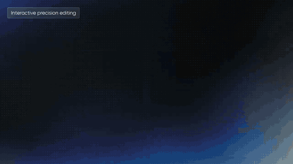</a>
</div>

#### 詳細

- **作者:** [@BytePlusGlobal](https://x.com/BytePlusGlobal)
- **出典:** [出典](https://x.com/BytePlusGlobal/status/2074878817458606402)
- **公開日:** 2026年7月8日
- **言語:** en

**[このプロンプトを使う · ImagineVid](https://imaginevid.io/ja/seedream-5-pro)**

---

<a id="prompt-59"></a>

### No. 9: Official complex information visualization


#### 説明

A BytePlus official capability example normalized into a dense information-design prompt.

#### プロンプト

```
Create a complex information visualization that combines one diagram, one small chart, explanatory labels, icons, and an illustration into a single clear layout. Make the hierarchy obvious, keep the text readable, align every panel to a grid, and avoid decorative clutter that weakens comprehension.
```

<div align="center">
<a href="https://video.twimg.com/amplify_video/2074858039396749313/vid/avc1/1280x720/yLs85cOuUX3ItC7Q.mp4?tag=28">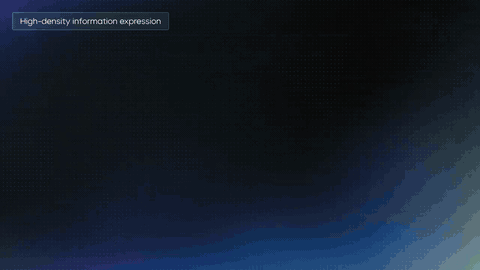</a>
</div>

#### 詳細

- **作者:** [@BytePlusGlobal](https://x.com/BytePlusGlobal)
- **出典:** [出典](https://x.com/BytePlusGlobal/status/2074878820122005880)
- **公開日:** 2026年7月8日
- **言語:** en

**[このプロンプトを使う · ImagineVid](https://imaginevid.io/ja/seedream-5-pro)**

---

<a id="prompt-60"></a>

### No. 10: Official native multilingual generation


#### 説明

A BytePlus official multilingual capability post normalized into a global-market creative prompt.

#### プロンプト

```
Generate a localized campaign asset directly in the target language. Respect the writing system, reading direction, line breaks, punctuation, and local design conventions. Keep the same brand structure across markets while adapting labels, headline length, and composition so the final image feels native rather than translated.
```

<div align="center">
<a href="https://video.twimg.com/amplify_video/2074858581493743616/vid/avc1/1280x720/o1wrqX-ohbORtRpU.mp4?tag=28">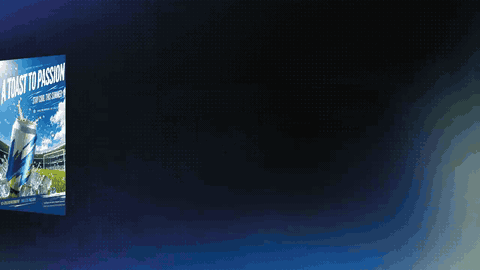</a>
</div>

#### 詳細

- **作者:** [@BytePlusGlobal](https://x.com/BytePlusGlobal)
- **出典:** [出典](https://x.com/BytePlusGlobal/status/2074878830695850276)
- **公開日:** 2026年7月8日
- **言語:** en

**[このプロンプトを使う · ImagineVid](https://imaginevid.io/ja/seedream-5-pro)**

---

<a id="community-prompt-cases"></a>

## Community · すべてのプロンプト

> Twitter/X-sourced community prompt cases, 公開日とキュレーション順で並べています.

<a id="workflow-directed-editing-input-control"></a>

### 指示編集と入力制御 (17)

Prompts that modify an existing image or use regions, sketches, references, and positional instructions to control the result.

**Community · 注目プロンプト**

- [Official precise editing control workflow](#prompt-58)

<a id="prompt-5"></a>

#### No. 1: Y2K reference selfie coffee-shop edit


##### 説明

A reference-image editing pattern, normalized from a public X prompt, that keeps facial identity and makeup while changing styling and setting.

##### プロンプト

```
Use the uploaded selfie only as the facial-identity and makeup reference. Keep face geometry recognizable, but replace the hairstyle with glossy side-parted blonde hair. Restyle the subject in a pale blue denim tube top, red bead necklace, and gold hoop earrings at an outdoor coffee-shop table on a bright New York summer morning around the year 2000. Shoot from a low phone-camera angle pointed toward the face, with one arm extending toward the edge of frame and the other near a half-empty coffee cup. Make the foreground candid, detailed, and lightly smiling, with blue sky and distant city architecture in the background.
```

##### 生成画像

<table>
<tr>
<td width="50%" valign="top" align="center"></td>
<td width="50%" valign="top" align="center"></td>
</tr>
</table>

##### 詳細

- **作者:** [@asheem01](https://x.com/asheem01)
- **出典:** [出典](https://x.com/asheem01/status/2074941260863811644)
- **公開日:** 2026年7月8日
- **言語:** en

**[このプロンプトを使う · ImagineVid](https://imaginevid.io/ja/seedream-5-pro)**

---

<a id="prompt-21"></a>

#### No. 2: Marked-up living room redesign


##### 説明

A precision-editing workflow normalized from a public Seedream 5 Pro interior-design post, for maintaining realism while applying clear edit notes.

##### プロンプト

```
Use the uploaded living-room image and follow the markup notes only where indicated. Replace the sofa, update curtains, adjust flooring, add warmer practical lighting, and introduce a few modern decor objects while preserving camera angle, windows, walls, room scale, and believable shadows. Keep the final image cohesive, realistic, and not over-styled.
```

##### 生成画像

<table>
<tr>
<td width="50%" valign="top" align="center"></td>
<td width="50%" valign="top" align="center"></td>
</tr>
</table>

##### 詳細

- **作者:** [@ZariaTechAI](https://x.com/ZariaTechAI)
- **出典:** [出典](https://x.com/ZariaTechAI/status/2074909390650634560)
- **公開日:** 2026年7月8日
- **言語:** en

**[このプロンプトを使う · ImagineVid](https://imaginevid.io/ja/seedream-5-pro)**

---

<a id="prompt-22"></a>

#### No. 3: Sketch-to-polished product visual edit


##### 説明

A Dreamina capability workflow normalized from CapCut’s Seedream 5.0 Pro announcement, focused on pixel-level edits, recolor, sketch refinement, and multi-image blending.

##### プロンプト

```
Start from a rough product sketch or reference collage. Preserve the original silhouette and intent, then turn it into a polished commercial product visual with clean contours, realistic materials, consistent recoloring, and a simple studio background. Blend any supplied references naturally, edit only the marked regions, and keep unmarked areas stable.
```

<div align="center">
<a href="https://video.twimg.com/amplify_video/2075228737575272448/vid/avc1/1280x720/63P-FYHYapJl_Un3.mp4?tag=28">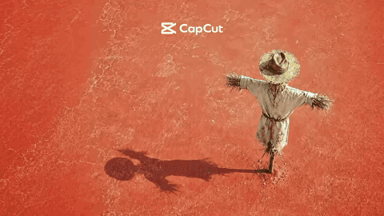</a>
</div>

##### 詳細

- **作者:** [@capcutapp](https://x.com/capcutapp)
- **出典:** [出典](https://x.com/capcutapp/status/2075230628786970765)
- **公開日:** 2026年7月9日
- **言語:** en

**[このプロンプトを使う · ImagineVid](https://imaginevid.io/ja/seedream-5-pro)**

---

<a id="prompt-24"></a>

#### No. 4: Ten-reference brand moodboard fusion


##### 説明

A Krea workflow normalized into a Seedream 5 Pro multi-reference prompt skill for brand-consistent image creation.

##### プロンプト

```
Use up to ten reference images as a brand moodboard: product form, color palette, fabric texture, lighting, background architecture, model pose, typography feel, campaign tone, packaging finish, and negative examples. Generate one coherent hero image that merges those references without collage artifacts. Keep the final asset clean, realistic, brand-safe, and directly usable in a campaign.
```

<div align="center">
<a href="https://video.twimg.com/amplify_video/2074890722336178177/vid/avc1/1280x720/2Z_T94P6AxOQrKsm.mp4?tag=28">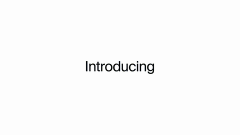</a>
</div>

##### 詳細

- **作者:** [@krea_ai](https://x.com/krea_ai)
- **出典:** [出典](https://x.com/krea_ai/status/2074891481832456638)
- **公開日:** 2026年7月8日
- **言語:** en

**[このプロンプトを使う · ImagineVid](https://imaginevid.io/ja/seedream-5-pro)**

---

<a id="prompt-47"></a>

#### No. 5: Character silhouette to real pudding edit


##### 説明

A Japanese image-to-image test normalized from a public Seedream 5 Pro post, focused on replacing a character shape with a realistic dessert.

##### プロンプト

```
Use the uploaded character silhouette and surface contours as the shape reference, then reinterpret it as a realistic custard pudding viewed from above. Preserve the overall outline and bumps, replace the material with glossy caramel, soft custard, plate shadows, and food-photography lighting.
```

##### 生成画像

<table>
<tr>
<td width="50%" valign="top" align="center"></td>
<td width="50%" valign="top" align="center"></td>
</tr>
</table>

##### 詳細

- **作者:** [@TlanoAI](https://x.com/TlanoAI)
- **出典:** [出典](https://x.com/TlanoAI/status/2075024241284837875)
- **公開日:** 2026年7月9日
- **言語:** ja

**[このプロンプトを使う · ImagineVid](https://imaginevid.io/ja/seedream-5-pro)**

---

<a id="prompt-61"></a>

#### No. 6: Separate-layer design handoff


##### 説明

A layer-separation workflow normalized from a high-engagement public Seedream 5.0 Pro post.

##### プロンプト

```
Create a design concept that can be separated into editable layers: background, subject, product, text, shadows, decorative marks, and callout labels. Keep edges clean, overlaps logical, and every layer visually independent enough for a Photoshop-style handoff.
```

<div align="center">
<a href="https://video.twimg.com/ext_tw_video/2074854109195194368/pu/vid/avc1/1280x720/KKPMgT-m9RMO2cHE.mp4?tag=26">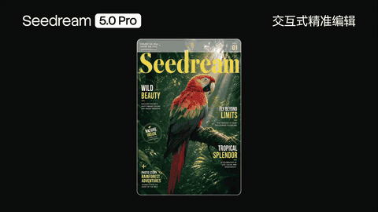</a>
</div>

##### 詳細

- **作者:** [@bdsqlsz](https://x.com/bdsqlsz)
- **出典:** [出典](https://x.com/bdsqlsz/status/2074854144469238254)
- **公開日:** 2026年7月8日
- **言語:** en

**[このプロンプトを使う · ImagineVid](https://imaginevid.io/ja/seedream-5-pro)**

---

<a id="prompt-69"></a>

#### No. 7: Photobomber removal replacement edit


##### 説明

A precision-editing workflow normalized from a public Seedream 5.0 Pro retouching post.

##### プロンプト

```
Use the uploaded street photo and remove the marked photobomber. Replace the area with a believable background object or environmental detail, preserving lighting, perspective, shadows, grain, and depth of field. Do not alter the main subject or surrounding composition.
```

##### 生成画像

<table>
<tr>
<td width="50%" valign="top" align="center"></td>
<td width="50%" valign="top" align="center"></td>
</tr>
</table>

##### 詳細

- **作者:** [@filodyprincess](https://x.com/filodyprincess)
- **出典:** [出典](https://x.com/filodyprincess/status/2074916756452483224)
- **公開日:** 2026年7月8日
- **言語:** en

**[このプロンプトを使う · ImagineVid](https://imaginevid.io/ja/seedream-5-pro)**

---

<a id="prompt-72"></a>

#### No. 8: Street-to-rainy chase annotation edit


##### 説明

A cinematic annotation workflow normalized from a public Seedream 5.0 Pro post.

##### プロンプト

```
Start from a normal street still with markup notes. Transform the scene into a rainy chase moment: wet pavement, motion energy, darker sky, directional headlights, and tense composition. Keep any marked subjects and camera framing consistent, and make every annotation land in the final image.
```

##### 生成画像

<table>
<tr>
<td width="50%" valign="top" align="center"></td>
<td width="50%" valign="top" align="center"></td>
</tr>
</table>

##### 詳細

- **作者:** [@HarshBisen143](https://x.com/HarshBisen143)
- **出典:** [出典](https://x.com/HarshBisen143/status/2074865604029550886)
- **公開日:** 2026年7月8日
- **言語:** en

**[このプロンプトを使う · ImagineVid](https://imaginevid.io/ja/seedream-5-pro)**

---

<a id="prompt-73"></a>

#### No. 9: Client feedback revision loop


##### 説明

A client-feedback workflow normalized from a public Seedream 5.0 Pro revision-loop post.

##### プロンプト

```
Use an existing design comp covered with plain-language feedback such as bigger, warmer, less busy, and move this left. Apply the revisions in one pass while keeping the original brand system, spacing logic, and image quality intact. The result should feel like a designer interpreted the comments correctly.
```

##### 生成画像

<table>
<tr>
<td width="25%" valign="top" align="center"></td>
<td width="25%" valign="top" align="center"></td>
<td width="25%" valign="top" align="center"></td>
<td width="25%" valign="top" align="center"></td>
</tr>
</table>

##### 詳細

- **作者:** [@techxsarfraj](https://x.com/techxsarfraj)
- **出典:** [出典](https://x.com/techxsarfraj/status/2074893823029998052)
- **公開日:** 2026年7月8日
- **言語:** en

**[このプロンプトを使う · ImagineVid](https://imaginevid.io/ja/seedream-5-pro)**

---

<a id="prompt-135"></a>

#### No. 10: Moonlit engawa cinematic reference edit


##### 説明

A fresh Seedream 5.0 Pro reference-driven scene prompt for retaining facial identity while placing the subject in a quiet moonlit Japanese veranda shot.

##### プロンプト

```
Long flowing dark hair with soft waves, natural and effortless beauty, soft glowing skin, same facial features exactly as reference. A beautiful young Japanese woman with long flowing dark hair, wearing a fitted black tank top and casual black shorts, relaxed and unposed, sitting casually on the engawa (wooden veranda) of a traditional Japanese house at night, leaning back slightly with one leg bent, looking down softly at her phone or simply resting with a calm, natural gaze not looking at the moon. The full moon glows softly in the background sky above the rooftop, purely as ambient scenery. Cinematic movie-grade shot, shallow depth of field with creamy bokeh, slow dolly-in camera movement, soft moonlight rim lighting mixed with warm ambient glow from paper shoji lanterns inside the house, subtle film grain, volumetric moonlight rays filtering through surrounding trees, color graded like a Denis Villeneuve film with deep indigo and warm amber tones, 35mm anamorphic lens.
```

##### 生成画像

<table>
<tr>
<td width="25%" valign="top" align="center"></td>
<td width="25%" valign="top" align="center"></td>
<td width="25%" valign="top" align="center"></td>
<td width="25%" valign="top" align="center"></td>
</tr>
</table>

##### 詳細

- **作者:** [@Cia0_exe](https://x.com/Cia0_exe)
- **出典:** [出典](https://x.com/Cia0_exe/status/2075632375858659717)
- **公開日:** 2026年7月10日
- **言語:** en

**[このプロンプトを使う · ImagineVid](https://imaginevid.io/ja/seedream-5-pro)**

---

<a id="prompt-142"></a>

#### No. 11: Summer Ferris wheel reference edit


##### 説明

A reference-preserving Seedream 5 Pro portrait edit that combines a boho summer outfit, bright fairground geometry, and candid smartphone-photo texture.

##### プロンプト

```
Shot from a low-angle perspective. The woman is wearing a boho-chic outfit and standing in front of a giant Ferris wheel with colorful gondolas against a clear blue sky.
She is dressed in a light-colored crop top and shorts with pom-pom trim, layered with a fringed denim jacket, a wide leather belt, a white wide-brim hat, and round dark sunglasses. Her long wavy hair is loose.
She strikes a dynamic pose: one hand is holding the brim of her hat while the other is extended out to the side.
The background is filled with the metal spokes and framework of the Ferris wheel, with the colorful gondolas occupying much of the scene.
Realistic smartphone photo, taken on a hot summer day in bright direct sunlight, with warm color grading, slightly overexposed highlights, natural shadows, a strong sense of summer heat, natural-looking skin, subtle film grain, slightly sun-faded colors, and the feel of a candid, spontaneous snapshot.
The face, identity, appearance, age, and all unique characteristics of the person from the original photo must be preserved exactly. The person is not looking at the camera.
```

##### 生成画像

<table>
<tr>
<td width="50%" valign="top" align="center"></td>
<td width="50%" valign="top" align="center"></td>
</tr>
</table>

##### 詳細

- **作者:** [@ChillaiKalan__](https://x.com/ChillaiKalan__)
- **出典:** [出典](https://x.com/ChillaiKalan__/status/2076205946674766094)
- **公開日:** 2026年7月12日
- **言語:** en

**[このプロンプトを使う · ImagineVid](https://imaginevid.io/ja/seedream-5-pro)**

---

<a id="prompt-90"></a>

#### No. 12: Christmas editorial selfie identity edit


##### 説明

A complete public Seedream 5 Pro image-edit prompt for preserving facial identity while changing hair, wardrobe, pose, and festive editorial styling.

##### プロンプト

```
Use facial identity, facial geometry but not original hair from the reference image. Her new hair is of a two-tone blonde colour, long, flowing and professionally styled. Create a high-fashion editorial Christmas scene featuring a woman flirting with a young and strong man dressed as Santa Claus. The setting is a lived-in indoor festive environment with a deep red carpeted floor, scattered Christmas ornaments, mirrored disco balls, and a partially visible champagne bottle on the floor. The woman is wearing a fitted deep-red, shimmering, metallic mini-dress, thin straps, and natural fabric tension around the waist and hips to accentuate her feminine beauty. Visible healthy skin texture and pores. She is sitting with slightly arched torso, in the lap of a tall and muscly man dressed in loose Santa outfit. One arm resting on Santa's leg, the other holding a champagne glass. Lighting is dramatic, reflections from disco balls, flash-style editorial lighting with strong highlights and defined shadows, realistic reflections on velvet fabric and ornaments. Santa's costume is rich red velvet with white fur trim, textured beard, round glasses catching light naturally. Shot on a full-frame DSLR, 35mm lens, shallow depth of field, crisp focus on faces, cinematic party, editorial style with natural grain.
```

##### 生成画像

<table>
<tr>
<td width="100%" valign="top" align="center"></td>
</tr>
</table>

##### 詳細

- **作者:** [@asheem01](https://x.com/asheem01)
- **出典:** [出典](https://x.com/asheem01/status/2075324671214403879)
- **公開日:** 2026年7月9日
- **言語:** en

**[このプロンプトを使う · ImagineVid](https://imaginevid.io/ja/seedream-5-pro)**

---

<a id="prompt-87"></a>

#### No. 13: Full-body dragon character extension


##### 説明

A public workflow using Seedream 5.0 Pro to extend a dragon into a full-body character view, normalized as a reference-image edit prompt.

##### プロンプト

```
Using the provided dragon head or partial-body reference, create a full-body character sheet that completes the creature while preserving the original silhouette language, horn shape, scale pattern, eye color, and personality. Show the dragon standing in a neutral three-quarter pose with wings, tail, claws, and torso fully visible. Add subtle studio lighting, a clean background, anatomical believability, and enough texture detail for concept-art review. Do not change the face identity from the reference image.
```

##### 生成画像

<table>
<tr>
<td width="33%" valign="top" align="center"></td>
<td width="33%" valign="top" align="center"></td>
<td width="33%" valign="top" align="center"></td>
</tr>
</table>

##### 詳細

- **作者:** [@JossMonzoni](https://x.com/JossMonzoni)
- **出典:** [出典](https://x.com/JossMonzoni/status/2075245480108257448)
- **公開日:** 2026年7月9日
- **言語:** en

**[このプロンプトを使う · ImagineVid](https://imaginevid.io/ja/seedream-5-pro)**

---

<a id="prompt-120"></a>

#### No. 14: Japanese no-makeup image edit instruction


##### 説明

A source-backed tutorial from the original public X post, demonstrating japanese no-makeup image edit instruction.

##### プロンプト

```
すっぴんメイクにして
```

##### 生成画像

<table>
<tr>
<td width="50%" valign="top" align="center"></td>
<td width="50%" valign="top" align="center"></td>
</tr>
</table>

<div align="center">

</div>

##### 詳細

- **作者:** [@renataro9](https://x.com/renataro9)
- **出典:** [出典](https://x.com/renataro9/status/2075059699112652908)
- **公開日:** 2026年7月9日
- **言語:** ja-JP

**[このプロンプトを使う · ImagineVid](https://imaginevid.io/ja/seedream-5-pro)**

---

<a id="prompt-123"></a>

#### No. 15: Localized anime edit preserving composition while changing one subject


##### 説明

A source-backed tutorial from the original public X post, demonstrating localized anime edit preserving composition while changing one subject.

##### プロンプト

```
元画像の構図、人物の横顔、顔の輪郭、髪型、花飾り、白いドレス、藤の花の背景、全体の淡いピンクとラベンダーの幻想的な雰囲気はそのまま維持してください。

局所的に、少女の視線の先にいる紫の蝶を、より美しく印象的な「光をまとった宝石のような蝶」に変更してください。蝶の羽は透明感のある紫、水晶、ラベンダー、淡いピンクのグラデーションで、細かな発光粒子と繊細な羽脈を持たせてください。

蝶から少女の瞳へ向かって、細い光の粒子と柔らかな魔法の軌跡を追加してください。光は強すぎず、白飛びさせず、既存の明るく儚い花園の空気感に自然に溶け込ませてください。

少女の紫色の瞳には、蝶の光が小さく反射しているような宝石風のハイライトを少しだけ追加してください。瞳の形、顔立ち、表情、年齢感は変えないでください。

前髪の一部にも、蝶の淡い紫光がわずかに反射しているようにしてください。ただし髪色全体は変えず、ピンクブロンドの柔らかさを維持してください。

全体は高品質な日本アニメイラスト、幻想的、透明感、春の花園、上品、繊細、儚い美しさ。過度な発光、派手な魔法陣、強いコントラスト、顔の変形、衣装変更、背景変更は避けてください。

顔を変えない、横顔を変えない、鼻を変えない、口を変えない、顎を変えない、髪型を変えない、花飾りを変えない、服を変えない、背景全体を変えない、暗くしない、ホラーにしない、強すぎる発光にしない、魔法陣を追加しない、羽を大きくしすぎない、蝶を主役にしすぎない、白飛びさせない、彩度を上げすぎない
```

##### 生成画像

<table>
<tr>
<td width="50%" valign="top" align="center"></td>
<td width="50%" valign="top" align="center"></td>
</tr>
</table>

##### 詳細

- **作者:** [@haruuraeadss](https://x.com/haruuraeadss)
- **出典:** [出典](https://x.com/haruuraeadss/status/2075035201391255593)
- **公開日:** 2026年7月9日
- **言語:** ja-JP

**[このプロンプトを使う · ImagineVid](https://imaginevid.io/ja/seedream-5-pro)**

---

<a id="prompt-124"></a>

#### No. 16: Image-input cat-to-mecha transformation


##### 説明

A source-backed demo from the original public X post, demonstrating image-input cat-to-mecha transformation.

##### プロンプト

```
a pic of my cat, asked for a mecha version
```

##### 生成画像

<table>
<tr>
<td width="50%" valign="top" align="center"></td>
<td width="50%" valign="top" align="center"></td>
</tr>
</table>

##### 詳細

- **作者:** [@JennyAITech](https://x.com/JennyAITech)
- **出典:** [出典](https://x.com/JennyAITech/status/2074870477651398972)
- **公開日:** 2026年7月8日
- **言語:** en

**[このプロンプトを使う · ImagineVid](https://imaginevid.io/ja/seedream-5-pro)**

---

<a id="workflow-commercial-design-ui-posters"></a>

### 商用デザイン・UI・ポスター (24)

Production briefs for advertisements, product campaigns, interfaces, posters, typography, and other designed assets.

**Community · 注目プロンプト**

- [Post-match sports refreshment campaign](#prompt-16)
- [Outdoor editorial action poster template](#prompt-18)
- [Official complex information visualization](#prompt-59)
- [Official native multilingual generation](#prompt-60)

<a id="prompt-20"></a>

#### No. 17: Baklava recipe infographic


##### 説明

A food infographic prompt normalized from a public Dreamina Seedream 5 Pro post, aimed at readable text, recipe structure, and illustrated steps.

##### プロンプト

```
Design a 4K food infographic explaining how to make baklava. Arrange ingredients, syrup ratios, layering steps, baking time, cutting pattern, and serving tips into clear panels. Use warm pastry colors, honey highlights, pistachio green accents, readable headings, small icons, and tidy recipe typography without fake brand marks.
```

##### 生成画像

<table>
<tr>
<td width="25%" valign="top" align="center"></td>
<td width="25%" valign="top" align="center"></td>
<td width="25%" valign="top" align="center"></td>
<td width="25%" valign="top" align="center"></td>
</tr>
</table>

##### 詳細

- **作者:** [@ahmetmertugrul](https://x.com/ahmetmertugrul)
- **出典:** [出典](https://x.com/ahmetmertugrul/status/2074914214074872162)
- **公開日:** 2026年7月8日
- **言語:** en

**[このプロンプトを使う · ImagineVid](https://imaginevid.io/ja/seedream-5-pro)**

---

<a id="prompt-25"></a>

#### No. 18: Enterprise visual asset production brief


##### 説明

A BytePlus announcement normalized into a broad prompt framework for production-ready enterprise visuals across editing, information graphics, realism, and multilingual output.

##### プロンプト

```
Create a production-ready enterprise visual asset for {argument name="industry" default="global logistics"}. The image must combine realistic subject matter, clear information hierarchy, localized headline text, and one precise edited element requested by the art director. Keep the style polished enough for a campaign landing page, with readable annotations, consistent brand colors, and no hallucinated logos.
```

<div align="center">
<a href="https://video.twimg.com/amplify_video/2074850963991748608/vid/avc1/1280x720/ODhCB80bgpUctSrG.mp4?tag=28"></a>
</div>

##### 詳細

- **作者:** [@BytePlusGlobal](https://x.com/BytePlusGlobal)
- **出典:** [出典](https://x.com/BytePlusGlobal/status/2074851378879668708)
- **公開日:** 2026年7月8日
- **言語:** en

**[このプロンプトを使う · ImagineVid](https://imaginevid.io/ja/seedream-5-pro)**

---

<a id="prompt-27"></a>

#### No. 19: Five-language safety poster set


##### 説明

A multilingual text-rendering test normalized from a public BytePlus Seedream 5.0 Pro post about same-layout posters in multiple scripts.

##### プロンプト

```
Design a workplace safety poster template, then render it in five languages while preserving the same layout. Use one central warning icon, three short rules, a footer callout, high-contrast color, and clean sans-serif typography. Prioritize script correctness, spacing, and readable labels over decorative complexity.
```

##### 生成画像

<table>
<tr>
<td width="100%" valign="top" align="center"></td>
</tr>
</table>

##### 詳細

- **作者:** [@Echoes999Y](https://x.com/Echoes999Y)
- **出典:** [出典](https://x.com/Echoes999Y/status/2074870172230484301)
- **公開日:** 2026年7月8日
- **言語:** en

**[このプロンプトを使う · ImagineVid](https://imaginevid.io/ja/seedream-5-pro)**

---

<a id="prompt-31"></a>

#### No. 20: Landing page style-transfer mockup


##### 説明

A UI/product mockup workflow normalized from Open Design’s Seedream 5 Pro template thread.

##### プロンプト

```
Create a landing-page hero mockup by transferring a supplied visual style into a new product page. Preserve the reference palette, spacing rhythm, and visual density, but invent a fresh layout with a clear product screenshot area, headline, supporting copy blocks, CTA zone, and background image treatment. Keep it polished, commercial, and ready for design review.
```

##### 生成画像

<table>
<tr>
<td width="25%" valign="top" align="center"></td>
<td width="25%" valign="top" align="center"></td>
<td width="25%" valign="top" align="center"></td>
<td width="25%" valign="top" align="center"></td>
</tr>
</table>

##### 詳細

- **作者:** [@OpenDesignHQ](https://x.com/OpenDesignHQ)
- **出典:** [出典](https://x.com/OpenDesignHQ/status/2075191289750937758)
- **公開日:** 2026年7月9日
- **言語:** en

**[このプロンプトを使う · ImagineVid](https://imaginevid.io/ja/seedream-5-pro)**

---

<a id="prompt-46"></a>

#### No. 21: Squishcraft kids clay product ad


##### 説明

A real prompt-bearing Seedream 5.0 Pro product poster test, rewritten for playful commercial composition and integrated typography.

##### プロンプト

```
Design a cheerful kids craft-product advertisement for a fictional clay set called SQUISHCRAFT. Show a laughing child with clay on their hands beside an oversized colorful clay box, with craft tools, sculptures, and handprints in a bright playroom. Use big rounded rainbow typography, a short tagline, warm commercial lighting, photoreal product polish, and no real brand logos.
```

<details>
<summary>関連プロンプトのバリエーション (1)</summary>

**Original SQUISHCRAFT advertisement prompt**

```
A messy fun kids advertisement poster. A laughing young girl age 6 with clay all over her hands proudly shows a lumpy clay sculpture beside a giant colorful clay set box 3x her height overflowing with clay blocks in every color, "SQUISHCRAFT" written in big squishy letters on the box. Bright cheerful craft room background with clay sculptures tools and colorful handprints on the walls. Big squishy rounded typography "SQUISHCRAFT" in rainbow colors filling the background. Tagline bottom: "Get your hands messy." Small text top-right corner reads "Designed with Seedream 5.0 Pro" in grey. Photorealistic, fun kids craft product commercial, bright warm playroom lighting.
```

作者: [@Strength04_X](https://x.com/Strength04_X)

出典: [出典](https://x.com/Strength04_X/status/2075063250656621054)

</details>

##### 生成画像

<table>
<tr>
<td width="100%" valign="top" align="center"></td>
</tr>
</table>

##### 詳細

- **作者:** [@Strength04_X](https://x.com/Strength04_X)
- **出典:** [出典](https://x.com/Strength04_X/status/2075063250656621054)
- **公開日:** 2026年7月9日
- **言語:** en

**[このプロンプトを使う · ImagineVid](https://imaginevid.io/ja/seedream-5-pro)**

---

<a id="prompt-52"></a>

#### No. 22: Data-dense operations dashboard set


##### 説明

A structured-information workflow normalized from a public Seedream 5.0 Pro infographic test.

##### プロンプト

```
Create a set of data-dense visual panels: a global supply chain dashboard, a quantum-computer architecture diagram, and a film-production call sheet. Use readable labels, aligned grids, chart elements, timeline blocks, hierarchy, and clean technical illustration. Prioritize information structure over decorative effects.
```

##### 生成画像

<table>
<tr>
<td width="25%" valign="top" align="center"></td>
<td width="25%" valign="top" align="center"></td>
<td width="25%" valign="top" align="center"></td>
<td width="25%" valign="top" align="center"></td>
</tr>
</table>

##### 詳細

- **作者:** [@rovvmut_](https://x.com/rovvmut_)
- **出典:** [出典](https://x.com/rovvmut_/status/2075194313752088727)
- **公開日:** 2026年7月9日
- **言語:** en

**[このプロンプトを使う · ImagineVid](https://imaginevid.io/ja/seedream-5-pro)**

---

<a id="prompt-55"></a>

#### No. 23: Spanish cultural altar explainer


##### 説明

A language-learning infographic pattern normalized from a public Seedream 5.0 Pro multilingual education post.

##### プロンプト

```
Design an authentic Spanish-language classroom infographic explaining a traditional altar. Include culturally specific objects, short Spanish labels, a clear title, three explanatory callouts, decorative but restrained color, and a teacher-friendly layout that reads naturally to native speakers.
```

##### 生成画像

<table>
<tr>
<td width="100%" valign="top" align="center"></td>
</tr>
</table>

##### 詳細

- **作者:** [@ItsMaryAI](https://x.com/ItsMaryAI)
- **出典:** [出典](https://x.com/ItsMaryAI/status/2075014028586524836)
- **公開日:** 2026年7月9日
- **言語:** en

**[このプロンプトを使う · ImagineVid](https://imaginevid.io/ja/seedream-5-pro)**

---

<a id="prompt-56"></a>

#### No. 24: Personal trading card generator


##### 説明

A playful structured-layout workflow normalized from a public Seedream 5.0 Pro trading-card post.

##### プロンプト

```
Create a premium collectible trading card for a person, pet, or object. Include a portrait window, rarity badge, stats table, flavor text, holographic border, small icons, and a clear nameplate. Keep the layout crisp, legible, and game-card-like without using real franchise branding.
```

##### 生成画像

<table>
<tr>
<td width="25%" valign="top" align="center"></td>
<td width="25%" valign="top" align="center"></td>
<td width="25%" valign="top" align="center"></td>
<td width="25%" valign="top" align="center"></td>
</tr>
</table>

##### 詳細

- **作者:** [@ThinkerSilentH](https://x.com/ThinkerSilentH)
- **出典:** [出典](https://x.com/ThinkerSilentH/status/2074940762861814235)
- **公開日:** 2026年7月8日
- **言語:** en

**[このプロンプトを使う · ImagineVid](https://imaginevid.io/ja/seedream-5-pro)**

---

<a id="prompt-57"></a>

#### No. 25: Game-ready interface concept sheet


##### 説明

A game UI concept workflow normalized from a public Seedream 5.0 Pro interface post.

##### プロンプト

```
Design a game-ready interface concept sheet with multiple panels: inventory, stats, character card, minimap, skill buttons, notification toast, and settings micro-UI. Keep every tiny element intentional, aligned, and legible, with a coherent visual theme and production-polished spacing.
```

##### 生成画像

<table>
<tr>
<td width="100%" valign="top" align="center"></td>
</tr>
</table>

##### 詳細

- **作者:** [@JameFalken](https://x.com/JameFalken)
- **出典:** [出典](https://x.com/JameFalken/status/2074959430374867438)
- **公開日:** 2026年7月8日
- **言語:** en

**[このプロンプトを使う · ImagineVid](https://imaginevid.io/ja/seedream-5-pro)**

---

<a id="prompt-67"></a>

#### No. 26: Delivery receipt with tracking callout


##### 説明

A receipt/document-layout workflow normalized from a public Seedream 5.0 Pro typography post.

##### プロンプト

```
Design a realistic delivery receipt with merchant name, order number, itemized rows, subtotal, delivery fee, tax, total, and a clear SCAN TO TRACK YOUR ORDER callout. Add thermal-paper texture, slight ink fading, aligned columns, and tiny but readable footer text.
```

##### 生成画像

<table>
<tr>
<td width="100%" valign="top" align="center"></td>
</tr>
</table>

##### 詳細

- **作者:** [@noorwithwifi](https://x.com/noorwithwifi)
- **出典:** [出典](https://x.com/noorwithwifi/status/2074872194858205529)
- **公開日:** 2026年7月8日
- **言語:** en

**[このプロンプトを使う · ImagineVid](https://imaginevid.io/ja/seedream-5-pro)**

---

<a id="prompt-136"></a>

#### No. 27: Emerald ICON fashion magazine cover


##### 説明

A high-engagement Seedream 5 Pro magazine-cover prompt that combines beauty photography with a controlled luxury editorial typography system.

##### プロンプト

```
Ultra-realistic high-fashion editorial magazine cover featuring a stunning female model with flawless porcelain skin, piercing emerald eyes, and matte burgundy lips. She wears an oversized ivory sculptural hat, a sleek black turtleneck, oversized geometric gold earrings, and elegant satin emerald green opera gloves gently framing her face. Minimal luxury makeup, ultra-detailed skin texture, sharp eyebrows, cinematic catchlights, premium beauty photography, Vogue-level styling, perfectly centered composition, shallow depth of field, soft diffused studio lighting, creamy off-white background with subtle shadows. Modern graphic design layout with massive vertical typography reading “ICON” positioned along the left edge in oversized hollow letters with emerald outlines, partially masking the portrait for a layered editorial effect. Add bold horizontal headline “BEYOND BEAUTY” across the lower third in elegant uppercase typography, accompanied by small minimalist captions, thin editorial divider lines, issue number, barcode, and subtle geometric accents. Clean Swiss-inspired magazine design, luxury fashion branding, negative space, premium typography hierarchy, sophisticated balance between portrait and graphics, ultra-sharp focus, realistic fabric textures, cinematic color grading, high-end beauty campaign, 8K, IMAX quality, HDR, photorealistic, award-winning fashion editorial, elegant contemporary magazine cover.
```

##### 生成画像

<table>
<tr>
<td width="25%" valign="top" align="center"></td>
<td width="25%" valign="top" align="center"></td>
<td width="25%" valign="top" align="center"></td>
<td width="25%" valign="top" align="center"></td>
</tr>
</table>

##### 詳細

- **作者:** [@iamrealsnow](https://x.com/iamrealsnow)
- **出典:** [出典](https://x.com/iamrealsnow/status/2075797065427529769)
- **公開日:** 2026年7月11日
- **言語:** en

**[このプロンプトを使う · ImagineVid](https://imaginevid.io/ja/seedream-5-pro)**

---

<a id="prompt-139"></a>

#### No. 28: Retro computer desk with curious squirrel


##### 説明

A compact Seedream 5 Pro still-life prompt pairing tactile retro computing hardware with a sharply detailed animal subject and outdoor color contrast.

##### プロンプト

```
A curious squirrel perched on a vintage beige computer keyboard connected to a chunky retro monitor, the computer resting on a worn, richly grained wooden desk. In softly diffused matte lighting, the squirrel’s detailed fur and delicate whiskers are clearly visible, as are the tactile keys and vents of the computer. In the softly blurred background, lush saturated green foliage and vivid orange fruit create a natural, slightly surreal outdoor setting that contrasts with the nostalgic technology.
```

##### 生成画像

<table>
<tr>
<td width="100%" valign="top" align="center"></td>
</tr>
</table>

##### 詳細

- **作者:** [@heathergreen](https://x.com/heathergreen)
- **出典:** [出典](https://x.com/heathergreen/status/2076094185149730904)
- **公開日:** 2026年7月12日
- **言語:** en

**[このプロンプトを使う · ImagineVid](https://imaginevid.io/ja/seedream-5-pro)**

---

<a id="prompt-140"></a>

#### No. 29: Doodle-integrated product campaign


##### 説明

A Seedream 5 Pro commercial prompt that blends a photographed product with expressive black-ink illustration for a clean, scroll-stopping brand composition.

##### プロンプト

```
Creative composite brand advertisement, 16:9 horizontal aspect ratio, clean white background, studio lighting, sharp focus. A real-life photograph of a [BRAND PRODUCT] is physically placed and seamlessly integrated with a hand-drawn black ink cartoon illustration. The drawing is simple, expressive line art with minimal shading — like a quick sketch on paper. A cartoon character is [SCENE], interacting naturally with the real product as if it exists in their world. At the top, the [BRAND] slogan in clean bold sans-serif typography. At the bottom, the real brand logo rendered in full original colors and proportions. Photorealistic product + bold black doodle art, perfect seamless blend between drawn and real elements, witty scroll-stopping brand ad aesthetic, high contrast, minimalist composition, trending creative ad design.
```

##### 生成画像

<table>
<tr>
<td width="25%" valign="top" align="center"></td>
<td width="25%" valign="top" align="center"></td>
<td width="25%" valign="top" align="center"></td>
<td width="25%" valign="top" align="center"></td>
</tr>
</table>

##### 詳細

- **作者:** [@ZephyraLeigh](https://x.com/ZephyraLeigh)
- **出典:** [出典](https://x.com/ZephyraLeigh/status/2076309161801887774)
- **公開日:** 2026年7月12日
- **言語:** en

**[このプロンプトを使う · ImagineVid](https://imaginevid.io/ja/seedream-5-pro)**

---

<a id="prompt-88"></a>

#### No. 30: Cinematic editorial fashion session


##### 説明

A public OpenArt Seedream 5 Pro editorial fashion session, rewritten into a reusable cinematic fashion-photography prompt.

##### プロンプト

```
Create a cinematic editorial fashion portrait for a fictional magazine story called Daily Dream. Place a model in sculptural couture against a minimal dusk city backdrop, with wind moving fabric edges and hair. Use a restrained luxury palette, shallow depth of field, controlled rim light, and confident magazine-cover composition. The image should feel like high-end AI photography: polished skin texture, believable textile detail, dramatic but not overlit, with no visible watermark or random text.
```

##### 生成画像

<table>
<tr>
<td width="50%" valign="top" align="center"></td>
<td width="50%" valign="top" align="center"></td>
</tr>
</table>

##### 詳細

- **作者:** [@westkast](https://x.com/westkast)
- **出典:** [出典](https://x.com/westkast/status/2075250137698324850)
- **公開日:** 2026年7月9日
- **言語:** en

**[このプロンプトを使う · ImagineVid](https://imaginevid.io/ja/seedream-5-pro)**

---

<a id="prompt-78"></a>

#### No. 31: Overdose gold corrupted luxury moodboard


##### 説明

A public Magnific Seedream 5.0 moodboard prompt pattern, rewritten for reusable luxury-color grading and toxic-gold atmosphere control.

##### プロンプト

```
Create an editorial fashion moodboard in the visual style OVERDOSE GOLD. Use a corrupted gold palette across the entire frame: highlights read as rich warm gold, midtones drift toward faint greenish brass, and shadows fall into deep brown-black with no clean transition. Skin should look golden but exhausted, luxurious on the surface and drained underneath. Velvet, metal, glass, jewelry, and wet lacquer all carry the same beautiful-but-wrong warmth. Make the atmosphere opulent and toxic at once, like wealth turning into slow poison. No visible light source; the gold must feel as if it comes from the palette itself.
```

##### 生成画像

<table>
<tr>
<td width="25%" valign="top" align="center"></td>
<td width="25%" valign="top" align="center"></td>
<td width="25%" valign="top" align="center"></td>
<td width="25%" valign="top" align="center"></td>
</tr>
</table>

##### 詳細

- **作者:** [@shikoba_86](https://x.com/shikoba_86)
- **出典:** [出典](https://x.com/shikoba_86/status/2075248011525910944)
- **公開日:** 2026年7月9日
- **言語:** en

**[このプロンプトを使う · ImagineVid](https://imaginevid.io/ja/seedream-5-pro)**

---

<a id="prompt-80"></a>

#### No. 32: Arabic poster typography test


##### 説明

A public Arabic-language Seedream 5.0 Pro typography observation from Magnific, normalized for testing Arabic poster readability and product layout.

##### プロンプト

```
Design two premium Arabic technology posters for Seedream 5 Pro. Use a dark cinematic background, bright controlled rim light, and a clean modern Arabic headline: "سيدريم 5 برو". Add a short Arabic subheading with crisp spacing and correct letter joining: "تصميم بصري ذكي ودقيق". Keep the typography large, legible, and centered in a professional advertising layout. Add a subtle product-light motif, gold-blue accents, and avoid broken Arabic glyphs, random Latin filler, or unreadable decorative text.
```

##### 生成画像

<table>
<tr>
<td width="50%" valign="top" align="center"></td>
<td width="50%" valign="top" align="center"></td>
</tr>
</table>

##### 詳細

- **作者:** [@aziz4ai](https://x.com/aziz4ai)
- **出典:** [出典](https://x.com/aziz4ai/status/2075242994102419920)
- **公開日:** 2026年7月9日
- **言語:** ar

**[このプロンプトを使う · ImagineVid](https://imaginevid.io/ja/seedream-5-pro)**

---

<a id="prompt-94"></a>

#### No. 33: Japanese cinematic magazine cover layout


##### 説明

A detailed public prompt tested with both GPT Image and Seedream 5.0 Pro, focused on identity preservation and dense Japanese editorial-cover typography.

##### プロンプト

```
你是一位顶级的世界级电影封面设计大师，根据以下需求，将我的图像作品进行顶级电影封面排版任务。

以参考图中的角色为拍摄主体，严格保持人物五官特征、脸部骨相、眼型、鼻唇比例、发型轮廓、肤色质感与整体气质一致，保持画面中角色的真实皮肤纹理、自然毛孔、细微绒毛、高光反射真实可见，不使用过度磨皮，不网红脸，不要 AI 塑料感，保持角色的姿势神态、场景氛围与画面构图不变。

封面主题：KishenArt Cinematic-Style Portraits。顶部超大日文刊名：PHOTO KISHEN DIGITAL。左上角：2026 July Vol.KishenArt002。画面左侧纵向排列摄影专题文字：終極特輯、プロ写真家インタビュー、Netflix 獨家海報、フィルムライクカラー研究。画面右上加入红色圆形贴纸：SPECIAL ISSUE KISHENART VISION。主标题采用超大红色日文字体：Sexy の毒液。副标题采用优雅手写英文：Cinematic Storytelling Vibe。画面底部大面积红色粗体文字覆盖：Netflix。

左下角添加 AI 工具 Logo icon，只需要图标，不需要文字名称：ChatGPT、Grok、Gemini、Dreamina、Kling。工具图标下加入社交媒体 Logo icon：X、Instagram、微博、小红书、抖音、B 站、YouTube、Telegram。左下角添加两排文字：Ideas Without Limits；Video Director | AI Design | Photographer。

整体版式遵循 Netflix 电影摄影海报杂志级别设计逻辑，专业摄影出版物质感，层级丰富但不拥挤，字体无阴影无描边，字体与图片融合自然。Ultra Photorealistic, 8K RAW, Editorial Cover Design, Japanese Magazine Layout, Real Skin Texture, Natural Light, Cinematic Depth of Field, Fine Art Portrait, Premium Print Quality, High Detail, 3:4 Vertical Cover, 4K HD Export.
```

##### 生成画像

<table>
<tr>
<td width="100%" valign="top" align="center"></td>
</tr>
</table>

##### 詳細

- **作者:** [@KishenArt](https://x.com/KishenArt)
- **出典:** [出典](https://x.com/KishenArt/status/2075090846412927134)
- **公開日:** 2026年7月9日
- **言語:** zh-TW

**[このプロンプトを使う · ImagineVid](https://imaginevid.io/ja/seedream-5-pro)**

---

<a id="prompt-122"></a>

#### No. 34: Premium sports footwear commercial ad set


##### 説明

A source-backed demo from the original public X post, demonstrating premium sports footwear commercial ad set.

##### プロンプト

```
Ultra-realistic premium sports footwear commercial advertisement featuring a modern running shoe floating horizontally at the center of a futuristic cyan and deep blue gradient background. The sneaker is displayed in a clean side profile with ultra-detailed breathable knit mesh texture, glossy air-cushion sole, realistic stitching, premium materials, and crisp branding. Soft cinematic studio lighting creates realistic reflections, shadows, and depth.

The composition is designed as a futuristic e-commerce product showcase inside a rounded glass-inspired interface with glowing white borders and translucent frosted panels. Large semi-transparent typography spelling the shoe model fills the background, creating depth without overpowering the product.

Minimal modern UI elements surround the shoe, including elegant category labels, product title, search icon, shopping bag icon, menu icon, zoom percentage indicator connected by thin curved lines, price tag, size selector, color option, and a glowing rounded “BUY NOW” button. Add subtle neon cyan highlights, holographic interface accents, floating particles, soft bloom, and glassmorphism effects.

Use a premium blue color palette with turquoise gradients, high-end sports branding aesthetics, luxury product presentation, Apple-inspired minimalism, futuristic web UI, perfect spacing, clean typography, ultra-sharp details, cinematic lighting, soft ambient glow, 3D depth, photorealistic textures, commercial advertising quality, Behance award-winning layout, 8K, HDR, octane render, Unreal Engine, global illumination, ray-traced reflections, ultra-realistic product photography.
```

##### 生成画像

<table>
<tr>
<td width="25%" valign="top" align="center"></td>
<td width="25%" valign="top" align="center"></td>
<td width="25%" valign="top" align="center"></td>
<td width="25%" valign="top" align="center"></td>
</tr>
</table>

##### 詳細

- **作者:** [@iamrealsnow](https://x.com/iamrealsnow)
- **出典:** [出典](https://x.com/iamrealsnow/status/2075063569486598281)
- **公開日:** 2026年7月9日
- **言語:** en

**[このプロンプトを使う · ImagineVid](https://imaginevid.io/ja/seedream-5-pro)**

---

<a id="prompt-119"></a>

#### No. 35: Cyberpunk android graphic poster


##### 説明

A source-backed demo from the original public X post, demonstrating cyberpunk android graphic poster.

##### プロンプト

```
A sci-fi cyberpunk graphic design poster. In the center, a striking portrait of a female android with glossy, liquid chrome skin. A vivid swirling streak of neon orange, yellow, and pink liquid paint brush stroke horizontally covers her eyes, soft smudged color overlay with smooth flowing pigment texture, no cracks or broken facial surfaces.

The background is a dark, textured charcoal gray. Behind the central figure, large bold white futuristic typography reads "Seedream 5.0 Pro" with a subtle digital glitch and halftone texture. The composition is decorated with technical HUD elements, thin white lines, geometric wireframe diagrams, barcodes, and small sci-fi text boxes.

Semi-transparent glassy spheres with grid textures overlap the foreground, creating depth. The overall mood is high-tech, dystopian, and avant-garde.
```

##### 生成画像

<table>
<tr>
<td width="100%" valign="top" align="center"></td>
</tr>
</table>

##### 詳細

- **作者:** [@ComfyUI](https://x.com/ComfyUI)
- **出典:** [出典](https://x.com/ComfyUI/status/2075027793491226677)
- **公開日:** 2026年7月9日
- **言語:** en

**[このプロンプトを使う · ImagineVid](https://imaginevid.io/ja/seedream-5-pro)**

---

<a id="prompt-102"></a>

#### No. 36: Trading terminal interface with market microstructure detail


##### 説明

A source-backed demo from the original public X post, demonstrating trading terminal interface with market microstructure detail.

##### プロンプト

```
a full trading terminal — K-lines, order book, bid/ask, volume, timestamps
```

##### 生成画像

<table>
<tr>
<td width="100%" valign="top" align="center"></td>
</tr>
</table>

##### 詳細

- **作者:** [@MishikaAI](https://x.com/MishikaAI)
- **出典:** [出典](https://x.com/MishikaAI/status/2074879603446026333)
- **公開日:** 2026年7月8日
- **言語:** en

**[このプロンプトを使う · ImagineVid](https://imaginevid.io/ja/seedream-5-pro)**

---

<a id="workflow-diagrams-technical-storyboards"></a>

### 図解・技術ビジュアル・絵コンテ (6)

Structured visuals where information order matters: diagrams, technical drawings, multi-panel sequences, and storyboards.

<a id="prompt-19"></a>

#### No. 37: Flat-pack assembly guide stress test


##### 説明

A layout prompt normalized from a public IKEA-style Seedream 5 Pro test, useful for instruction diagrams and procedural clarity.

##### プロンプト

```
Generate an IKEA-style flat-pack assembly guide for a compact modular side table. Show numbered steps, simplified line drawings, screws, dowels, panels, arrows, hand-tool icons, and a final assembled object. Keep the page clean, grayscale, realistic enough to be useful, and structured so each part and action is legible at a glance.
```

##### 生成画像

<table>
<tr>
<td width="50%" valign="top" align="center"></td>
<td width="50%" valign="top" align="center"></td>
</tr>
</table>

##### 詳細

- **作者:** [@al_tools43377](https://x.com/al_tools43377)
- **出典:** [出典](https://x.com/al_tools43377/status/2074971603054502365)
- **公開日:** 2026年7月8日
- **言語:** en

**[このプロンプトを使う · ImagineVid](https://imaginevid.io/ja/seedream-5-pro)**

---

<a id="prompt-29"></a>

#### No. 38: 1960s Havana documentary video seed


##### 説明

A Seedream + Seedance workflow normalized from a public Magnific thread, designed to create a still image that can be animated into documentary footage.

##### プロンプト

```
Generate a realistic 1960s Havana documentary still as the first frame for video. Use natural imperfections, handheld street photography, period cars, sun-worn facades, varied faces, humid air, imperfect clothing, and archival film texture. Avoid modern objects, glossy fashion styling, duplicated faces, and over-clean AI skin. Leave enough motion cues for Seedance-style documentary animation.
```

<div align="center">
<a href="https://video.twimg.com/amplify_video/2075167807415767040/vid/avc1/1280x720/U81a7nKFJpaq4PFN.mp4?tag=28">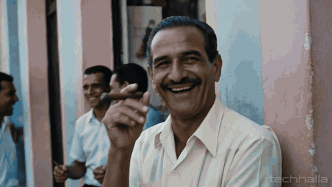</a>
</div>

##### 詳細

- **作者:** [@techhalla](https://x.com/techhalla)
- **出典:** [出典](https://x.com/techhalla/status/2075170093626011858)
- **公開日:** 2026年7月9日
- **言語:** en

**[このプロンプトを使う · ImagineVid](https://imaginevid.io/ja/seedream-5-pro)**

---

<a id="prompt-49"></a>

#### No. 39: Sixteen-panel cavalry charge narrative


##### 説明

A narrative-consistency workflow normalized from a public Seedream 5.0 Pro sequence test with knights and horses.

##### プロンプト

```
Create a 16-panel grayscale storyboard of one cavalry charge from preparation to impact. Keep the same knights, horses, banners, armor shapes, and terrain consistent across every panel. Vary camera distance and angle like a shot list, add panel numbers, and make the action readable as one continuous sequence.
```

<details>
<summary>関連プロンプトのバリエーション (2)</summary>

**Shot-list driven grayscale scene planning**

```
a shot list — panel-by-panel direction, camera moves, grayscale spec
```

作者: [@munzxsdv](https://x.com/munzxsdv)

出典: [出典](https://x.com/munzxsdv/status/2074865454485483885)

**Single-prompt 16-panel cavalry storyboard**

```
16-panel storyboard from ONE prompt: numbered frames, consistent characters, coherent camera logic across a whole cavalry charge
```

作者: [@sulekhat95](https://x.com/sulekhat95)

出典: [出典](https://x.com/sulekhat95/status/2074966196563431636)

</details>

##### 生成画像

<table>
<tr>
<td width="100%" valign="top" align="center"></td>
</tr>
</table>

##### 詳細

- **作者:** [@ElaraGrace_AI](https://x.com/ElaraGrace_AI)
- **出典:** [出典](https://x.com/ElaraGrace_AI/status/2074891631313015060)
- **公開日:** 2026年7月8日
- **言語:** en

**[このプロンプトを使う · ImagineVid](https://imaginevid.io/ja/seedream-5-pro)**

---

<a id="prompt-149"></a>

#### No. 40: Four-philosopher knowledge-world diorama


##### 説明

A parameterized 2×2 educational layout that combines miniature cutaway rooms, pop-up books, silhouette infographics, and museum-grade guidebook materials.

##### プロンプト

```
2x2 grid, 16:9, do this for 4 philosophers: <instructions> a = { isometric cutaway miniature rooms, dollhouse compartments, tiny props, toy‑scale figures }

b = { open‑book pop‑up diorama, labeled callouts, accessory diagrams, warm page texture, educational layout }

c = { object‑shaped infographic chart: items arranged in silhouette, axis labels, category progression, grid logic, museum‑data design }

d = { premium collector's pop‑up book: thick cardstock pages, ribbon bookmark, gold foil accents, museum vitrine lighting }

knowledge_world = (a ∩ isometric_base) ∪ (b ∩ book_spread) ∪ (c ∩ silhouette_infographic) ∪ (d ∩ premium_book)

render $ subject as this composite diorama:

- the silhouette of $ subject is formed by hundreds of tiny room‑like cells, each holding a miniature prop or figure relevant to $ subject's domain.

- the whole piece sits on an open book with cream pages, labeled callouts with thin leader lines, category axes (e.g., timeline, complexity, function) along the sides.

- isometric perspective, soft editorial shadows, materials: matte painted resin, tiny wood, paper, clay.

- palette: warm ivory, muted teal, clay red, ochre, charcoal ink, small gold foil accents.

output as an 8k macro photo of a premium educational guidebook spread.
```

##### 生成画像

<table>
<tr>
<td width="100%" valign="top" align="center"></td>
</tr>
</table>

##### 詳細

- **作者:** [Gadgetify](https://x.com/Gdgtify)
- **出典:** [出典](https://x.com/Gdgtify/status/2077875673763627262)
- **公開日:** 2026年7月16日
- **言語:** en

**[このプロンプトを使う · ImagineVid](https://imaginevid.io/ja/seedream-5-pro)**

---

<a id="prompt-130"></a>

#### No. 41: Spanish seafood paella production storyboard


##### 説明

A fresh public X prompt for a nine-panel cinematic food storyboard, useful for testing recipe sequencing, panel layout, and readable production-board captions.

##### プロンプト

```
A wide horizontal storyboard layout, 16:9 aspect ratio, arranged in a clean 3x3 grid with 9 panels total. Thin black borders separating each frame. Warm parchment/off-white background like a printed production board. At the top center, add the title: SPANISH SEAFOOD PAELLA — Production Storyboard. Each panel should have a small white label box in the top-left corner with the panel number in brackets: [1], [2], [3], etc. Under each panel, add a short italic serif caption starting with a two-digit number and an em dash.

Visual style: High-end cinematic food photography, warm rustic Spanish outdoor kitchen, golden afternoon sunlight, open wood fire flame beneath a wide carbon-steel paella pan, smoke, rough wooden outdoor table, terracotta tiles, saffron-yellow rice, bright red and orange seafood, old Spanish kitchen tools in the background, realistic textures, caramelized socarrat, appetizing food details, premium commercial cooking video look.

Panels:
[1] Hands finely dicing ripe tomato and red pepper on a rough wooden board, golden olive oil in a small ceramic dish nearby, warm Spanish sunlight. Caption: 01 — Prepare sofrito base ingredients.
[2] The sofrito of tomato, pepper, and garlic sizzling and slowly reducing in a wide carbon-steel paella pan over an open wood fire, smoke curling up. Caption: 02 — Fry sofrito in paella pan.
[3] Dry bomba rice poured into the sofrito, stirred with a wooden spoon until each grain is coated and lightly toasted, shimmering in oil. Caption: 03 — Toast bomba rice in pan.
[4] Bright saffron-infused golden stock being poured in a generous steady stream into the pan, steam surging dramatically as it hits the hot rice. Caption: 04 — Add saffron-infused stock.
[5] Fresh mussels, clams, whole prawns, and squid rings arranged in a decorative circle over the simmering saffron rice, raw seafood glistening. Caption: 05 — Arrange seafood over the rice.
[6] The paella pan on the open wood fire, rice cooking undisturbed, the edges beginning to caramelize into the deep golden-brown socarrat crust. Caption: 06 — Allow socarrat crust to form.
[7] A wooden spoon lifting the edge of the rice to reveal the dark, crispy caramelized socarrat bottom — the sign of a perfect paella. Caption: 07 — Check the golden socarrat crust.
[8] Pan removed from fire, lemon halves squeezed over the seafood in a golden mist of juice, fresh flat-leaf parsley scattered generously over the top. Caption: 08 — Rest, add lemon and parsley.
[9] Final hero shot of the complete paella pan on a rough wooden outdoor table, afternoon Spanish light, steam rising, seafood glistening, wooden spoon beside it. Caption: 09 — Completed paella, hero shot.

Make the entire storyboard feel like a polished production planning sheet for a premium Spanish food commercial. Keep every panel realistic, cinematic, warm golden-toned, detailed, consistent in lighting and outdoor kitchen environment.
```

##### 生成画像

<table>
<tr>
<td width="100%" valign="top" align="center"></td>
</tr>
</table>

##### 詳細

- **作者:** [@Strength04_X](https://x.com/Strength04_X)
- **出典:** [出典](https://x.com/Strength04_X/status/2075487330996273442)
- **公開日:** 2026年7月10日
- **言語:** en

**[このプロンプトを使う · ImagineVid](https://imaginevid.io/ja/seedream-5-pro)**

---

<a id="prompt-77"></a>

#### No. 42: Exploded engineering diagram layout


##### 説明

A Seedream 5.0 Pro structural-control example from a public BytePlus/Lumina post, normalized into a reusable exploded technical diagram prompt.

##### プロンプト

```
Create an exploded technical diagram of a compact high-end AI camera module, every component separated in clean perspective as if prepared by an engineering studio. Show the outer shell, lens stack, sensor block, heat sink, screws, flex cables, and small circuit boards floating on aligned axes. Add precise callout labels, thin measurement lines, numbered part markers, and a restrained white-and-slate background. Keep spacing consistent, edges crisp, typography readable, and the overall composition believable as a product teardown sheet rather than a fantasy illustration.
```

##### 生成画像

<table>
<tr>
<td width="33%" valign="top" align="center"></td>
<td width="33%" valign="top" align="center"></td>
<td width="33%" valign="top" align="center"></td>
</tr>
</table>

##### 詳細

- **作者:** [@Ciri_ai](https://x.com/Ciri_ai)
- **出典:** [出典](https://x.com/Ciri_ai/status/2075248022515294567)
- **公開日:** 2026年7月9日
- **言語:** en

**[このプロンプトを使う · ImagineVid](https://imaginevid.io/ja/seedream-5-pro)**

---

<a id="workflow-characters-cinema-visual-styles"></a>

### キャラクター・映画表現・ビジュアルスタイル (49)

Character, portrait, fashion, cinematic-frame, and style-exploration prompts centered on visual direction and image language.

**Community · 注目プロンプト**

- [Hard sci-fi airlock film still](#prompt-1)
- [1970s Dutch romantic drama camera memory](#prompt-2)
- [Anime kunoichi portrait with fine identity details](#prompt-3)
- [Folk-horror sunset convergence](#prompt-7)

<a id="prompt-8"></a>

#### No. 43: Rain-soaked noir roadside diner


##### 説明

A noir lighting test from a public Seedream 5 Pro prompt thread, normalized for wet asphalt, sodium light, and black negative space.

##### プロンプト

```
Create a wide exterior noir shot of a lonely roadside diner during heavy night rain. Pool sodium-orange streetlight across wet asphalt so puddles fracture the reflections. Let the diner glow faintly warm against an otherwise black sky, with one detective silhouette barely visible through a rain-streaked window. Keep the surrounding darkness nearly absolute, add visible rain streaks, film grain, and anamorphic letterboxing.
```

##### 生成画像

<table>
<tr>
<td width="100%" valign="top" align="center"></td>
</tr>
</table>

##### 詳細

- **作者:** [@karim_yourself](https://x.com/karim_yourself)
- **出典:** [出典](https://x.com/karim_yourself/status/2075165441236803971)
- **公開日:** 2026年7月9日
- **言語:** en

**[このプロンプトを使う · ImagineVid](https://imaginevid.io/ja/seedream-5-pro)**

---

<a id="prompt-9"></a>

#### No. 44: Sun Throne scale contrast


##### 説明

A fantasy scale-composition prompt, rewritten from a public Seedream 5 Pro thread, for testing shafts of light and foreground blur.

##### プロンプト

```
Build a fantasy film still titled The Sun Throne. Place a bowed supplicant in soft foreground blur while enormous gilded steps climb sharply into a blinding golden shaft. Keep the god-king unseen so the architecture does the storytelling. Use deep hall shadows, one diagonal beam of light, extreme scale contrast, film grain, and a reverent but oppressive atmosphere.
```

##### 生成画像

<table>
<tr>
<td width="100%" valign="top" align="center"></td>
</tr>
</table>

##### 詳細

- **作者:** [@karim_yourself](https://x.com/karim_yourself)
- **出典:** [出典](https://x.com/karim_yourself/status/2075165447490535486)
- **公開日:** 2026年7月9日
- **言語:** en

**[このプロンプトを使う · ImagineVid](https://imaginevid.io/ja/seedream-5-pro)**

---

<a id="prompt-10"></a>

#### No. 45: Whiteout survival abstraction


##### 説明

A minimal survival-film prompt, normalized from a public Seedream 5 Pro thread, for near-white compositions and directional ambiguity.

##### プロンプト

```
Create a survival film still in a total snow whiteout. Reduce the mountaineer to a tiny faint mark in a field of almost pure white with no horizon and no reliable sense of up or down. Let a taut climbing rope be the only clear line in the frame. Use flat blinding light, minimal contrast, subtle film grain, and an anamorphic composition that feels disorienting and desperate.
```

##### 生成画像

<table>
<tr>
<td width="100%" valign="top" align="center"></td>
</tr>
</table>

##### 詳細

- **作者:** [@karim_yourself](https://x.com/karim_yourself)
- **出典:** [出典](https://x.com/karim_yourself/status/2075165459993784441)
- **公開日:** 2026年7月9日
- **言語:** en

**[このプロンプトを使う · ImagineVid](https://imaginevid.io/ja/seedream-5-pro)**

---

<a id="prompt-11"></a>

#### No. 46: Lived-in afternoon kitchen portrait


##### 説明

A candid lifestyle photography pattern from a public Seedream 5 Pro prompt thread, rewritten for natural skin, domestic detail, and warm late light.

##### プロンプト

```
Photograph a relaxed adult woman leaning against a kitchen counter in a lived-in suburban home during late afternoon. Use a 35mm eye-level handheld feel, natural shallow depth of field, visible skin texture, loose hair, an oversized cream knit cardigan, worn denim, and both hands around a matte ceramic mug. Add window light from camera right, dust in the air, soft long shadows, muted domestic clutter, warm cream and denim blues, and no beauty-filter gloss.
```

##### 生成画像

<table>
<tr>
<td width="100%" valign="top" align="center"></td>
</tr>
</table>

##### 詳細

- **作者:** [@Digitalwindai](https://x.com/Digitalwindai)
- **出典:** [出典](https://x.com/Digitalwindai/status/2075222988106932645)
- **公開日:** 2026年7月9日
- **言語:** en

**[このプロンプトを使う · ImagineVid](https://imaginevid.io/ja/seedream-5-pro)**

---

<a id="prompt-12"></a>

#### No. 47: Western Front dawn trench still


##### 説明

A historical realism pattern from a public Seedream 5 Pro prompt thread, useful for restrained color, period texture, and atmospheric depth.

##### プロンプト

```
Create a 1916 Western Front film still at dawn. Show an exhausted young soldier in period uniform standing in a muddy trench, rifle slung over one shoulder, staring past the camera. Build the scene with sandbags, timber supports, distant barbed wire, faint smoke over no-man’s land, cold overcast light, muted khaki, grey, rust, and realistic mud, fabric, and worn metal texture.
```

##### 生成画像

<table>
<tr>
<td width="100%" valign="top" align="center"></td>
</tr>
</table>

##### 詳細

- **作者:** [@Digitalwindai](https://x.com/Digitalwindai)
- **出典:** [出典](https://x.com/Digitalwindai/status/2075222992515125388)
- **公開日:** 2026年7月9日
- **言語:** en

**[このプロンプトを使う · ImagineVid](https://imaginevid.io/ja/seedream-5-pro)**

---

<a id="prompt-14"></a>

#### No. 48: Anime sorceress key visual


##### 説明

An anime key-visual prompt from a public Seedream 5 Pro thread, rewritten for dynamic cel shading and magical lighting.

##### プロンプト

```
Create an epic Japanese anime key visual of a sorceress mid-incantation. Use a low-angle dynamic medium shot, flowing hair and robes, hands weaving glowing runes, an arcane circle below, floating debris, and a battlefield backdrop. Make the main light a vivid violet-cyan magic glow with gold accents, crisp cel-shaded fabric, clean hair detail, radiant particles, and no photorealistic skin or 3D-render look.
```

##### 生成画像

<table>
<tr>
<td width="100%" valign="top" align="center"></td>
</tr>
</table>

##### 詳細

- **作者:** [@Digitalwindai](https://x.com/Digitalwindai)
- **出典:** [出典](https://x.com/Digitalwindai/status/2075223017127383054)
- **公開日:** 2026年7月9日
- **言語:** en

**[このプロンプトを使う · ImagineVid](https://imaginevid.io/ja/seedream-5-pro)**

---

<a id="prompt-30"></a>

#### No. 49: San Francisco sunset phone candid


##### 説明

A simple benchmark prompt normalized from a public Seedream 5.0 Pro test, useful for everyday realism and sunset phone-light handling.

##### プロンプト

```
Create a candid street photo of a Korean woman in her twenties using her phone in San Francisco at sunset. Keep the composition natural, with warm side light, believable city background blur, relaxed posture, real skin texture, and the casual imperfection of a quick everyday snapshot rather than a studio portrait.
```

<details>
<summary>関連プロンプトのバリエーション (1)</summary>

**Original San Francisco sunset prompt**

```
a Korean girl in her twenties on her iPhone in San Francisco at sunset
```

作者: [@mattworkman](https://x.com/mattworkman)

出典: [出典](https://x.com/mattworkman/status/2074850550349222210)

</details>

##### 生成画像

<table>
<tr>
<td width="100%" valign="top" align="center"></td>
</tr>
</table>

##### 詳細

- **作者:** [@mattworkman](https://x.com/mattworkman)
- **出典:** [出典](https://x.com/mattworkman/status/2074850550349222210)
- **公開日:** 2026年7月8日
- **言語:** en

**[このプロンプトを使う · ImagineVid](https://imaginevid.io/ja/seedream-5-pro)**

---

<a id="prompt-34"></a>

#### No. 50: Noir cigarette ember close-up


##### 説明

A near-black noir close-up from a public Seedream 5 Pro cinematic thread, rewritten for micro-lighting and smoke texture.

##### プロンプト

```
Create an extreme noir close-up in near-total darkness. Let a cigarette ember glow orange-red as the only vivid point of light, revealing just a sliver of cheekbone, jaw, stubble, and drifting smoke. Use a distant sodium streetlight as a hard sculpting key, keep most of the frame pure black, add film grain, and compose in anamorphic 2.39:1 with severe contrast.
```

##### 生成画像

<table>
<tr>
<td width="100%" valign="top" align="center"></td>
</tr>
</table>

##### 詳細

- **作者:** [@karim_yourself](https://x.com/karim_yourself)
- **出典:** [出典](https://x.com/karim_yourself/status/2075165444453876197)
- **公開日:** 2026年7月9日
- **言語:** en

**[このプロンプトを使う · ImagineVid](https://imaginevid.io/ja/seedream-5-pro)**

---

<a id="prompt-35"></a>

#### No. 51: Courtroom witness hard-key portrait


##### 説明

A single-light courtroom prompt from a public Seedream 5 Pro cinematic thread, normalized for emotional restraint and silhouette blocking.

##### プロンプト

```
Frame a tense courtroom witness in tight portrait. Half-light the face with a harsh overhead shaft so the eyes catch moisture while the rest drops into shadow. Let the lawyer appear only as a dark edge intruding from frame left. Keep the surrounding room nearly black, with restrained film grain, anamorphic framing, and a cornered but resolute mood.
```

##### 生成画像

<table>
<tr>
<td width="100%" valign="top" align="center"></td>
</tr>
</table>

##### 詳細

- **作者:** [@karim_yourself](https://x.com/karim_yourself)
- **出典:** [出典](https://x.com/karim_yourself/status/2075165450674069946)
- **公開日:** 2026年7月9日
- **言語:** en

**[このプロンプトを使う · ImagineVid](https://imaginevid.io/ja/seedream-5-pro)**

---

<a id="prompt-36"></a>

#### No. 52: Mob kitchen sauce-and-threat still


##### 説明

A crime-drama film still from a public Seedream 5 Pro prompt thread, rewritten around warm domestic menace.

##### プロンプト

```
Create a cramped mob-drama kitchen still. Steam rises from a pot of sauce while an older boss stands half-lit by the stove flame, discussing danger as casually as a family recipe. Use warm practical light, lived-in clutter, textured walls, realistic steam, film grain, and a cozy domestic palette that makes the threat feel worse.
```

##### 生成画像

<table>
<tr>
<td width="100%" valign="top" align="center"></td>
</tr>
</table>

##### 詳細

- **作者:** [@karim_yourself](https://x.com/karim_yourself)
- **出典:** [出典](https://x.com/karim_yourself/status/2075165453568053713)
- **公開日:** 2026年7月9日
- **言語:** en

**[このプロンプトを使う · ImagineVid](https://imaginevid.io/ja/seedream-5-pro)**

---

<a id="prompt-37"></a>

#### No. 53: Family table mob drama wide shot


##### 説明

A companion mob-drama prompt from a public Seedream 5 Pro thread, normalized for group staging and warm overhead light.

##### プロンプト

```
Compose a wide shot of a cramped family kitchen table crowded with plates. Place the boss at the head, half-lit by warm overhead light, while a soldier leans in to whisper. Keep the room ordinary and lived-in, with sauce, dishes, and family warmth hiding the violence underneath. Use anamorphic framing, film grain, and a cozy-ominous tone.
```

##### 生成画像

<table>
<tr>
<td width="100%" valign="top" align="center"></td>
</tr>
</table>

##### 詳細

- **作者:** [@karim_yourself](https://x.com/karim_yourself)
- **出典:** [出典](https://x.com/karim_yourself/status/2075165456822882498)
- **公開日:** 2026年7月9日
- **言語:** en

**[このプロンプトを使う · ImagineVid](https://imaginevid.io/ja/seedream-5-pro)**

---

<a id="prompt-38"></a>

#### No. 54: Aristocratic alien diplomat portrait


##### 説明

A sci-fi character still from a public Seedream 5 Pro prompt thread, rewritten for prosthetic-grade alien design.

##### プロンプト

```
Design a cinematic portrait of an aristocratic alien diplomat with pale lavender-gray skin, an elongated smooth skull, no visible nose, black almond eyes, and a delicate ridged brow. Dress the figure in an ornate high-collared ceremonial garment with filigree detail. Use quiet diplomatic tension, soft directional light, restrained color, and production-quality prosthetic realism.
```

##### 生成画像

<table>
<tr>
<td width="100%" valign="top" align="center"></td>
</tr>
</table>

##### 詳細

- **作者:** [@karim_yourself](https://x.com/karim_yourself)
- **出典:** [出典](https://x.com/karim_yourself/status/2075165463009501682)
- **公開日:** 2026年7月9日
- **言語:** en

**[このプロンプトを使う · ImagineVid](https://imaginevid.io/ja/seedream-5-pro)**

---

<a id="prompt-39"></a>

#### No. 55: Villeneuve-style neutral mask portrait


##### 説明

A restrained character close-up from a public Seedream 5 Pro prompt thread, rewritten for sparse architecture and unreadable emotion.

##### プロンプト

```
Create a close character portrait with very pale skin, light eyes, and an entirely neutral expression. Suggest that a mask and robe have just been removed, leaving partial fabric at the neck. Keep the background a dark interior with only one faint architectural line. Use soft severity, minimal palette, and a quiet Villeneuve-inspired cinematic mood without copying a specific film.
```

##### 生成画像

<table>
<tr>
<td width="100%" valign="top" align="center"></td>
</tr>
</table>

##### 詳細

- **作者:** [@karim_yourself](https://x.com/karim_yourself)
- **出典:** [出典](https://x.com/karim_yourself/status/2075165466041925663)
- **公開日:** 2026年7月9日
- **言語:** en

**[このプロンプトを使う · ImagineVid](https://imaginevid.io/ja/seedream-5-pro)**

---

<a id="prompt-41"></a>

#### No. 56: War robot city cannon blast


##### 説明

A blockbuster sci-fi action prompt from a public Seedream 5 Pro thread, rewritten for VFX-grade scale and debris timing.

##### プロンプト

```
Create a cinematic sci-fi action still of a massive humanoid war robot firing an oversized cannon between skyscrapers. Use a low wide 24mm angle, muzzle flash, shockwave, smoke, tanks below, collapsing facade, frozen glass and debris, hard explosion light against cold daylight, steel-gray materials, and blockbuster VFX realism.
```

##### 生成画像

<table>
<tr>
<td width="100%" valign="top" align="center"></td>
</tr>
</table>

##### 詳細

- **作者:** [@Digitalwindai](https://x.com/Digitalwindai)
- **出典:** [出典](https://x.com/Digitalwindai/status/2075223008038261027)
- **公開日:** 2026年7月9日
- **言語:** en

**[このプロンプトを使う · ImagineVid](https://imaginevid.io/ja/seedream-5-pro)**

---

<a id="prompt-42"></a>

#### No. 57: Natural copper-red close portrait


##### 説明

A photoreal portrait prompt from a public Seedream 5 Pro thread, rewritten for untreated skin and medium-format feel.

##### プロンプト

```
Make a medium-format close portrait of a young European woman with copper-red hair, green eyes, natural freckles, and a calm direct gaze. Use an 85mm shallow-depth setup, soft window light, warm skin tones, muted neutral background, natural untouched skin, clear catchlights, and no beauty-filter smoothing.
```

##### 生成画像

<table>
<tr>
<td width="100%" valign="top" align="center"></td>
</tr>
</table>

##### 詳細

- **作者:** [@Digitalwindai](https://x.com/Digitalwindai)
- **出典:** [出典](https://x.com/Digitalwindai/status/2075223012589085119)
- **公開日:** 2026年7月9日
- **言語:** en

**[このプロンプトを使う · ImagineVid](https://imaginevid.io/ja/seedream-5-pro)**

---

<a id="prompt-43"></a>

#### No. 58: Magical realist dry-lake fisherman


##### 説明

A magical realism film-still prompt from a public Seedream 5 Pro thread, normalized for warm painterly light without losing realism.

##### プロンプト

```
Create a wide low-angle magical-realist film still of an old fisherman kneeling in the cracked bed of a vanished lake, calmly mending a boat that should not be there. Use saturated sunset color, warm painterly light, realistic weathered skin, dry mud texture, long shadows, and a quiet impossible mood without obvious magic particles.
```

##### 生成画像

<table>
<tr>
<td width="100%" valign="top" align="center"></td>
</tr>
</table>

##### 詳細

- **作者:** [@Digitalwindai](https://x.com/Digitalwindai)
- **出典:** [出典](https://x.com/Digitalwindai/status/2075223026656854053)
- **公開日:** 2026年7月9日
- **言語:** en

**[このプロンプトを使う · ImagineVid](https://imaginevid.io/ja/seedream-5-pro)**

---

<a id="prompt-45"></a>

#### No. 59: Bleach-bypass thriller pursuit


##### 説明

A thriller film-still prompt from a public Seedream 5 Pro thread, rewritten for harsh desaturated contrast and motion tension.

##### プロンプト

```
Create a bleach-bypass thriller still with harsh desaturated contrast, blown highlights, and crushed blacks. Use a low 28mm tracking angle on a figure moving through an industrial corridor, with hard overhead fluorescents, gritty concrete, motion tension, and a realistic cinematic finish that avoids soft pastel digital color.
```

##### 生成画像

<table>
<tr>
<td width="100%" valign="top" align="center"></td>
</tr>
</table>

##### 詳細

- **作者:** [@Digitalwindai](https://x.com/Digitalwindai)
- **出典:** [出典](https://x.com/Digitalwindai/status/2075223035406070068)
- **公開日:** 2026年7月9日
- **言語:** en

**[このプロンプトを使う · ImagineVid](https://imaginevid.io/ja/seedream-5-pro)**

---

<a id="prompt-134"></a>

#### No. 60: Snowfall close-up with natural skin texture


##### 説明

A newly published Seedream 5.0 Pro portrait prompt for realistic winter skin texture, soft rim light, and an intimate over-the-shoulder composition.

##### プロンプト

```
Ultra-realistic close-up portrait of a young woman outdoors during gentle snowfall, looking back over her shoulder at the camera. Long dark brown wavy hair with loose strands blowing across her face, snowflakes resting naturally on her hair and shoulders. Thick charcoal gray knitted scarf wrapped around her neck, black textured winter coat. Soft pink lips, defined natural eyebrows, subtle makeup, light blue-gray eyes with a calm expression. Warm golden winter sunlight creates soft rim lighting against a blurred snowy forest background. Shallow depth of field, cinematic composition, 85mm lens, f/1.8, high dynamic range, photorealistic, DSLR quality. Natural skin texture with visible pores, fine peach fuzz, subtle skin imperfections, realistic subsurface scattering, gentle tonal variation, no plastic skin, no excessive smoothing, no beauty filter, true-to-life complexion, crisp eye detail, lifelike facial features. Cold winter atmosphere, soft bokeh, ultra-detailed, 8K.
```

##### 生成画像

<table>
<tr>
<td width="100%" valign="top" align="center"></td>
</tr>
</table>

##### 詳細

- **作者:** [@rovvmut_](https://x.com/rovvmut_)
- **出典:** [出典](https://x.com/rovvmut_/status/2075619983837831390)
- **公開日:** 2026年7月10日
- **言語:** en

**[このプロンプトを使う · ImagineVid](https://imaginevid.io/ja/seedream-5-pro)**

---

<a id="prompt-137"></a>

#### No. 61: Crimson saree palace portrait at golden hour


##### 説明

A fresh Seedream 5.0 Pro heritage-fashion portrait prompt with patterned sunlight, detailed silk texture, and an editorial 85mm composition.

##### プロンプト

```
Ultra-realistic cinematic portrait of a beautiful young woman wearing a rich deep crimson red silk saree with a matching sleeveless blouse featuring subtle floral jacquard embroidery and a muted gold border. She is standing beside an intricately carved ivory stone pillar in a heritage palace corridor during golden hour, gazing softly into the distance with a calm, dreamy expression. Her hair is styled in a neat low bun adorned with a single fresh red rose, with a few loose curled strands framing her face. Smooth glowing natural skin, expressive brown eyes, soft pink lips, minimal makeup. Warm sunlight passes through ornate carved jali patterns, casting intricate floral shadows across her face, neck, shoulders, blouse, and saree. Soft cinematic backlight, creamy bokeh, shallow depth of field, luxurious heritage architecture blurred in the background, elegant composition, warm golden color grading, highly detailed silk texture, photorealistic skin, natural facial proportions, HDR, 8K, DSLR quality, 85mm portrait lens, f/1.8, ultra sharp focus on the face, premium editorial fashion photography.
```

##### 生成画像

<table>
<tr>
<td width="25%" valign="top" align="center"></td>
<td width="25%" valign="top" align="center"></td>
<td width="25%" valign="top" align="center"></td>
<td width="25%" valign="top" align="center"></td>
</tr>
</table>

##### 詳細

- **作者:** [@aaliya_va](https://x.com/aaliya_va)
- **出典:** [出典](https://x.com/aaliya_va/status/2075924410423271453)
- **公開日:** 2026年7月11日
- **言語:** en

**[このプロンプトを使う · ImagineVid](https://imaginevid.io/ja/seedream-5-pro)**

---

<a id="prompt-138"></a>

#### No. 62: Low-angle financial district fashion portrait


##### 説明

A recent Seedream 5.0 Pro street-photography prompt for ambitious city scale, natural curls, and a handheld 20mm editorial perspective.

##### プロンプト

```
Ultra-realistic cinematic street photograph of a confident young woman standing between towering modern skyscrapers in a dense financial district. Captured from an extreme low angle perspective, making the dark glass and steel buildings rise dramatically around her and converge toward the cloudy blue sky. She has shoulder-length curly black hair and wears a deep burgundy leather jacket over a clean white high-neck top. Her expression is serious, calm, and determined as she looks upward toward something beyond the frame. The woman occupies the lower center of the composition while the massive architecture dominates the surrounding space, creating a strong sense of ambition, pressure, and scale. Blurred silhouettes of commuters move through the background, adding natural city energy without distracting from the subject. Cool overcast daylight, deep blue and charcoal tones, subtle warm reflections inside the buildings, soft directional light across her face, realistic skin texture, natural curls, detailed leather grain, authentic fabric folds, atmospheric depth, cinematic shadows, shallow depth of field, 20mm wide-angle lens, f/2.8, slight edge distortion, handheld editorial photography, high dynamic range, subtle film grain, photorealistic full-frame camera quality, no artificial beauty filter, no plastic skin, no CGI appearance, ultra-detailed, 8K.
```

##### 生成画像

<table>
<tr>
<td width="100%" valign="top" align="center"></td>
</tr>
</table>

##### 詳細

- **作者:** [@bmx_ai13](https://x.com/bmx_ai13)
- **出典:** [出典](https://x.com/bmx_ai13/status/2075922805573751264)
- **公開日:** 2026年7月11日
- **言語:** en

**[このプロンプトを使う · ImagineVid](https://imaginevid.io/ja/seedream-5-pro)**

---

<a id="prompt-141"></a>

#### No. 63: Celestial fox above the mountains


##### 説明

A cinematic Seedream 5 Pro fantasy scene that anchors a human-scale gesture against a vast cloud-and-light fox spirit.

##### プロンプト

```
A cinematic fantasy scene from a slightly low, over-the-shoulder perspective. A lone young man stands on a weathered stone mountain viewpoint with a rustic wooden railing, seen mostly from behind, wearing a dark olive-green hooded jacket, black pants, and black shoes. He calmly raises one hand to gently touch the nose of an enormous celestial fox spirit descending from the sky. The spirit is an ethereal heavenly guardian made of white clouds, mist, and flowing strands of living light—not a solid fox. It has an elegant elongated face, peaceful closed eyes, a long slender muzzle, a tiny black nose, and two enormous, tall, perfectly upright triangular ears that define its silhouette. Only the head, neck, faint chest, and part of the front legs are visible while the rest of its colossal body dissolves seamlessly into the clouds, sky, and distant mountains. Fine glowing white strands flow naturally from its body into the atmosphere, creating a soft divine aura. Dramatic storm clouds fill the sky with a small opening where the hidden sun casts subtle warm rays and gentle rim light. Towering green karst mountains, drifting mist, and a winding road below. Ultra-realistic, photorealistic, cinematic, atmospheric, mystical, 8K.
```

##### 生成画像

<table>
<tr>
<td width="50%" valign="top" align="center"></td>
<td width="50%" valign="top" align="center"></td>
</tr>
</table>

##### 詳細

- **作者:** [@frametheory058](https://x.com/frametheory058)
- **出典:** [出典](https://x.com/frametheory058/status/2076341429350404486)
- **公開日:** 2026年7月12日
- **言語:** en

**[このプロンプトを使う · ImagineVid](https://imaginevid.io/ja/seedream-5-pro)**

---

<a id="prompt-143"></a>

#### No. 64: The Star Ritual manga storyboard


##### 説明

A Seedream 5 Pro sequential-art prompt that directs a complete black-and-white shrine ritual across eight dramatic manga panels.

##### プロンプト

```
Gritty black-and-white Japanese manga storyboard page, dense ink linework, heavy screentone shading, dramatic cross-hatching, irregular panel grid layout like a professional seinen manga spread, Japanese onomatopoeia sound effects lettering in several panels. Recurring character: a young shrine maiden witch with long brown twin ponytails tied with red ribbons, golden eyes, wearing a white haori robe and red hakama skirt, carrying a golden ceremonial bell staff (kagura suzu). Story: a starlit incantation ritual, titled THE STAR RITUAL. Panel 1: wide shot of the shrine maiden standing on a shrine veranda under a vast starry night sky, ribbons flowing in the wind. Panel 2: close-up of her raising the bell staff high overhead with both hands. Panel 3: extreme close-up of the golden bells on the staff beginning to glow. Panel 4: medium shot, she chants an incantation, eyes closed, mouth open. Panel 5: close-up of her free hand forming a mystic seal gesture, fingers interlaced. Panel 6: wide shot, the stars above swirl together into a glowing magic circle. Panel 7: dynamic burst panel, a beam of light descends from the sky onto the shrine, bold sound effect lettering, radiant light streaks. Panel 8: final shot, she stands calm and serene as glowing petal-like light particles drift down around her, ribbons still fluttering. High contrast dramatic lighting, monochrome ink illustration, no color.
```

##### 生成画像

<table>
<tr>
<td width="100%" valign="top" align="center"></td>
</tr>
</table>

##### 詳細

- **作者:** [@renoiseai](https://x.com/renoiseai)
- **出典:** [出典](https://x.com/renoiseai/status/2076578475700523447)
- **公開日:** 2026年7月13日
- **言語:** en

**[このプロンプトを使う · ImagineVid](https://imaginevid.io/ja/seedream-5-pro)**

---

<a id="prompt-144"></a>

#### No. 65: Red-background urban webtoon portrait


##### 説明

A Seedream 5 Pro character-design prompt for a severe, graphic webtoon portrait with a disciplined red palette and tailored-suit silhouette.

##### プロンプト

```
[Subject], centered in a vertical 2:3 composition, shown from above the knees to the head in a bust-style framing, facing directly forward with a cold and tense expression. Bold solid red background with dramatic brown and dark green shadows created by strong directional lighting. Clean digital illustration style with sharp outlines, smooth gradients, and refined East Asian modern webtoon aesthetics without photorealistic textures. Wearing a black pinstripe or solid black tailored suit with a black shirt, optional black tie or leather choker, silver drop earrings, and a necklace maintained at accurate size and placement. Sharp eyes with a calm, piercing gaze. Hair flows naturally with a red hair tie accent. Flat monochrome background with no foreground objects or surrounding people. Sophisticated urban atmosphere. No photographic rendering or bright pastel colors.
```

##### 生成画像

<table>
<tr>
<td width="50%" valign="top" align="center"></td>
<td width="50%" valign="top" align="center"></td>
</tr>
</table>

##### 詳細

- **作者:** [@ChillaiKalan__](https://x.com/ChillaiKalan__)
- **出典:** [出典](https://x.com/ChillaiKalan__/status/2076523680860151863)
- **公開日:** 2026年7月13日
- **言語:** en

**[このプロンプトを使う · ImagineVid](https://imaginevid.io/ja/seedream-5-pro)**

---

<a id="prompt-145"></a>

#### No. 66: Apple blossom spring selfie portrait


##### 説明

A Seedream 5 Pro portrait prompt that combines a playful eye-level selfie with crisp spring blossoms, natural glam, and warm outdoor light.

##### プロンプト

```
Sunny outdoor selfie-style portrait of a young woman standing beneath a blooming apple tree, white-and-pink blossoms framing and partly covering her face. She tilts her head to rest gently on her own shoulder, gazing at the camera with a soft playful smile. Long sleek hair parted in the middle, falling straight past the shoulders. Fresh natural glam makeup: defined brows, bronze-neutral lids, long lashes, glowing sun-kissed skin, soft glossy nude lips. She wears a white ribbed scoop-neck tank under a cream knit cardigan, chunky gold hoop earrings and a thin gold chain choker. Background: a bright green spring garden with blossoming branches and a clear blue sky. Vertical shot, eye-level angle, bright natural sunlight, warm airy spring aesthetic.
```

##### 生成画像

<table>
<tr>
<td width="100%" valign="top" align="center"></td>
</tr>
</table>

##### 詳細

- **作者:** [@dreamydigiarts](https://x.com/dreamydigiarts)
- **出典:** [出典](https://x.com/dreamydigiarts/status/2076630217180041662)
- **公開日:** 2026年7月13日
- **言語:** en

**[このプロンプトを使う · ImagineVid](https://imaginevid.io/ja/seedream-5-pro)**

---

<a id="prompt-146"></a>

#### No. 67: Dual-character urban fantasy design sheet


##### 説明

A production-ready character comparison board with opposing visual identities, turnaround poses, weapon callouts, palettes, traits, and a shared abandoned-mall key scene.

##### プロンプト

```
Character comparison design sheet, dual character reference layout,
modern urban fantasy anime style, white/light gray background with
symmetrical left-right panel structure,

CENTER MAIN ILLUSTRATION:
two full-body anime characters standing face to face in a large abandoned
modern shopping mall interior, glass dome skylight ceiling, escalators,
store displays, mannequins, scattered debris and fallen mannequin parts,
cinematic lighting with soft daylight through glass ceiling,

CHARACTER A (left, purple/lavender theme):
young woman with long flowing silver-lavender hair, high ponytail with
dark flower hair ornament, purple eyes, elegant fantasy streetwear -
black crop top, black mini skirt with layered sheer white/purple cape-like
overlay, gold chain belt details, purple tassel accessories, thigh-high
gap showing legwarmers, white knee-high heeled boots with gold buckle
details, holding an ornate rapier sword with circular guard and purple
tassel, confident graceful pose, hand near collarbone,

CHARACTER B (right, red/black theme):
young woman with long black hair streaked with red, high ponytail with
red ribbon, red eyes, aggressive streetwear - red bandeau top, black
open jacket with red trim and asian-inspired patterns, black cargo pants
with red straps and chain details, red belt, black and white sneakers,
fingerless gloves, wielding a large dark scythe with red blade and chain
tassel over shoulder, confident wild stance, hand on hip,

small text label center top: "ABANDONED DEPARTMENT STORE" in gray serif
font with small decorative slash marks,

LEFT SIDE PANEL (Character A info):
top-left bold purple header "CHARACTER A" with subtitle traits in caps
("GRACEFUL / CONTROL / SHARP"),
below: close-up portrait bust shot of character A in bordered box,
below that: "TURNAROUND" label with 4 small full-body reference poses
(front, 3/4, back, side) in a row,
below that: "WEAPON" label with weapon name "RAPIER" and detailed weapon
illustration,
bottom: "COLOR PALETTE (A)" with 5 color swatch squares (lavender, dark
purple, gray, cream, gold),
next to it: "KEY TRAITS (A)" with 3 small icon badges and labels
("AGILITY" "PRECISION" "INTELLIGENCE"),

RIGHT SIDE PANEL (Character B info) - mirrored layout:
top-right bold red header "CHARACTER B" with subtitle traits in caps
("WILD / AGGRESSIVE / UNBREAKABLE"),
close-up portrait bust shot of character B in bordered box,
"TURNAROUND" label with 4 small full-body reference poses,
"WEAPON" label with weapon name "SCYTHE" and detailed weapon illustration,
"COLOR PALETTE (B)" with 5 color swatch squares (red, black, gray, white,
dark maroon),
"KEY TRAITS (B)" with 3 small icon badges and labels ("STRENGTH" "IMPACT"
"RESILIENCE"),

STYLE:
high-detail modern anime illustration, semi-realistic proportions,
glossy rendering, dramatic character design contrast (elegant/refined vs
wild/aggressive), professional game character design document layout,
clean white background panels, thin border boxes, minimalist typography,
color-coded sections (purple for A, red for B),

high resolution, polished digital painting, official character design
sheet presentation
```

##### 生成画像

<table>
<tr>
<td width="100%" valign="top" align="center"></td>
</tr>
</table>

##### 詳細

- **作者:** [Renoise](https://x.com/renoiseai)
- **出典:** [出典](https://x.com/renoiseai/status/2076993082587779465)
- **公開日:** 2026年7月14日
- **言語:** en

**[このプロンプトを使う · ImagineVid](https://imaginevid.io/ja/seedream-5-pro)**

---

<a id="prompt-147"></a>

#### No. 68: Low-angle skatepark fashion portrait


##### 説明

A structured reference-image prompt for preserving facial identity while directing streetwear, a ground-level heroic camera angle, foreground skateboard depth, and hard summer light.

##### プロンプト

```
{
    "subject_and_outfit_formula": "A stylish young East Asian woman with a confident and cool expression, her dark, shoulder-length hair gently tousled by a light breeze. She is dressed in an oversized, retro-style red athletic jersey with white side panels and bold graphic lettering on the chest. Below, she wears high-waisted light-wash denim shorts featuring aggressive distressing, large ripped panels across the thighs, and raw, frayed hems. Her footwear includes thick white crew socks with classic red and blue stripes at the top, paired with chunky, multi-layered cream and beige platform sneakers that add to her urban, sporty aesthetic.",
    "background_and_environment": "The scene is set in a minimalist, sun-drenched outdoor skatepark featuring smooth, sweeping gray concrete ramps and bowls. The backdrop is an expansive, vibrant azure sky dotted with soft, feathered white clouds, suggesting a clear and bright summer afternoon. Intense, direct sunlight originates from a high angle, creating a luminous rim-lighting effect around the subject's silhouette and casting sharp, defined shadows on the concrete surface, evoking a sense of high-energy urban life.",
    "camera_angle_and_composition": "An extreme low-angle 'worm's eye view' shot captured from a ground-level perspective looking steeply upward, which emphasizes the subject's height and commanding, heroic presence. A colorful, illustrative skateboard with intricate pop-art graphics and bold 'SKATE' typography is held vertically in the immediate foreground, acting as a powerful visual anchor and creating a strong sense of depth. The composition utilizes a wide-angle perspective to frame the subject against the vastness of the sky, making her the central focal point of the frame.",
    "face_reference": "Use the uploaded photo as the primary reference for facial structure and features.",
    "camera_and_vintage_style_settings": "Standard high-quality digital photography, crisp and clear."
}
```

##### 生成画像

<table>
<tr>
<td width="50%" valign="top" align="center"></td>
<td width="50%" valign="top" align="center"></td>
</tr>
</table>

##### 詳細

- **作者:** [Kashberg](https://x.com/Kashberg_0)
- **出典:** [出典](https://x.com/Kashberg_0/status/2076518233956622760)
- **公開日:** 2026年7月13日
- **言語:** en

**[このプロンプトを使う · ImagineVid](https://imaginevid.io/ja/seedream-5-pro)**

---

<a id="prompt-148"></a>

#### No. 69: Summer train-station coming-of-age portrait


##### 説明

A multi-shot photoreal coming-of-age sequence shaped by suburban rail details, candid gestures, summer backlight, Portra color, and restrained slice-of-life nostalgia.

##### プロンプト

```
A cinematic coming-of-age portrait of a Japanese high school girl at a suburban train station on a bright summer afternoon, wearing a white sailor-style school uniform with a light blue skirt, carrying a navy school bag and backpack. Natural wind blowing through her shoulder-length black hair, candid expressions, looking out a train window, standing alone on the platform, walking alongside the tracks. Soft golden sunlight, blue sky with fluffy cumulus clouds, railway tracks, overhead power lines, subtle reflections on train glass, shallow depth of field, emotional and nostalgic atmosphere, Japanese slice-of-life anime film aesthetic translated into photorealism, Kodak Portra 400 colors, film grain, cinematic composition, bokeh, realistic skin texture, 35mm photography, low-angle and medium shots, backlighting, highly detailed, ultra-realistic, 8k.
Negative Prompt
low quality, blurry, oversaturated, HDR, CGI, cartoon, extra limbs, extra fingers, deformed face, bad anatomy, duplicate person, watermark, text, logo, artifacts, noisy, overprocessed skin, harsh shadows, cropped head, distorted proportions.
```

##### 生成画像

<table>
<tr>
<td width="25%" valign="top" align="center"></td>
<td width="25%" valign="top" align="center"></td>
<td width="25%" valign="top" align="center"></td>
<td width="25%" valign="top" align="center"></td>
</tr>
</table>

##### 詳細

- **作者:** [Kashberg](https://x.com/Kashberg_0)
- **出典:** [出典](https://x.com/Kashberg_0/status/2077421901656572021)
- **公開日:** 2026年7月15日
- **言語:** en

**[このプロンプトを使う · ImagineVid](https://imaginevid.io/ja/seedream-5-pro)**

---

<a id="prompt-131"></a>

#### No. 70: Four-film-still noir lighting prompt set


##### 説明

A public ALT-prompt set for western, gothic-horror, war-drama, and thriller film stills, focused on negative space, hard key light, and anamorphic composition.

##### プロンプト

```
Prompt 1:
Cinematic western film still, "Salt Flat Reckoning" — SHOT 2. Close-up: the rider's sun-cracked face beneath a wide-brim hat, deep shadow carved under the brim, only the lower half of his face lit by blinding white noon sun, jaw set, eyes invisible in shadow. Heat shimmer softens the background to a white blur. Bleached desaturated palette, harsh top light, 35mm film grain, anamorphic 2.39:1 letterbox.

Prompt 2:
Cinematic gothic-horror film still, "The Hollow Choir". Interior of a ruined cathedral at night, moonlight falling through a single broken stained-glass window in a shaft of cold blue-white light across the stone floor. A lone robed figure kneels at the edge of the light, face in shadow. Vaulted ceiling dissolves into total black above. Desaturated blue-grey palette, dust motes visible in the light shaft, high-contrast noir shadow, 35mm grain, anamorphic 2.39:1, director's-note composition.

Prompt 3:
Cinematic war-drama film still, "Last Transmission". Extreme close-up: a soldier's hand gripping a cracked radio handset, knuckles white, mud and blood under the fingernails. Backlit by a single flare arcing somewhere off-frame, throwing hard orange rim-light across the hand while the rest stays near-black. Smoke drifting through the light shaft. Ultra high contrast, single hard practical key, 90% negative space in shadow, 35mm grain, anamorphic 2.39:1, cinematic.

Prompt 4:
Cinematic thriller film still, "Static Frequency". Interior wide shot: an abandoned lighthouse control room at night, banks of dead analog equipment glowing faint green from one dying monitor. A lone operator sits with back to camera, headphones on, face unseen. Dust hangs visible in the single shaft of light. Everything outside that glow drops to black. Cold teal-green key, high-contrast noir shadow, film grain, anamorphic 2.39:1 letterbox, director's-note style, shot on anamorphic 35mm.
```

##### 生成画像

<table>
<tr>
<td width="25%" valign="top" align="center"></td>
<td width="25%" valign="top" align="center"></td>
<td width="25%" valign="top" align="center"></td>
<td width="25%" valign="top" align="center"></td>
</tr>
</table>

##### 詳細

- **作者:** [@Photonotix16](https://x.com/Photonotix16)
- **出典:** [出典](https://x.com/Photonotix16/status/2075529012156539185)
- **公開日:** 2026年7月10日
- **言語:** en

**[このプロンプトを使う · ImagineVid](https://imaginevid.io/ja/seedream-5-pro)**

---

<a id="prompt-132"></a>

#### No. 71: Transparent android ballet halation portrait


##### 説明

A public ALT prompt normalized into clean English for a translucent android fashion portrait with Kodak-style halation and cinematic grain.

##### プロンプト

```
Create a hybrid female android with translucent skin and white-gray mechanical plates. Give her a medium-length bob cut swept to the left, dyed white-blond, with soft strands framing the face. The blurred translucent latex-like skin reveals internal cybernetic mechanisms while keeping a glamorous ballet-inspired silhouette: narrow waist, strong shoulders, sculptural legs, and poised elegance. Place her in an empty park with autumn trees, an overcast sky, and dawn sunlight breaking through the clouds. Shoot the image as a full-body 35mm Kodak Vision3 cinematic photograph with red halation around the highlights, visible film grain, and a realistic analog finish. Pose her with one leg extended forward on pointe, wearing only a salmon-pink tutu. Keep the image refined, surreal, and fashion-editorial rather than plastic or cartoonish.
```

##### 生成画像

<table>
<tr>
<td width="100%" valign="top" align="center"></td>
</tr>
</table>

##### 詳細

- **作者:** [@_wib_](https://x.com/_wib_)
- **出典:** [出典](https://x.com/_wib_/status/2075508470468473030)
- **公開日:** 2026年7月10日
- **言語:** en

**[このプロンプトを使う · ImagineVid](https://imaginevid.io/ja/seedream-5-pro)**

---

<a id="prompt-95"></a>

#### No. 72: Extreme close-up portrait camera template


##### 説明

A reusable public portrait prompt template retested with Seedream 5 Pro, with editable subject, attire, age, eye-color, camera, and shot-distance variables.

##### プロンプト

```
Extremely realistic image, an extreme close-up shot of a {subject} in {attire}. The subject is {age}, with extremely natural skin texture and {eye-color} eyes, exquisite details, natural lighting, shot on a Canon EOS 250D / Rebel SL3 digital SLR camera at f/10. You can change the shot style to a mid shot, wide shot, or full-body shot while preserving the same natural skin detail and photographic realism.
```

##### 生成画像

<table>
<tr>
<td width="50%" valign="top" align="center"></td>
<td width="50%" valign="top" align="center"></td>
</tr>
</table>

##### 詳細

- **作者:** [@madpencil_](https://x.com/madpencil_)
- **出典:** [出典](https://x.com/madpencil_/status/2075248453173858556)
- **公開日:** 2026年7月9日
- **言語:** en

**[このプロンプトを使う · ImagineVid](https://imaginevid.io/ja/seedream-5-pro)**

---

<a id="prompt-79"></a>

#### No. 73: Master ink art animal study


##### 説明

A public Renoise Seedream 5.0 Pro ink-art post normalized into a brush-control prompt for traditional monochrome image generation.

##### プロンプト

```
Generate a master-level traditional ink artwork of a mythic crane and pine tree on handmade rice paper. Use confident black brushwork, dry-brush feather texture, soft ink bleeding at the edges, and a few deliberate empty spaces so the composition breathes. The subject should feel created by years of calligraphy practice rather than a digital filter: uneven pressure, elegant negative space, expressive line economy, and subtle paper fibers visible under natural studio light.
```

##### 生成画像

<table>
<tr>
<td width="100%" valign="top" align="center"></td>
</tr>
</table>

##### 詳細

- **作者:** [@renoiseai](https://x.com/renoiseai)
- **出典:** [出典](https://x.com/renoiseai/status/2075247860770357248)
- **公開日:** 2026年7月9日
- **言語:** en

**[このプロンプトを使う · ImagineVid](https://imaginevid.io/ja/seedream-5-pro)**

---

<a id="prompt-81"></a>

#### No. 74: Pancake angel dessert illustration


##### 説明

A Japanese public Seedream 5 Pro test on Magnific, rewritten as a whimsical dessert-character prompt with controlled Japanese text handling.

##### プロンプト

```
Create a delicate pancake angel character sitting on a stack of fluffy pancakes, with small cream-colored wings, maple-syrup highlights, soft morning light, and fine pastry texture. Place the character in a cozy cafe tabletop scene with powdered sugar drifting like snow. Add a small handwritten Japanese title card reading "パンケーキ天使" on the plate rim, keeping the text simple and legible. Use polished storybook illustration detail, gentle colors, and a clean 1.5k-style high-resolution finish.
```

##### 生成画像

<table>
<tr>
<td width="100%" valign="top" align="center"></td>
</tr>
</table>

##### 詳細

- **作者:** [@ayumi_t820](https://x.com/ayumi_t820)
- **出典:** [出典](https://x.com/ayumi_t820/status/2075239907006832996)
- **公開日:** 2026年7月9日
- **言語:** ja

**[このプロンプトを使う · ImagineVid](https://imaginevid.io/ja/seedream-5-pro)**

---

<a id="prompt-82"></a>

#### No. 75: Soft anime expression pair


##### 説明

A public Seedream 5 Pro anime-style test, normalized into a two-image character expression prompt for evaluating line quality and color softness.

##### プロンプト

```
Generate a paired anime character study of the same young adventurer in two emotional beats: calm curiosity and sudden wonder. Use clean expressive eyes, soft painterly cel shading, light hair movement, and a gentle fantasy background that stays secondary to the face. Keep the character design consistent across both images: same hairstyle, outfit, color palette, and proportions. Make the linework crisp but not harsh, with luminous pastel highlights and a finished key-visual feel.
```

##### 生成画像

<table>
<tr>
<td width="50%" valign="top" align="center"></td>
<td width="50%" valign="top" align="center"></td>
</tr>
</table>

##### 詳細

- **作者:** [@stargliderbr](https://x.com/stargliderbr)
- **出典:** [出典](https://x.com/stargliderbr/status/2075233749805957188)
- **公開日:** 2026年7月9日
- **言語:** en

**[このプロンプトを使う · ImagineVid](https://imaginevid.io/ja/seedream-5-pro)**

---

<a id="prompt-85"></a>

#### No. 76: Cloud maker fantasy portrait


##### 説明

A public Seedream 5 Pro fantasy image post, rewritten into a magical-realism prompt focused on atmosphere, hand gesture, and cloud-form control.

##### プロンプト

```
Create a magical realist portrait titled The Cloud Maker. Show a solitary figure standing on a high stone balcony at dawn, shaping a small storm cloud between both hands like wet clay. Wisps of vapor curl around their fingers, with tiny lightning threads glowing inside the cloud. The background opens into a vast pale sky over distant mountains, soft wind moving the cloak, cinematic realism, subtle film grain, cool blue-gold light, and a sense of quiet myth rather than superhero spectacle.
```

##### 生成画像

<table>
<tr>
<td width="100%" valign="top" align="center"></td>
</tr>
</table>

##### 詳細

- **作者:** [@higginswerx](https://x.com/higginswerx)
- **出典:** [出典](https://x.com/higginswerx/status/2075226897085243767)
- **公開日:** 2026年7月9日
- **言語:** en

**[このプロンプトを使う · ImagineVid](https://imaginevid.io/ja/seedream-5-pro)**

---

<a id="prompt-98"></a>

#### No. 77: Casual cafe-step street portrait


##### 説明

A complete public blind-test prompt shared with GPT Image 2.0 and Seedream 5.0 Pro, emphasizing authentic smartphone texture and a detailed cafe environment.

##### プロンプト

```
A realistic vertical 3:4 smartphone social-media street photo of a young adult woman sitting on a wooden step outside an urban cafe. Behind her are gray metal window frames and large glass panes showing the cafe interior: warm yellow lights, dining guests, wooden chairs and tables, distressed concrete walls, and tree reflections on the glass. The image should feel like a real casual snapshot, not a clean studio shoot, with natural background clutter, reflections, slight glare, and mild social-media compression.

She faces the camera while seated in a relaxed, slightly asymmetrical pose. Her body leans a little toward the left side of the frame. One leg bends sideways and the other bends naturally forward, with white socks and chunky black-and-white sneakers visible. One hand is raised near her hair, while the other holds a clear tall glass containing a pink-orange drink with a white straw. A phone with a white case rests on her lap, and a black handbag sits beside her.

She wears a black-and-white thin-strap cropped camisole with a white base, black trim, black straps, a black-and-white comic graphic, halftone dot texture, a speech bubble, and small bow details near the straps. The hem sits above the waist, revealing a small strip of midriff. Her bottoms are low-rise washed black-gray denim shorts with distressed patches, faded areas, and frayed edges, giving a Y2K streetwear feeling.

Her visible skin includes the shoulders, collarbones, upper chest edge, arms, hands, a small section of midriff, the side hip area partly covered by shorts, thighs, knees, and lower legs; the back and buttocks are not visible. The skin tone is fair with a warm pink undertone, with subtle natural redness on the cheeks and knees. The skin should look fine, soft, semi-matte, and real, with slight texture rather than plastic smoothing. Soft outdoor diffused light illuminates the front, while warm cafe lights behind the glass create faint golden reflections on the hair, shoulders, and arms.

Her styling follows a K-beauty / J-fashion sweet-cool idol-inspired direction: dark brown-black fluffy hair with airy bangs, softly curled ends, loose face-framing strands, and a black-and-white polka-dot hair clip on the left side of the image. Makeup includes a clean fair base, visible aegyo-sal, fine black eyeliner, long lashes, pink blush, and glossy rose lips. She looks into the camera with one eye open and the other playfully winking, lips softly closed with a slight smile and subtle pout.

Camera feel: taken by a friend standing in front of her with a smartphone, using a 26-35mm equivalent lens, front-facing slightly high angle, close environmental portrait framing, seated full-body view with shoes mostly included. Keep a fairly deep depth of field, clear subject, detailed cafe background, natural imperfections, reflections, mild noise, and authentic casual-photo texture.
```

##### 生成画像

<table>
<tr>
<td width="50%" valign="top" align="center"></td>
<td width="50%" valign="top" align="center"></td>
</tr>
</table>

##### 詳細

- **作者:** [@underwoodxie96](https://x.com/underwoodxie96)
- **出典:** [出典](https://x.com/underwoodxie96/status/2075140186992939103)
- **公開日:** 2026年7月9日
- **言語:** en

**[このプロンプトを使う · ImagineVid](https://imaginevid.io/ja/seedream-5-pro)**

---

<a id="prompt-118"></a>

#### No. 78: Fashion outfit editorial set in a parking structure


##### 説明

A source-backed demo from the original public X post, demonstrating fashion outfit editorial set in a parking structure.

##### プロンプト

```
A stylish young woman with long layered black hair and soft curtain bangs, wearing sleek black rectangular sunglasses, an oversized chocolate-brown tailored blazer with matching wide-leg trousers, and a fitted mocha-brown camisole. She carries a large structured ivory leather tote bag with gold hardware over one shoulder. Standing confidently with one hand in her pocket, looking back over her shoulder. Shot in a modern open-air parking structure beneath a concrete overpass, with parked cars softly blurred in the background. Natural midday sunlight creates soft shadows and clean highlights. Minimalist luxury aesthetic, quiet luxury fashion, effortless street style, neutral earth-tone color palette, premium editorial photography, shallow depth of field, ultra-realistic skin texture, subtle makeup with glossy nude lips, high-end fashion campaign, cinematic composition, 85mm lens, f/2.0, soft bokeh, crisp focus, HDR, RAW, 8K, Vogue-style luxury editorial.
```

##### 生成画像

<table>
<tr>
<td width="25%" valign="top" align="center"></td>
<td width="25%" valign="top" align="center"></td>
<td width="25%" valign="top" align="center"></td>
<td width="25%" valign="top" align="center"></td>
</tr>
</table>

##### 詳細

- **作者:** [@ChillaiKalan__](https://x.com/ChillaiKalan__)
- **出典:** [出典](https://x.com/ChillaiKalan__/status/2075071088137208063)
- **公開日:** 2026年7月9日
- **言語:** en

**[このプロンプトを使う · ImagineVid](https://imaginevid.io/ja/seedream-5-pro)**

---

<a id="prompt-92"></a>

#### No. 79: Backlit street portrait feeding stray cats


##### 説明

A public Chinese Seedream 5.0 Pro portrait prompt with a low-angle candid composition, specific styling, natural gestures, and hazy commercial backlight.

##### プロンプト

```
正午（好日头），户外场景，仰拍镜头，正脸看镜头，慵懒外套白内衬。戴项链，戴手表，耳钉，钻石手链，做出可爱的表情，梦幻朦胧感，噪点，逆光，微微过曝，商业修图，日常抓拍，冷白皮，通透，清冷女爱豆，长发半遮面，一半自然披散，在小区楼下蹲着给流浪猫喂零食，猫在吃，她穿着浅灰 oversize 卫衣和浅蓝牛仔短裤，膝盖着地，一手摊着零食、一手比着耶，她头发垂下来挡着半张脸，眼神温柔又小心翼翼，阳光透过树叶投下光斑，背景有缩在角落的小猫、堆着的纸箱。
```

##### 生成画像

<table>
<tr>
<td width="50%" valign="top" align="center"></td>
<td width="50%" valign="top" align="center"></td>
</tr>
</table>

##### 詳細

- **作者:** [@DeepBlueAIX](https://x.com/DeepBlueAIX)
- **出典:** [出典](https://x.com/DeepBlueAIX/status/2075062633666089004)
- **公開日:** 2026年7月9日
- **言語:** zh

**[このプロンプトを使う · ImagineVid](https://imaginevid.io/ja/seedream-5-pro)**

---

<a id="prompt-129"></a>

#### No. 80: Anime skateboard sequence with multiple shot prompts


##### 説明

A source-backed demo from the original public X post, demonstrating anime skateboard sequence with multiple shot prompts.

##### プロンプト

```
Prompt 1:
A girl with a sharp bob cut, purple hair with black accent strands, stylized layered hair flowing in the wind, wearing layered cloth with black accents, riding a skateboard through a vibrant concrete skate park, captured from a dramatic high angle looking down at the front profile, dynamic action pose, body leaning into a turn, skate park ramps, rails, and colorful graffiti walls sprawling below, cel shaded, toon shading, hard shadows, bold outlines, anime style, vibrant flat colors, crisp line art, key visual quality, bright late afternoon sunlight casting strong contrast, warm orange and purple sky, energetic youthful vibe, 8K detail, slight motion blur on wheels, dynamic perspective looking down

Prompt 2:
A girl with a sharp bob cut, purple hair with black accent strands, stylized layered hair swept back by the wind, wearing layered cloth with black accents, cruising on a skateboard through a colorful skate park, captured from a medium shot side profile, one foot on the board the other pushing off the ground, relaxed confident posture, skate park ramps, rails, and vibrant graffiti walls passing in the background, high-quality cartoon animation, stylized cel-shaded rendering, bold clean outlines, flat vibrant colors, expressive character design, smooth animated aesthetic, warm golden-hour glow, playful energetic mood, strong silhouette, clear readable pose

Prompt 3:
A girl with a sharp bob cut, purple hair with black accent strands, stylized layered hair, wearing layered cloth with black accents, standing at the corner edge of a skate park ramp, skateboard positioned underfoot, poised and ready to launch, captured from a cinematic over-the-shoulder shot from the corner side, peering past her shoulder toward the same corner direction she's facing, tense anticipation in the posture, knees bent, weight shifted forward, concrete skate park ramps and rails stretching out below, cinematic still, anamorphic lens, film grain, rich contrast, cinematic color grading, dramatic shadows, low golden-hour sun casting a long shadow forward, warm rim light on the shoulder and hair, 8K resolution, shallow depth of field, motion blur creeping at the edges, suspenseful action moment

Prompt 4:
A girl with a sharp bob cut, purple hair with black accent strands, stylized layered hair slightly tousled, wearing layered cloth with black accents, standing at a concrete skate park holding her skateboard under one arm, captured from a medium shot, casual confident pose, one hand flashing a peace sign, tongue playfully sticking out, skateboard tucked at her side, skate park ramps and graffiti walls in the softly blurred background, cinematic still, anamorphic lens, film grain, rich contrast, cinematic color grading, soft natural afternoon light, warm golden tones, playful rebellious attitude, 8K resolution, shallow depth of field, sharp focus on the face and peace sign, editorial finish
```

##### 生成画像

<table>
<tr>
<td width="25%" valign="top" align="center"></td>
<td width="25%" valign="top" align="center"></td>
<td width="25%" valign="top" align="center"></td>
<td width="25%" valign="top" align="center"></td>
</tr>
</table>

##### 詳細

- **作者:** [@asatoucan](https://x.com/asatoucan)
- **出典:** [出典](https://x.com/asatoucan/status/2075060881067769903)
- **公開日:** 2026年7月9日
- **言語:** en

**[このプロンプトを使う · ImagineVid](https://imaginevid.io/ja/seedream-5-pro)**

---

<a id="prompt-117"></a>

#### No. 81: ARRI-style cinematic city close-up


##### 説明

A source-backed demo from the original public X post, demonstrating arri-style cinematic city close-up.

##### プロンプト

```
Prompt 1:
超写实电影剧照，一位女性在昏暗的都市环境中仰望天空，画面极具感染力。使用 ARRI Alexa Mini LF 摄影机和 Panavision C 系列 50mm 变形镜头拍摄，光圈 T2，加装 Black Pro-Mist 1/8 滤镜，采用 2.39:1 变形宽银幕构图。低角度特写镜头，镜头略低于女性面部，营造出亲密的电影视角。女性位于画面右侧，左侧留出大片空白。
右上角背景中存在强烈的人工光源，产生强烈的变形镜头水平光晕、蓝白色的光晕、镜头内部反射、电影光晕效果以及柔和的高光。
光源并非阳光，而是远处城市路灯或工业灯光，并因浅景深而呈现出模糊效果。柔和的青色环境光部分照亮了女性的脸庞，展现出逼真的肌肤纹理、自然的毛孔、细微的瑕疵，嘴唇微张，眼神充满情感地向上凝视。前景包含模糊的暗色调环境元素。中景是女性的脸部和头发。背景是高度虚化的城市建筑，点缀着抽象的光影。深邃的阴影、低对比度的黑色、冷色调的蓝色调、逼真的夜景电影感、柯达胶片质感、细腻的颗粒感、变形光晕、朦胧的氛围，以及真实的电影画面。

Prompt 2:
A vast grassy field filled with several large sci-fi spaceships and scattered cargo. Two people walk across the field toward the center of the landed fleet. 30s ambiguous male, average build, short dark hair, tan skin, stubble., wearing metallic silver helmet, dark armored chest plate, leather cape., neutral expression; 30s white female, average build, reddish-brown hair, tan skin., wearing blue and gray tactical jumpsuit, leather belt, holsters., neutral expression. Small_group, walking across a grassy field toward a large spaceship., facing from_back. Set in landing field, day. Even, diffused natural sunlight illuminates the field with minimal shadows. Naturalistic color palette with muted greens and grays reflecting daylight. Live_action style with a neutral mood.

Prompt 3:
A teenager stands behind a metal chain-link fence in a grassy outdoor area. She looks toward the camera while the fence is in the foreground. Teen white female, slim build, long straight brown hair, pale skin, light features., wearing dark blue puffy jacket over a reddish zip-up hoodie., neutral expression. Solo, A young woman stands behind a chain-link fence looking forward., facing frontal. Set in fence, day. Diffused natural overcast daylight provides even, shadowless illumination. The image features a cool, desaturated color grade with muted greens and grays. Live_action style with a neutral mood.
```

##### 生成画像

<table>
<tr>
<td width="25%" valign="top" align="center"></td>
<td width="25%" valign="top" align="center"></td>
<td width="25%" valign="top" align="center"></td>
<td width="25%" valign="top" align="center"></td>
</tr>
</table>

##### 詳細

- **作者:** [@df_reno](https://x.com/df_reno)
- **出典:** [出典](https://x.com/df_reno/status/2075055332452106476)
- **公開日:** 2026年7月9日
- **言語:** zh

**[このプロンプトを使う · ImagineVid](https://imaginevid.io/ja/seedream-5-pro)**

---

<a id="prompt-114"></a>

#### No. 82: Japanese casual portrait styling set


##### 説明

A source-backed demo from the original public X post, demonstrating japanese casual portrait styling set.

##### プロンプト

```
A beautiful young Japanese woman, natural and effortless beauty, soft glowing skin, wearing a fitted black tank top layered under an oversized cool white shirt worn open, casual chic styling. Cinematic movie-grade shot, anamorphic lens flare, shallow depth of field with creamy bokeh, slow dolly-in camera movement, dramatic rim lighting from golden hour sun, subtle film grain, volumetric light rays through window, color graded like a Denis Villeneuve film teal and warm amber tones, 35mm anamorphic lens, motion blur on hair strands from gentle breeze, realistic skin texture, ultra-detailed, photorealistic, --ar 16:9
```

##### 生成画像

<table>
<tr>
<td width="25%" valign="top" align="center"></td>
<td width="25%" valign="top" align="center"></td>
<td width="25%" valign="top" align="center"></td>
<td width="25%" valign="top" align="center"></td>
</tr>
</table>

##### 詳細

- **作者:** [@Cia0_exe](https://x.com/Cia0_exe)
- **出典:** [出典](https://x.com/Cia0_exe/status/2075033845032993261)
- **公開日:** 2026年7月9日
- **言語:** en

**[このプロンプトを使う · ImagineVid](https://imaginevid.io/ja/seedream-5-pro)**

---

<a id="prompt-121"></a>

#### No. 83: Iridescent glass-flower editorial poster


##### 説明

A source-backed demo from the original public X post, demonstrating iridescent glass-flower editorial poster.

##### プロンプト

```
An editorial graphic design poster on a solid black background. The central elements are exquisite, translucent 3D glass flowers with iridescent, holographic petals in shades of electric blue, violet, and soft purple.

In the background, large, bold white sans-serif typography reads "Seedream 5.0 Pro", elegantly layered behind and interwoven with the glass petals.

The layout is filled with clean blocks of small white placeholder body text and delicate thin white vector lines, creating a futuristic, tech-organic informational poster. High-contrast, sharp details, refractive glass textures, glossy finish, professional UI/UX design aesthetic.
```

##### 生成画像

<table>
<tr>
<td width="100%" valign="top" align="center"></td>
</tr>
</table>

##### 詳細

- **作者:** [@ComfyUI](https://x.com/ComfyUI)
- **出典:** [出典](https://x.com/ComfyUI/status/2075027810666914062)
- **公開日:** 2026年7月9日
- **言語:** en

**[このプロンプトを使う · ImagineVid](https://imaginevid.io/ja/seedream-5-pro)**

---

<a id="prompt-106"></a>

#### No. 84: Melting-world-landmarks concept generation


##### 説明

A source-backed demo from the original public X post, demonstrating melting-world-landmarks concept generation.

##### プロンプト

```
world's landmarks, melting like wax
```

##### 生成画像

<table>
<tr>
<td width="50%" valign="top" align="center"></td>
<td width="50%" valign="top" align="center"></td>
</tr>
</table>

##### 詳細

- **作者:** [@magnific](https://x.com/magnific)
- **出典:** [出典](https://x.com/magnific/status/2074918700709523881)
- **公開日:** 2026年7月8日
- **言語:** en

**[このプロンプトを使う · ImagineVid](https://imaginevid.io/ja/seedream-5-pro)**

---

<a id="prompt-113"></a>

#### No. 85: Fantasy fallen-angel warrior key visual


##### 説明

A source-backed demo from the original public X post, demonstrating fantasy fallen-angel warrior key visual.

##### プロンプト

```
A divine fallen angel warrior kneeling in the center of an ancient celestial temple, thrusting a massive flaming holy sword into a cracked white marble floor, the impact creating glowing lava-like fractures and flying debris. Gigantic pure white feathered wings spread wide behind the warrior, wearing ornate gold and crimson medieval armor with intricate engravings, a flowing dark red cape, and ram-like curled white horns. Glowing crimson eyes stare downward with an intense, wrathful expression. A colossal circular celestial halo filled with sacred runes, geometric symbols, and ancient inscriptions dominates the background. Powerful golden volumetric sunlight pours from the upper right, illuminating the wings and armor while dramatic shadows fill the environment. Dust, smoke, ash, and embers swirl around the impact point. Hyper-detailed feathers, realistic metal reflections, cinematic fantasy atmosphere, epic dark fantasy, divine judgment, ultra-realistic, photorealistic, Unreal Engine 5, Octane Render, ray-traced global illumination, volumetric fog, HDR lighting, 8K,
```

##### 生成画像

<table>
<tr>
<td width="100%" valign="top" align="center"></td>
</tr>
</table>

##### 詳細

- **作者:** [@SimplyAnnisa](https://x.com/SimplyAnnisa)
- **出典:** [出典](https://x.com/SimplyAnnisa/status/2074900816662774189)
- **公開日:** 2026年7月8日
- **言語:** en

**[このプロンプトを使う · ImagineVid](https://imaginevid.io/ja/seedream-5-pro)**

---

<a id="prompt-105"></a>

#### No. 86: Fisheye editorial portraits with miniature clone motif


##### 説明

A source-backed demo from the original public X post, demonstrating fisheye editorial portraits with miniature clone motif.

##### プロンプト

```
Prompt 1:
Shot on cinema camera with subtle halation effect, 35mm film grain, fashion editorial photography in the style of Y2K revival magazine covers. Extreme fisheye lens, distorted wide perspective pulling the scene toward the curved edges, low camera angle from the street. A young man around 20 years old with messy dark hair with soft curtain bangs, smooth youthful skin with natural texture and a few freckles, wearing small oval sunglasses with pink tinted lenses, a colorful beaded necklace, silver hoop earring, an oversized light blue and white varsity-style jacket over a plain white tee and baggy jeans, walking across a zebra crossing looking straight into the camera with a deadpan expression. Peeking out of his jacket chest pocket is his identical 15cm miniature clone, same messy hair, same pink tinted oval sunglasses, same light blue jacket, arms resting on the pocket edge, also deadpan at camera. Background: washed pale blue sky, bright clean daylight, yellow taxis, glass office towers

Prompt 2:
Unretouched natural photograph, shot on cinema camera with subtle halation, fine 35mm film grain, soft honest realism like an analog editorial photo. Extreme fisheye lens inside a retro neighborhood hair salon, the row of vintage hooded dryer chairs, mirrored wall and checkered floor curving with the distortion, warm tungsten light mixed with pale fluorescent, muted palette of dusty pink, mint green, cream and chrome, faded posters without readable text. An elderly woman in her early seventies photographed like a real person: silver grey hair set in rollers under a vintage hooded dryer, authentic aged skin with deep natural wrinkles, soft jowls, visible pores and gentle age spots, kind tired eyes, thin lips with no lipstick, no smoothing, no doll-like features, wearing large round glasses with gold frames, a floral blouse in muted tones under a dusty pink salon cape, a colorful beaded necklace and clip-on earrings. She and her 15cm miniature clone wear the exact same identical outfit.
```

##### 生成画像

<table>
<tr>
<td width="50%" valign="top" align="center"></td>
<td width="50%" valign="top" align="center"></td>
</tr>
</table>

##### 詳細

- **作者:** [@magnific](https://x.com/magnific)
- **出典:** [出典](https://x.com/magnific/status/2074872903938846900)
- **公開日:** 2026年7月8日
- **言語:** en

**[このプロンプトを使う · ImagineVid](https://imaginevid.io/ja/seedream-5-pro)**

---

<a id="prompt-108"></a>

#### No. 87: Photorealistic high-fashion portrait lighting


##### 説明

A source-backed demo from the original public X post, demonstrating photorealistic high-fashion portrait lighting.

##### プロンプト

```
This is a highly photorealistic, high-fashion full-body portrait with an overall dark-toned, dreamy, and hazy atmosphere, filled with the flowing beauty of light and shadow. The scene uses refined artificial lighting that is soft yet richly layered, with sparkling highlights, crystal-clear reflections, and a subtle lomo film texture in certain areas, creating a surreal and luxurious fashion mood that feels both realistic and dreamlike.

The subject is a young adult Taiwanese woman with short pink-and-white blended hair and side-swept bangs. She has delicate, beautiful features, a well-defined bone structure, and facial lines that are both soft and sculptural. She has a naturally curvy, elegant, and well-proportioned figure, with an overall presence that feels mature, confident, and relaxed. Her skin has a cool fair matte quality, looking smooth and translucent while still preserving realistic skin texture. Her makeup is refined and soft, with rosy cheeks, moist dreamy eyes, and an expression that carries a hint of laziness, aloofness, and world-weary indifference, giving her an aura that feels both sophisticated and mysterious.

Her face features intricate decorative makeup details, including a huadian ornament on the forehead, floral ornaments at the outer corners of the eyes, heart-shaped facial decorations, and small artistic pig-pattern facial elements. These embellishments are naturally integrated into the overall high-end makeup look, with delicate shimmer and pearlescent textures. They should feel refined, luxurious, and elegant, never cheap or cartoonish.

The composition is shot from a low angle, with the subject’s full body visible and facing the camera directly. She extends one hand toward the lens, with long slender fingers and delicately manicured long nails, creating a strong foreground blur and a clear sense of perspective, making the image more visually dynamic. Her pose is elegant and confident, with the visual language of a high-end fashion editorial.

The overall color palette is dominated by rich, dark tones, accented with nude pink, skin-tone hues, pearlescent highlights, silvery-white reflections, and sparkling details. The image has a low-contrast tonal range, with soft focus, haze, luminosity, and a luxurious finish, resembling a meticulously retouched fashion editorial. The photo should feel highly realistic, rich in detail, with natural skin texture, in 8K ultra-high definition, with a trendy high-end internet aesthetic, vertical 9:16.
```

<details>
<summary>関連プロンプトのバリエーション (1)</summary>

**High-fashion full-body portrait template**

```
Create a high-fashion full-body portrait on a minimal editorial set. Use dramatic posture, couture silhouette, controlled studio lighting, crisp fabric texture, visible footwear, balanced negative space, and a magazine-ready finish. Keep the figure readable from head to toe and avoid cropped hands or distorted limbs.
```

作者: [@OpenDesignHQ](https://x.com/OpenDesignHQ)

出典: [出典](https://x.com/OpenDesignHQ/status/2075191300366733710)

</details>

##### 生成画像

<table>
<tr>
<td width="100%" valign="top" align="center"></td>
</tr>
</table>

##### 詳細

- **作者:** [@BubbleBrain](https://x.com/BubbleBrain)
- **出典:** [出典](https://x.com/BubbleBrain/status/2074856963591290979)
- **公開日:** 2026年7月8日
- **言語:** en

**[このプロンプトを使う · ImagineVid](https://imaginevid.io/ja/seedream-5-pro)**

---

<a id="workflow-environments-architecture-worldbuilding"></a>

### 環境・建築・世界観構築 (11)

Environment, architecture, landscape, concept-art, and worldbuilding prompts where the place itself carries the idea.

<a id="prompt-13"></a>

#### No. 88: Capital ship over alien planet


##### 説明

A sci-fi scale prompt from a public Seedream 5 Pro thread, rewritten for deep-focus space realism and non-neon production design.

##### プロンプト

```
Render a massive capital-class spaceship orbiting a fictional alien planet. Use a wide deep-focus 35mm frame with the planet curve below, swirling atmosphere, tiny stars, and a faint nebula for scale. Light one side of the hull with hard directional sunlight while the other side falls into deep shadow, with a soft blue atmospheric rim on the metal. Avoid urban cyberpunk and neon; keep the mood vast, quiet, and photorealistic.
```

##### 生成画像

<table>
<tr>
<td width="100%" valign="top" align="center"></td>
</tr>
</table>

##### 詳細

- **作者:** [@Digitalwindai](https://x.com/Digitalwindai)
- **出典:** [出典](https://x.com/Digitalwindai/status/2075222996810145816)
- **公開日:** 2026年7月9日
- **言語:** en

**[このプロンプトを使う · ImagineVid](https://imaginevid.io/ja/seedream-5-pro)**

---

<a id="prompt-15"></a>

#### No. 89: Floating temple archipelago key visual


##### 説明

An anime environment prompt from a public Seedream 5 Pro thread, rewritten for painterly background art and strong depth layering.

##### プロンプト

```
Design a wide anime establishing shot of ancient temple islands floating above a sea of clouds. Link the islands with long stone stairways, torii gates, pagoda rooftops, mist, drifting cherry petals, and one small figure crossing a bridge for scale. Use warm late-afternoon sun breaking through the cloud layer, soft god rays, coral-pink blossoms, teal distant sky, and clean painterly background detail.
```

##### 生成画像

<table>
<tr>
<td width="100%" valign="top" align="center"></td>
</tr>
</table>

##### 詳細

- **作者:** [@Digitalwindai](https://x.com/Digitalwindai)
- **出典:** [出典](https://x.com/Digitalwindai/status/2075223022089154792)
- **公開日:** 2026年7月9日
- **言語:** en

**[このプロンプトを使う · ImagineVid](https://imaginevid.io/ja/seedream-5-pro)**

---

<a id="prompt-40"></a>

#### No. 90: Ash Country post-apocalypse wanderer


##### 説明

A post-apocalyptic still from a public Seedream 5 Pro prompt thread, rewritten for desaturated restraint and one color accent.

##### プロンプト

```
Frame a post-apocalyptic wanderer paused in a bleached ash landscape. Wrap gray cloth over the face so only the eyes remain visible, with ash caught in the folds and a rust-red pack strap as the only color accent. Use flat overcast light, a desaturated void background, medium framing, film grain, and exhausted silence.
```

##### 生成画像

<table>
<tr>
<td width="100%" valign="top" align="center"></td>
</tr>
</table>

##### 詳細

- **作者:** [@karim_yourself](https://x.com/karim_yourself)
- **出典:** [出典](https://x.com/karim_yourself/status/2075165469107949677)
- **公開日:** 2026年7月9日
- **言語:** en

**[このプロンプトを使う · ImagineVid](https://imaginevid.io/ja/seedream-5-pro)**

---

<a id="prompt-44"></a>

#### No. 91: Dense neon-noir city skyline


##### 説明

A cyberpunk establishing shot from a public Seedream 5 Pro prompt thread, rewritten for dense urban depth and nocturnal atmosphere.

##### プロンプト

```
Render a dense neon-noir dystopian city skyline at night from a high 24mm vantage point. Stack towers, skybridges, traffic ribbons, wet rooftops, holographic signage, steam, and deep perspective layers. Keep the mood crowded and cinematic, with colored reflections, atmospheric haze, and no clean empty sci-fi minimalism.
```

##### 生成画像

<table>
<tr>
<td width="100%" valign="top" align="center"></td>
</tr>
</table>

##### 詳細

- **作者:** [@Digitalwindai](https://x.com/Digitalwindai)
- **出典:** [出典](https://x.com/Digitalwindai/status/2075223031085957564)
- **公開日:** 2026年7月9日
- **言語:** en

**[このプロンプトを使う · ImagineVid](https://imaginevid.io/ja/seedream-5-pro)**

---

<a id="prompt-48"></a>

#### No. 92: Parametric landmark infographic pair


##### 説明

A technical infographic workflow normalized from a public Seedream 5.0 Pro post about Eiffel Tower and Pyramid diagram tests.

##### プロンプト

```
Create a parametric architectural infographic for a famous landmark. Combine a clean elevation, structural grid, measurement labels, material callouts, construction timeline, simplified formulas, and small diagram panels. Keep the information dense but logical, with professional technical illustration clarity and readable text.
```

##### 生成画像

<table>
<tr>
<td width="50%" valign="top" align="center"></td>
<td width="50%" valign="top" align="center"></td>
</tr>
</table>

##### 詳細

- **作者:** [@ZaraIrahh](https://x.com/ZaraIrahh)
- **出典:** [出典](https://x.com/ZaraIrahh/status/2075118336783089710)
- **公開日:** 2026年7月9日
- **言語:** en

**[このプロンプトを使う · ImagineVid](https://imaginevid.io/ja/seedream-5-pro)**

---

<a id="prompt-75"></a>

#### No. 93: Worldbuilding anchor frame color grade


##### 説明

A worldbuilding workflow normalized from a public Seedream 5.0 Pro post about locking an anchor frame and color grade.

##### プロンプト

```
Create an anchor frame for a worldbuilding project. Establish the environment, hero object, atmosphere, and color grade in one image that future references can follow. Use consistent material language, cinematic depth, clear foreground-midground-background separation, and a palette stable enough to guide later scene generation.
```

<div align="center">
<a href="https://video.twimg.com/amplify_video/2075026724396392448/vid/avc1/1280x720/Bu8O6tzxdB4Ch-Ac.mp4?tag=28">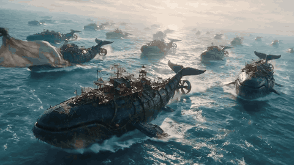</a>
</div>

##### 詳細

- **作者:** [@diffractstudio](https://x.com/diffractstudio)
- **出典:** [出典](https://x.com/diffractstudio/status/2075029719490195858)
- **公開日:** 2026年7月9日
- **言語:** en

**[このプロンプトを使う · ImagineVid](https://imaginevid.io/ja/seedream-5-pro)**

---

<a id="prompt-91"></a>

#### No. 94: Ethereal librarian on a frozen lake


##### 説明

A concise public Seedream 5.0 Pro prompt combining a surreal literary subject, frozen landscape, restrained palette, and oil-painted cinematic light.

##### プロンプト

```
Ethereal librarian in flowing velvet robes wandering across a cracked, translucent frozen lake. Ancient, glowing books float mid-air like frozen birds. Surreal cinematic lighting, dark teal and silver palette, oil painting style.
```

##### 生成画像

<table>
<tr>
<td width="100%" valign="top" align="center"></td>
</tr>
</table>

##### 詳細

- **作者:** [@Zubnet](https://x.com/Zubnet)
- **出典:** [出典](https://x.com/Zubnet/status/2075295691652415799)
- **公開日:** 2026年7月9日
- **言語:** en

**[このプロンプトを使う · ImagineVid](https://imaginevid.io/ja/seedream-5-pro)**

---

<a id="prompt-89"></a>

#### No. 95: Knight beneath a colossal stone sentinel


##### 説明

An original public Seedream 5 Pro prompt shared in an X reply, built for oppressive scale, dark-fantasy architecture, and high-contrast cinematic lighting.

##### プロンプト

```
ASPECT RATIO: 16:9

RENDER ENGINE: Unreal Engine 5.4 (Path-Traced, 8K Resolution)

CINEMATIC STYLE: Dark Fantasy, Melancholic Grandeur, High-Contrast Chiaroscuro

An extreme low-angle, compositionally oppressive shot looking up from behind a battle-worn knight toward a colossal, mountain-sized Stone Sentinel.

The Knight: Positioned in the lower-third, slightly off-center-left, back to the camera. Wearing intricately detailed, battle-scarred plate armor of blackened steel and tarnished silver filigree. A tattered, ash-stained royal blue surcoat clings to his shoulders, fraying into threads. He rests both hands on the pommel of a massive, notched greatsword planted deep into the cracked, flagstone earth.

The Colossal Stone Giant: A monolithic entity of basalt and decaying marble, towering three hundred feet into the bruised, twilight sky. Its body is designed like gothic architecture; its ribcage resembles flying buttresses, and its shoulders are overgrown with weeping golden moss and petrified roots. Its head is a featureless, cracked stone monolith, with a single vertical crevice glowing with a cold, dying cosmic gold light.

The Environment: A ruined cathedral plaza of colossal proportions, half-buried in volcanic ash. In the background, the skeletal remains of a mountain-sized gothic archway frame a bruised, crimson-and-charcoal sky. Thick, low-hanging volumetric fog pools around the giant's massive, pillar-like legs.

Lighting and Color: High-contrast chiaroscuro. Strong, directional cold moonlight hits the right side of the giant, while the glowing gold from its face casts a warm, melancholic amber hue onto the wet, reflective armor of the knight below. Cinematic film grain, sub-surface scattering on the moss, and highly detailed dust motes suspended in the air.
```

##### 生成画像

<table>
<tr>
<td width="100%" valign="top" align="center"></td>
</tr>
</table>

##### 詳細

- **作者:** [@itsPixieVerse](https://x.com/itsPixieVerse)
- **出典:** [出典](https://x.com/itsPixieVerse/status/2075253671177404932)
- **公開日:** 2026年7月9日
- **言語:** en

**[このプロンプトを使う · ImagineVid](https://imaginevid.io/ja/seedream-5-pro)**

---

<a id="prompt-112"></a>

#### No. 96: Impossible-scale cinematic sci-fi worldbuilding set


##### 説明

A source-backed demo from the original public X post, demonstrating impossible-scale cinematic sci-fi worldbuilding set.

##### プロンプト

```
Prompt 1:
An industrial civilization is constructing an entire planet inside an enormous orbital shipyard. Giant robotic arms hold continents in place while molten oceans are poured into gigantic basins. Thousands of spacecraft weld mountain ranges together. The unfinished world glows from its molten core. Unreal scale, NASA realism, cinematic science fiction.

Prompt 2:
Gigantic floating whales drift above endless wheat fields while enormous wind-powered harvesting machines extend hundreds of meters into the sky to collect glowing crystals that grow beneath the creatures. Farmers below appear tiny. Warm sunset, golden dust, beautiful atmospheric perspective, ultra-realistic, cinematic masterpiece.

Prompt 3:
A massive ocean wave nearly one kilometer high has frozen in time just before crashing into a coastal city. Emergency helicopters fly through tunnels inside the transparent wall of water. Every droplet is perfectly suspended. Cold blue lighting mixed with sunrise reflections, photorealistic, impossible but believable physics.

Prompt 4:
A mountain village built on impossibly tall stone pillars extends far above Earth's weather. Massive thunderstorms rage thousands of meters below while peaceful gardens, waterfalls and wooden bridges sit in bright sunshine above the clouds. Eagles glide beneath the village instead of above it. Ultra realistic, breathtaking scale.
```

##### 生成画像

<table>
<tr>
<td width="25%" valign="top" align="center"></td>
<td width="25%" valign="top" align="center"></td>
<td width="25%" valign="top" align="center"></td>
<td width="25%" valign="top" align="center"></td>
</tr>
</table>

##### 詳細

- **作者:** [@AllaAisling](https://x.com/AllaAisling)
- **出典:** [出典](https://x.com/AllaAisling/status/2075036565147906511)
- **公開日:** 2026年7月9日
- **言語:** en

**[このプロンプトを使う · ImagineVid](https://imaginevid.io/ja/seedream-5-pro)**

---

<a id="prompt-109"></a>

#### No. 97: Solar-powered desert research station concept


##### 説明

A source-backed demo from the original public X post, demonstrating solar-powered desert research station concept.

##### プロンプト

```
A solar-powered research station in a desert, featuring domed structures, solar panels, and various equipment for energy and research management.
```

##### 生成画像

<table>
<tr>
<td width="100%" valign="top" align="center"></td>
</tr>
</table>

##### 詳細

- **作者:** [@ashen_one](https://x.com/ashen_one)
- **出典:** [出典](https://x.com/ashen_one/status/2074915677815886071)
- **公開日:** 2026年7月8日
- **言語:** en

**[このプロンプトを使う · ImagineVid](https://imaginevid.io/ja/seedream-5-pro)**

---

<a id="prompt-125"></a>

#### No. 98: Bedroom design variations for MBTI types


##### 説明

A source-backed demo from the original public X post, demonstrating bedroom design variations for mbti types.

##### プロンプト

```
design a bedroom for each MBTI type
```

##### 生成画像

<table>
<tr>
<td width="25%" valign="top" align="center"></td>
<td width="25%" valign="top" align="center"></td>
<td width="25%" valign="top" align="center"></td>
<td width="25%" valign="top" align="center"></td>
</tr>
</table>

##### 詳細

- **作者:** [@FloraTechAI](https://x.com/FloraTechAI)
- **出典:** [出典](https://x.com/FloraTechAI/status/2074866317484794131)
- **公開日:** 2026年7月8日
- **言語:** en

**[このプロンプトを使う · ImagineVid](https://imaginevid.io/ja/seedream-5-pro)**

---

<a id="workflow-benchmarks-model-comparisons"></a>

### ベンチマークとモデル比較 (21)

Controlled tests and comparisons used to evaluate prompt following, editing behavior, consistency, typography, or visual quality.

**Community · 注目プロンプト**

- [Futuristic sports car blueprint board](#prompt-17)

<a id="prompt-4"></a>

#### No. 99: Avant-garde streetwear creator sheet


##### 説明

A character design sheet pattern, normalized from a public X comparison post, useful for full-body turnaround, techwear, and studio render tests.

##### プロンプト

```
Design a full-body character sheet for a male creator in avant-garde streetwear. Build the look around an oversized asymmetrical matte-black tech jacket, dark turtleneck, tactical cargo trousers with hardware straps, chunky futuristic shoes, geometric tinted smart glasses, and a small neon-green piping accent. Place the figure on a minimal ash-grey studio background. Use high-contrast cinematic lighting, sleek editorial styling, clean turnaround readability, ultra-detailed materials, and a 16:9 composition.
```

##### 生成画像

<table>
<tr>
<td width="25%" valign="top" align="center"></td>
<td width="25%" valign="top" align="center"></td>
<td width="25%" valign="top" align="center"></td>
<td width="25%" valign="top" align="center"></td>
</tr>
</table>

##### 詳細

- **作者:** [@Boluwatifeolad7](https://x.com/Boluwatifeolad7)
- **出典:** [出典](https://x.com/Boluwatifeolad7/status/2075191098184442310)
- **公開日:** 2026年7月9日
- **言語:** en

**[このプロンプトを使う · ImagineVid](https://imaginevid.io/ja/seedream-5-pro)**

---

<a id="prompt-6"></a>

#### No. 100: Maldives tropical paradise visual


##### 説明

A travel-poster visual pattern, normalized from public image ALT text, for clean composition, water clarity, and destination-brand mood.

##### プロンプト

```
Create an exotic tropical travel visual of the Maldives with crystal-clear turquoise water, clean white sand, vivid coral reef color beneath the surface, and a calm luxury-resort atmosphere. Keep the image bright, polished, and tranquil, with a wide composition that can work as a destination campaign banner. Preserve natural water texture, crisp sunlight, and a premium editorial finish.
```

<details>
<summary>関連プロンプトのバリエーション (1)</summary>

**Original Maldives travel-poster prompt**

```
With its crystal-clear waters, white sandy beaches, and vibrant coral reefs, the Maldives is a tropical paradise perfect for exotic and tranquil visuals. SIGNATURE: 'BicRevelation' cursive script lower-left.
```

作者: [@Bic_Revelation](https://x.com/Bic_Revelation)

出典: [出典](https://x.com/Bic_Revelation/status/2074959714366922857)

</details>

##### 生成画像

<table>
<tr>
<td width="50%" valign="top" align="center"></td>
<td width="50%" valign="top" align="center"></td>
</tr>
</table>

##### 詳細

- **作者:** [@Bic_Revelation](https://x.com/Bic_Revelation)
- **出典:** [出典](https://x.com/Bic_Revelation/status/2074959714366922857)
- **公開日:** 2026年7月8日
- **言語:** en

**[このプロンプトを使う · ImagineVid](https://imaginevid.io/ja/seedream-5-pro)**

---

<a id="prompt-53"></a>

#### No. 101: Makeup identity-preservation comparison


##### 説明

A reference-editing workflow normalized from a public Seedream 5.0 Pro makeup comparison post.

##### プロンプト

```
Use the uploaded portrait as the identity anchor. Change only the makeup: add refined glitter eye detail, clean skin highlights, and a more polished beauty look while preserving facial geometry, expression, age, skin texture, lighting direction, and camera angle. Avoid changing the person into a different face.
```

##### 生成画像

<table>
<tr>
<td width="25%" valign="top" align="center"></td>
<td width="25%" valign="top" align="center"></td>
<td width="25%" valign="top" align="center"></td>
<td width="25%" valign="top" align="center"></td>
</tr>
</table>

##### 詳細

- **作者:** [@SeharShinwari](https://x.com/SeharShinwari)
- **出典:** [出典](https://x.com/SeharShinwari/status/2074879382326526377)
- **公開日:** 2026年7月8日
- **言語:** en

**[このプロンプトを使う · ImagineVid](https://imaginevid.io/ja/seedream-5-pro)**

---

<a id="prompt-133"></a>

#### No. 102: Four Symbols macro eye poster comparison


##### 説明

A Chinese public comparison prompt translated and localized into English, preserving the Four Symbols art direction while avoiding Chinese prompt text.

##### プロンプト

```
Use the uploaded close-up eye reference as the only reference for the person's eye identity. Create a 3:4 four-panel Eastern fantasy art portrait focused on the eyes. Each panel represents one of the Four Symbols: Qinglong, Zhuque, Baihu, and Xuanwu. Overall style: Eastern mythological beauty, luxury makeup advertising, surreal art photography. Preserve realistic human eye anatomy, macro photographic detail, natural skin texture, fine eyelashes, delicate eye makeup, and the same eye shape. All four panels must keep the same identity, angle, and composition.

Panel 1: Qinglong, spring awakening. The iris is jade-green, like a natural Eastern gemstone. Inside the iris, hide a miniature landscape with Qinglong coiling through mist, bamboo, peach blossoms, and flowing water. Transform the eyelashes into slender bamboo leaves and blue-green feather textures, with tiny peach petals near the corner of the eye. Add a gentle spring glow and green light around the eye. Place the Latin label "Qinglong" in translucent white seal-style lettering. Palette: elegant green, airy, alive.

Panel 2: Zhuque, blazing summer. The iris is red-gold amber. Inside the iris, create a small phoenix world: Zhuque spreads its wings through golden flame, phoenix feathers, and sunset clouds. Give the eyelashes subtle flame-feather texture, with small golden feathers near the eye corner. Light the skin with warm gold illumination for a premium jewelry-campaign feel. Place the Latin label "Zhuque" in translucent white-gold seal-style lettering. Palette: red and gold, ornate, passionate, sacred.

Panel 3: Baihu, autumn severity. The iris is golden amber. Inside the iris, create an Eastern autumn forest with Baihu hidden among golden trees, maple leaves, ancient trunks, and drifting dust. Blend white tiger-stripe texture and autumn leaf motifs into the eyelashes, with faint silver-white markings around the brow. Use sunset light through the forest for cinematic warmth. Place the Latin label "Baihu" in translucent white ink-style lettering. Palette: gold, silver-white, deep brown, mysterious and noble.

Panel 4: Xuanwu, frozen mystic realm. The iris is ice-blue crystal. Inside the iris, create an Eastern snow world with Xuanwu sleeping among glaciers, a frozen lake, snow mountains, ice crystals, and cold mist. Cover the eyelashes with transparent ice-crystal texture and add tiny snowflakes with silver light at the eye corner. Use cold blue moonlight for an ice-goddess luxury visual. Place the Latin label "Xuanwu" in translucent white calligraphic lettering. Palette: ice blue and silver-white, cold, pure, ethereal.

Unified requirements: arrange all four panels neatly like a high-end art exhibition poster. Use a minimal Eastern negative-space background with faint ink texture, mist, and metallic embossed detail. Typography should feel like traditional seal engraving rendered in white translucent Latin labels, never modern commercial type. Photography style: macro eye photography, ultra-realistic skin texture, cinematic lighting, luxury beauty campaign, 8K detail, high-fashion editorial. Avoid cartoon style, anime eyes, distorted eyeballs, low-quality CG, plastic skin, wrong text, and extra eyes.
```

##### 生成画像

<table>
<tr>
<td width="50%" valign="top" align="center"></td>
<td width="50%" valign="top" align="center"></td>
</tr>
</table>

##### 詳細

- **作者:** [@Chengzilhy](https://x.com/Chengzilhy)
- **出典:** [出典](https://x.com/Chengzilhy/status/2075462701887930745)
- **公開日:** 2026年7月10日
- **言語:** en

**[このプロンプトを使う · ImagineVid](https://imaginevid.io/ja/seedream-5-pro)**

---

<a id="prompt-76"></a>

#### No. 103: Sepia documentary portrait study


##### 説明

A public Krea multi-model Seedream 5.0 Pro comparison with prompt details preserved from ALT text for a vintage documentary portrait workflow.

##### プロンプト

```
A sepia-toned vintage portrait of a middle-aged man with wind-tousled light hair and round wire-rimmed glasses, wearing a worn white button-down shirt with sleeves rolled to the elbows. He leans forward on a rough wooden railing, arms crossed, his weathered face turned slightly to the left with a distant pensive gaze. The background is swallowed by deep velvety darkness with only a faint warm glow from upper left hinting at an unseen light source. The entire image bears the patina of age: heavy grain, faded sepia chemistry, slightly uneven tonality, soft focus at the edges, and the textured feel of an old silver gelatin print or newspaper photograph. Exhaustion and quiet resilience etched into his features. Memory-like realism, not staged, documentary quality. No border, no frame, no margins, no white space. Aspect ratio 1:1.
```

##### 生成画像

<table>
<tr>
<td width="25%" valign="top" align="center"></td>
<td width="25%" valign="top" align="center"></td>
<td width="25%" valign="top" align="center"></td>
<td width="25%" valign="top" align="center"></td>
</tr>
</table>

##### 詳細

- **作者:** [@Chain_Loader](https://x.com/Chain_Loader)
- **出典:** [出典](https://x.com/Chain_Loader/status/2075251821342503352)
- **公開日:** 2026年7月9日
- **言語:** en

**[このプロンプトを使う · ImagineVid](https://imaginevid.io/ja/seedream-5-pro)**

---

<a id="prompt-99"></a>

#### No. 104: Minimal painting replacement iteration test


##### 説明

A public three-model editing comparison using the same intentionally minimal instruction to measure how quickly repeated edits drift from the source.

##### プロンプト

```
Change the painting.
```

<div align="center">
<a href="https://video.twimg.com/amplify_video/2075226893171793920/vid/avc1/1552x656/xkovrTxbvOg2mk9R.mp4?tag=28">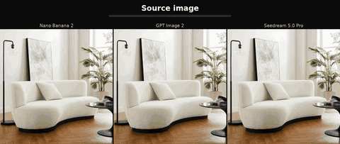</a>
</div>

##### 詳細

- **作者:** [@abdoul94_](https://x.com/abdoul94_)
- **出典:** [出典](https://x.com/abdoul94_/status/2075229273179279409)
- **公開日:** 2026年7月9日
- **言語:** en

**[このプロンプトを使う · ImagineVid](https://imaginevid.io/ja/seedream-5-pro)**

---

<a id="prompt-83"></a>

#### No. 105: Afternoon street portrait prompt


##### 説明

A public Chinese same-prompt comparison between GPT Image 2 and Seedream 5.0 Pro, preserving the detailed street-photography prompt for reuse.

##### プロンプト

```
主体：一位25岁左右的中国女性，鹅蛋脸，黑色及肩微卷长发被风吹起几缕，穿米白色 oversized 西装外套内搭黑色吊带，锁骨清晰。
动作与姿态：走在人行道上被镜头抓拍的瞬间，一只手轻拨耳边碎发，身体微微侧转，步伐自然。
表情与视线：不经意间瞥向镜头的瞬间，嘴角似笑非笑，眼神松弛真实。
场景环境：下午四点的城市街头，梧桐树影落在人行道上，背景是虚化的咖啡店橱窗和路人。
镜头：中景，85mm 镜头，浅景深，主体位于画面右三分之一，前景有虚化树叶。
光线：午后侧逆光勾勒发丝金边，树影在脸上形成斑驳光斑，自然柔和。
风格：写实街拍摄影，富士胶片色调，轻微颗粒感。
材质细节：可见皮肤毛孔和自然肤质，西装面料的编织纹理，发丝根根分明。
约束：无文字水印，无畸形手指，避免过度磨皮的塑料感皮肤。
```

##### 生成画像

<table>
<tr>
<td width="50%" valign="top" align="center"></td>
<td width="50%" valign="top" align="center"></td>
</tr>
</table>

##### 詳細

- **作者:** [@johnAGI168](https://x.com/johnAGI168)
- **出典:** [出典](https://x.com/johnAGI168/status/2075228822887157932)
- **公開日:** 2026年7月9日
- **言語:** zh

**[このプロンプトを使う · ImagineVid](https://imaginevid.io/ja/seedream-5-pro)**

---

<a id="prompt-84"></a>

#### No. 106: Old-money creator turnaround sheet


##### 説明

A public multi-model character-design comparison using Seedream 5 Pro, preserving the full-body turnaround prompt for fashion-character workflows.

##### プロンプト

```
Character design sheet, full body turnaround, 23-year-old tall lean male creator, old money superstar aesthetic, royal and exquisite vibe. Wearing an extravagant, oversized long fur coat in arctic white and rich brown. Underneath the coat, a minimalist tailored matte charcoal turtleneck and dark ash trousers. Vintage gold-rimmed tinted aviator glasses, heavy gold signet ring. Confident, effortless posture. Set against a minimalist ash-grey studio background. High contrast, cinematic lighting, ultra-detailed luxury fashion, 8k, photorealistic --ar 16:9
```

##### 生成画像

<table>
<tr>
<td width="25%" valign="top" align="center"></td>
<td width="25%" valign="top" align="center"></td>
<td width="25%" valign="top" align="center"></td>
<td width="25%" valign="top" align="center"></td>
</tr>
</table>

##### 詳細

- **作者:** [@Boluwatifeolad7](https://x.com/Boluwatifeolad7)
- **出典:** [出典](https://x.com/Boluwatifeolad7/status/2075228499653079138)
- **公開日:** 2026年7月9日
- **言語:** en

**[このプロンプトを使う · ImagineVid](https://imaginevid.io/ja/seedream-5-pro)**

---

<a id="prompt-86"></a>

#### No. 107: Same-prompt model comparison triptych


##### 説明

A public Chinese post comparing Seedream 5.0 Pro, GPT Image 2, and Midjourney V8.1, normalized into a controlled comparison-board prompt.

##### プロンプト

```
Create a clean three-panel comparison board for the same visual prompt across three image models. Panel one is labeled "Seedream 5.0 Pro", panel two "GPT Image 2", and panel three "Midjourney V8.1". Use the same subject, framing, lighting, and color palette in every panel so differences in detail, typography, and realism are easy to inspect. Keep labels crisp, the grid balanced, and the background neutral like a professional benchmark slide.
```

##### 生成画像

<table>
<tr>
<td width="33%" valign="top" align="center"></td>
<td width="33%" valign="top" align="center"></td>
<td width="33%" valign="top" align="center"></td>
</tr>
</table>

##### 詳細

- **作者:** [@lukfan](https://x.com/lukfan)
- **出典:** [出典](https://x.com/lukfan/status/2075219606617346357)
- **公開日:** 2026年7月9日
- **言語:** zh

**[このプロンプトを使う · ImagineVid](https://imaginevid.io/ja/seedream-5-pro)**

---

<a id="prompt-93"></a>

#### No. 108: 1990s Andalusian home-video still


##### 説明

A public same-prompt Seedream 5 Pro comparison prompt recreating the imperfect exposure, tape texture, and unpolished framing of a 1990s Spanish home video.

##### プロンプト

```
1990s Spain home video still frame, consumer camcorder (Hi8 / VHS-C), whitewashed Andalusian village street at siesta hour, handheld casual framing, imperfect focus, auto exposure shift, VHS tape noise, interlaced video look, low resolution, faded warm colors, overexposed sunlit walls and deep shade mixed lighting, dry dusty afternoon atmosphere, raw documentary footage look, unpolished realism, no cinematic grading, no stylization, no text, no watermark. Old woman in a dark housecoat sitting on a wooden chair beside her doorway in the shade, a dog lying on the ground at her feet, long shadows down the empty street, unaware of the camera, neutral mood.
```

##### 生成画像

<table>
<tr>
<td width="100%" valign="top" align="center"></td>
</tr>
</table>

##### 詳細

- **作者:** [@magnific](https://x.com/magnific)
- **出典:** [出典](https://x.com/magnific/status/2075103712448831774)
- **公開日:** 2026年7月9日
- **言語:** en

**[このプロンプトを使う · ImagineVid](https://imaginevid.io/ja/seedream-5-pro)**

---

<a id="prompt-110"></a>

#### No. 109: Reference-image camera-angle change comparison


##### 説明

A source-backed evaluation from the original public X post, demonstrating reference-image camera-angle change comparison.

##### プロンプト

```
リファレンス画像のスタイルを保ったまま、もう少し高い位置からの画角に変更してもらいました。
```

##### 生成画像

<table>
<tr>
<td width="25%" valign="top" align="center"></td>
<td width="25%" valign="top" align="center"></td>
<td width="25%" valign="top" align="center"></td>
<td width="25%" valign="top" align="center"></td>
</tr>
</table>

##### 詳細

- **作者:** [@hasamaru_studio](https://x.com/hasamaru_studio)
- **出典:** [出典](https://x.com/hasamaru_studio/status/2075052934409375918)
- **公開日:** 2026年7月9日
- **言語:** ja-JP

**[このプロンプトを使う · ImagineVid](https://imaginevid.io/ja/seedream-5-pro)**

---

<a id="prompt-128"></a>

#### No. 110: Lake Como fashion scene comparison against Banana Pro


##### 説明

A source-backed evaluation from the original public X post, demonstrating lake como fashion scene comparison against banana pro.

##### プロンプト

```
A straight-on medium-wide cinematic shot at eye-level, static locked frame, 4:5 vertical, captures a sun-bright late-morning inside a Lake Como villa courtyard room, camera perpendicular to the wall plane with no tilt, the atmosphere crisp and alive like the minute before heading out for gelato, the wall behind the scene a warm hand-troweled sable butter-yellow lime plaster slightly uneven with soft sun-bleach along the upper right edge, the floor matte burnt-terracotta chili tile grounding the frame, grout lines aged and dusty.

Centered lower in the frame, a fully restored 1965 Vespa Primavera in glossy melon-orange lacquer parked on its side stand parallel to the camera, full profile visible, polished chrome Vespa badge on the legshield catching light, round chrome headlamp glinting, chrome handlebars and mirrors, aged cognac brown leather saddle, a silk twill scarf in marine navy, chili orange, cream and cognac pattern loosely tied around the right handlebar with tails cascading down, a small wicker basket bag on the left handlebar spilling a baguette and green grapes.

The subject is a stunning World Cup beauty in her mid-twenties, with radiant sun-kissed skin and natural healthy glow, long silky dark chestnut brown hair loosely pulled into a soft low bun with gentle face-framing waves, striking hazel eyes with bright lively spark looking directly into the camera, high cheekbones, full lips in a soft warm cognac-rose shade with corners gently lifted in quiet joy. She is seated sideways on the Vespa saddle, body in a bright open three-quarter twist toward the camera, both legs crossed at the ankles on the same side, knees angled toward the lens, one hand resting lightly on the chrome handlebar, the other arm relaxed behind her on the rear of the saddle. Shoulders open and relaxed, natural breathing pose.

She wears a fitted cream football jersey with subtle gold embroidery and thin spaghetti straps, tucked into a flowing cream bias-cut midi skirt that falls mid-calf, a slim cognac leather belt at the waist, flat cognac leather Roman sandals with ankle ties, stack of thin gold bangles on one wrist, delicate gold chain with small gold-and-coral pendant, small gold hoop earrings. Miu Miu oval sunglasses with thin gold frames and warm cognac lenses pushed up on her head. A cream quilted Miu Miu matelassé crossbody bag with gold chain slung across her torso.

Natural skin texture with soft luminosity, gentle sheen on nose and lips, crisp morning sunlight, cinematic color grading, highly detailed, photorealistic, Slim Aarons style with modern World Cup energy.
```

##### 生成画像

<table>
<tr>
<td width="50%" valign="top" align="center"></td>
<td width="50%" valign="top" align="center"></td>
</tr>
</table>

##### 詳細

- **作者:** [@cso6709](https://x.com/cso6709)
- **出典:** [出典](https://x.com/cso6709/status/2075046425277399261)
- **公開日:** 2026年7月9日
- **言語:** en

**[このプロンプトを使う · ImagineVid](https://imaginevid.io/ja/seedream-5-pro)**

---

<a id="prompt-127"></a>

#### No. 111: Fantasy village watermill comparison against GPT Image 2


##### 説明

A source-backed evaluation from the original public X post, demonstrating fantasy village watermill comparison against gpt image 2.

##### プロンプト

```
stylized stylized fantasy village watermill, two-story half-timbered red-clay tower w/ thatched conical roof, big wooden water-wheel, attached small thatched cottage, wooden walkways and stairs, lush green meadow w/ stones, painterly Genshin-Impact / Studio Ghibli env art, fluffy cumulus clouds, sunny midday
```

##### 生成画像

<table>
<tr>
<td width="50%" valign="top" align="center"></td>
<td width="50%" valign="top" align="center"></td>
</tr>
</table>

##### 詳細

- **作者:** [@emmanuel_2m](https://x.com/emmanuel_2m)
- **出典:** [出典](https://x.com/emmanuel_2m/status/2075000114427375742)
- **公開日:** 2026年7月8日
- **言語:** en

**[このプロンプトを使う · ImagineVid](https://imaginevid.io/ja/seedream-5-pro)**

---

<a id="prompt-111"></a>

#### No. 112: Oversized beverage-can advertising composition comparison


##### 説明

A source-backed evaluation from the original public X post, demonstrating oversized beverage-can advertising composition comparison.

##### プロンプト

```
A premium infographic-style advertisement featuring an oversized Pepsi can placed beside a young woman. The can is scaled to be nearly the same size as her entire seated body, creating a striking surreal proportion. The woman sits casually leaning against the giant can, one arm resting on it, interacting naturally. The Pepsi can is ultra-detailed with crisp branding, condensation droplets, realistic reflections, and metallic texture. The logo is clean, sharp, and properly proportioned. Composition is modern and minimal, set in a clean studio with a soft gradient background. Subtle infographic-style annotation lines highlight features like 'refreshment', 'carbonation', 'chilled texture'. Lighting is soft studio with controlled highlights. The model wears minimal contemporary clothing that complements the red white and blue tones of the can. Color grading crisp and slightly vibrant, commercial ad aesthetic. High-end product infographic, commercial beverage advertisement, ultra high resolution, 4K, photorealistic.
```

##### 生成画像

<table>
<tr>
<td width="50%" valign="top" align="center"></td>
<td width="50%" valign="top" align="center"></td>
</tr>
</table>

##### 詳細

- **作者:** [@emmanuel_2m](https://x.com/emmanuel_2m)
- **出典:** [出典](https://x.com/emmanuel_2m/status/2075000101362131350)
- **公開日:** 2026年7月8日
- **言語:** en

**[このプロンプトを使う · ImagineVid](https://imaginevid.io/ja/seedream-5-pro)**

---

<a id="prompt-96"></a>

#### No. 113: Bedroom mirror-selfie influencer portrait


##### 説明

A public same-prompt comparison retested with Seedream 5.0 Pro, specifying pose, wardrobe, accessories, room props, and natural smartphone photography.

##### プロンプト

```
Subject and Pose: Young woman taking a mirror selfie in a bedroom, standing in front of a bed, holding a phone in her right hand at chest level, her left hand holding an iced drink near her lips while sipping through a straw, relaxed casual pose, slight head tilt.

Clothing: Fitted cream off-white ribbed knit tank top with thin straps and low scoop neckline, light-wash high-waisted straight-leg denim jeans, showing a small strip of midriff.

Accessories: Olive green New York Yankees baseball cap worn forward, silver over-ear headphones worn over the cap, large chunky gold hoop earrings, delicate gold cross pendant necklace, multiple gold rings, and stacked gold bangle bracelets on both wrists.

Items: iPhone with pink floral rose-pattern phone case, iced matcha green tea latte in a clear plastic cup with dark green straw.

Hair and Makeup: Long brown wavy hair flowing past the shoulders, natural glam makeup, nude lip.

Background: Minimalist white bedroom, white textured bedding, black woven leather shoulder bag lying on the bed, distressed white vintage nightstand with a white ceramic lamp, and a glimpse of a leopard-print pillow.

Technical: Soft diffused natural window lighting, warm color tones, vertical 9:16 aspect ratio, lifestyle photography, influencer aesthetic, high resolution, shot on iPhone, realistic skin texture.
```

##### 生成画像

<table>
<tr>
<td width="100%" valign="top" align="center"></td>
</tr>
</table>

##### 詳細

- **作者:** [@Arminn_Ai](https://x.com/Arminn_Ai)
- **出典:** [出典](https://x.com/Arminn_Ai/status/2074959192096457130)
- **公開日:** 2026年7月8日
- **言語:** en

**[このプロンプトを使う · ImagineVid](https://imaginevid.io/ja/seedream-5-pro)**

---

<a id="prompt-107"></a>

#### No. 114: Seedream vs GPT Image 2 for clean lifestyle portrait styling


##### 説明

A source-backed evaluation from the original public X post, demonstrating seedream vs gpt image 2 for clean lifestyle portrait styling.

##### プロンプト

```
摄影风格：冷白清透CCD生活照风 写真方向：轻熟生活照 场景方向：酒店泳池外步道 / 白色躺椅 / 浅蓝池水 / 简洁遮阳伞 服装方向：浅鼠尾草色修身无袖针织短裙 气质标签：温柔、清透、轻熟、安静、有吸引力 五官方向：真实清透自然脸，安静干净，不网红 五官细节：柔和鹅蛋脸，面部轮廓自然；清亮杏眼，眼神温柔安静；鼻型流畅小巧；唇形柔软克制，低饱和裸粉唇色；整体是安静、通透、舒服的生活感美人脸 发型方向：自然黑长发或低扎发，发丝顺滑，额前少量碎发，带一点微风感 身形方向：轻盈纤细，上围饱满自然 线条强调：强 镜头方向：大腿及上半身 姿态动作：站在泳池步道边，身体轻微侧向镜头，一只手自然垂落，另一只手轻扶裙侧 光线氛围：高色温晴天自然光 + 水面反射光 + 冷白极弱柔闪 滤镜效果：冷白高光 + 蓝白清透生活照色彩 + 轻颗粒 + 轻数码噪点 + 轻微过曝 画幅比例：9:16 补充要求：连衣裙贴身柔软，突出胸部轮廓、腰线和整体修长感，人物五官要安静耐看，整体要冷白清爽，不要商业泳池大片感
```

##### 生成画像

<table>
<tr>
<td width="50%" valign="top" align="center"></td>
<td width="50%" valign="top" align="center"></td>
</tr>
</table>

##### 詳細

- **作者:** [@liyue_ai](https://x.com/liyue_ai)
- **出典:** [出典](https://x.com/liyue_ai/status/2074890690686005590)
- **公開日:** 2026年7月8日
- **言語:** zh

**[このプロンプトを使う · ImagineVid](https://imaginevid.io/ja/seedream-5-pro)**

---

<a id="prompt-116"></a>

#### No. 115: Anime key-visual comparison


##### 説明

A source-backed evaluation from the original public X post, demonstrating anime key-visual comparison.

##### プロンプト

```
新作アニメのキービジュアルを作って下さい
```

##### 生成画像

<table>
<tr>
<td width="100%" valign="top" align="center"></td>
</tr>
</table>

##### 詳細

- **作者:** [@roco_kn_roco](https://x.com/roco_kn_roco)
- **出典:** [出典](https://x.com/roco_kn_roco/status/2074890020260094137)
- **公開日:** 2026年7月8日
- **言語:** ja-JP

**[このプロンプトを使う · ImagineVid](https://imaginevid.io/ja/seedream-5-pro)**

---

<a id="prompt-115"></a>

#### No. 116: Chengdu travel scrapbook poster comparison


##### 説明

A source-backed evaluation from the original public X post, demonstrating chengdu travel scrapbook poster comparison.

##### プロンプト

```
成都旅游 · 小红书手帐风海报

一张竖版 9:16 的小红书风格拼贴海报，主题为**「成都旅游城市漫游计划」**。整体采用手帐风设计，像旅行日记一样丰富、有生活感和轻松氛围。

画面以成都城市旅行为核心内容，包含宽窄巷子、锦里古街、春熙路、IFS熊猫、成都大熊猫繁育研究基地、东郊记忆、都江堰、青城山等真实场景照片，以拼贴方式散落在画面中，搭配撕纸边框与胶带装饰。画面中穿插熊猫元素、茶馆、人民公园、盖碗茶、街头巷尾、夜市、美食街、城市天际线等真实旅行场景，充分展现成都悠闲惬意的慢生活氛围。

整体视觉使用天蓝色作为主色调，并点缀粉色、浅黄色与柔和绿色，营造清新明亮又富有烟火气的城市旅行氛围。

画面中加入大量手帐元素，例如手绘箭头、涂鸦星星、对话气泡、便签标签、贴纸装饰、旅行地图、定位图标、拍立得照片、胶带、旅行印章、熊猫贴纸、相机、咖啡杯、小花、云朵、笑脸图标等，使画面具有强烈的小红书「种草笔记」视觉风格。

主标题为**「成都达人计划 / Chengdu City Guide」，采用手写感或涂鸦字体，具有明显的年轻化社交媒体风格。画面中穿插中英文混排文字，如「City Walk Chengdu」「探索成都旅行路线」「熊猫打卡推荐」「成都美食地图」「Travel Notes」「Weekend Trip」**等，增强旅行攻略的真实感。

局部可以加入旅行时间标签**「最佳旅行时间：3月～6月｜9月～11月」**，做成便签或贴纸形式，增强真实旅行计划感。

画面中还可加入成都火锅、串串香、担担面、钟水饺、兔头、盖碗茶等特色美食照片，以拼贴方式自然分布在画面四周，与景点照片共同构成丰富的旅行内容。

整体构图为非对称拼贴布局，中心突出成都城市主题，但四周元素丰富散落，呈现出活泼、松弛、像真实旅行手帐一样的视觉体验，适合小红书旅行种草海报风格。
```

##### 生成画像

<table>
<tr>
<td width="50%" valign="top" align="center"></td>
<td width="50%" valign="top" align="center"></td>
</tr>
</table>

##### 詳細

- **作者:** [@DeepBlueAIX](https://x.com/DeepBlueAIX)
- **出典:** [出典](https://x.com/DeepBlueAIX/status/2074872447229419956)
- **公開日:** 2026年7月8日
- **言語:** zh

**[このプロンプトを使う · ImagineVid](https://imaginevid.io/ja/seedream-5-pro)**

---

<a id="prompt-97"></a>

#### No. 117: Seat-belted car selfie first frame


##### 説明

A detailed public Chinese same-prompt comparison for a realistic 16:9 in-car selfie, with explicit seat-belt state, camera placement, styling, and negative constraints.

##### プロンプト

```
生成一张真实感车内自拍视频首帧照片，横屏 16:9。画面像固定在副驾驶前方或中控台附近的小型广角相机拍摄，轻微广角，近距离车内第一视角，像社交媒体短视频截图。

主角是一位成年女性，气质清冷、安静、精致，整体像日常车内自拍视频里的主角。她脸型小巧偏鹅蛋脸，五官自然精致，鼻梁挺，嘴唇自然，表情平静、淡淡的，有一点冷感但不夸张。她正面面向镜头或略微看向前方，能清楚看到完整正脸，不低头，不侧脸。她戴细框透明或浅银色眼镜，长直发偏浅棕色，带轻微空气刘海，头发自然垂落在肩侧。穿简洁灰色无袖针织连衣裙或灰色无袖上衣搭配同色下装，造型干净日常、端庄自然。

她坐在驾驶位，安全带已经插好并固定完成：黑色安全带清楚地从肩膀斜跨过上身到腰侧，状态自然贴合身体，不是在拉安全带，也不是正在插卡扣。她一只手自然放在方向盘附近或轻扶方向盘，另一只手放低在座椅边或腿侧，姿态像准备开车前刚坐正的一瞬间。表情专注平静，眼神可以看向镜头，也可以略微看向前方道路。

车内是红棕色真皮座椅和红棕色门板，方向盘在画面右前方形成明显前景，仪表台、车窗边缘和后排座椅可见。车窗外是白天城市道路旁的绿化、树木和轻微模糊的街景，但车子此刻看起来还没有启动，背景相对静止。自然日光从车窗照进来，皮肤质感真实，头发有自然光泽。

整体风格：真实摄影，高质量手机或运动相机车内自拍视频首帧，清晰自然，轻微广角畸变，真实车内空间，社交媒体短视频质感，不像棚拍写真。

避免：低头、侧脸、正在插安全带、正在拉安全带、字幕、文字、水印、多余人物、夸张姿势、夸张摆拍、安全带消失、方向盘变形、手指畸形、眼镜变形、车内结构错乱、背景高速运动、夜景、动漫风、CG 感、塑料皮肤、过度美颜。
```

##### 生成画像

<table>
<tr>
<td width="100%" valign="top" align="center"></td>
</tr>
</table>

##### 詳細

- **作者:** [@johnAGI168](https://x.com/johnAGI168)
- **出典:** [出典](https://x.com/johnAGI168/status/2074870910469677387)
- **公開日:** 2026年7月8日
- **言語:** zh

**[このプロンプトを使う · ImagineVid](https://imaginevid.io/ja/seedream-5-pro)**

---

<a id="prompt-100"></a>

#### No. 118: Multi-task Seedream capability sampling from four Chinese prompts


##### 説明

A source-backed evaluation from the original public X post, demonstrating multi-task seedream capability sampling from four chinese prompts.

##### プロンプト

```
1. 一句话让它生成《黑神话：水浒传》的一个游戏截图 2. 让他生成一张茶叶制作和品种的科普图 3. 给它一个参考图，让它基于这个参考图的组件生成一个 Web 的 UI 设计稿 4. 让他用一张图介绍《凡人修仙传：人界篇》的剧情
```

##### 生成画像

<table>
<tr>
<td width="25%" valign="top" align="center"></td>
<td width="25%" valign="top" align="center"></td>
<td width="25%" valign="top" align="center"></td>
<td width="25%" valign="top" align="center"></td>
</tr>
</table>

##### 詳細

- **作者:** [@op7418](https://x.com/op7418)
- **出典:** [出典](https://x.com/op7418/status/2074862226905948549)
- **公開日:** 2026年7月8日
- **言語:** zh

**[このプロンプトを使う · ImagineVid](https://imaginevid.io/ja/seedream-5-pro)**

---

## 貢献方法

高品質なプロンプト投稿を GitHub Issues で歓迎しています。

### GitHub Issue

1. Click [**新しいプロンプトを投稿**](https://github.com/imaginevid-ai/Awesome-seedream-5-pro-prompts-and-skills/issues/new?template=submit-prompt.yml)
2. プロンプトの詳細と画像情報を入力
3. 送信してメンテナーの確認を待つ
4. 承認後、ローカルの構造化データに同期できます
5. README 生成ワークフロー実行後に表示されます

**注：** README の表示を揃えるため、投稿は構造化形式で管理しています。

詳しくは [CONTRIBUTING.md](docs/CONTRIBUTING.md) をご覧ください。

---

## ライセンス

[CC BY 4.0](https://creativecommons.org/licenses/by/4.0/) ライセンスです。

---

## 謝辞

- [ImagineVid](https://imaginevid.io)
<details>
<summary>コミュニティ作者への謝辞 (91)</summary>

[@_wib_](https://x.com/_wib_) · [@aaliya_va](https://x.com/aaliya_va) · [@abdoul94_](https://x.com/abdoul94_) · [@ahmetmertugrul](https://x.com/ahmetmertugrul) · [@AI__TSUBAKI](https://x.com/AI__TSUBAKI) · [@AiwithZohaib](https://x.com/AiwithZohaib) · [@al_tools43377](https://x.com/al_tools43377) · [@AllaAisling](https://x.com/AllaAisling)<br>
[@Arminn_Ai](https://x.com/Arminn_Ai) · [@asatoucan](https://x.com/asatoucan) · [@asheem01](https://x.com/asheem01) · [@ashen_one](https://x.com/ashen_one) · [@ayumi_t820](https://x.com/ayumi_t820) · [@aziz4ai](https://x.com/aziz4ai) · [@bdsqlsz](https://x.com/bdsqlsz) · [@Bic_Revelation](https://x.com/Bic_Revelation)<br>
[@bmx_ai13](https://x.com/bmx_ai13) · [@Boluwatifeolad7](https://x.com/Boluwatifeolad7) · [@BubbleBrain](https://x.com/BubbleBrain) · [@BytePlusGlobal](https://x.com/BytePlusGlobal) · [@capcutapp](https://x.com/capcutapp) · [@Chain_Loader](https://x.com/Chain_Loader) · [@characternexus](https://x.com/characternexus) · [@Chengzilhy](https://x.com/Chengzilhy)<br>
[@ChillaiKalan__](https://x.com/ChillaiKalan__) · [@Cia0_exe](https://x.com/Cia0_exe) · [@Ciri_ai](https://x.com/Ciri_ai) · [@ComfyUI](https://x.com/ComfyUI) · [@cso6709](https://x.com/cso6709) · [@DeepBlueAIX](https://x.com/DeepBlueAIX) · [@df_reno](https://x.com/df_reno) · [@diffractstudio](https://x.com/diffractstudio)<br>
[@Digitalwindai](https://x.com/Digitalwindai) · [@dreamydigiarts](https://x.com/dreamydigiarts) · [@Echoes999Y](https://x.com/Echoes999Y) · [@ElaraGrace_AI](https://x.com/ElaraGrace_AI) · [@emmanuel_2m](https://x.com/emmanuel_2m) · [@filodyprincess](https://x.com/filodyprincess) · [@FloraTechAI](https://x.com/FloraTechAI) · [@frametheory058](https://x.com/frametheory058)<br>
[@HarshBisen143](https://x.com/HarshBisen143) · [@haruuraeadss](https://x.com/haruuraeadss) · [@hasamaru_studio](https://x.com/hasamaru_studio) · [@heathergreen](https://x.com/heathergreen) · [@higginswerx](https://x.com/higginswerx) · [@iamrealsnow](https://x.com/iamrealsnow) · [@ItsMaryAI](https://x.com/ItsMaryAI) · [@itsPixieVerse](https://x.com/itsPixieVerse)<br>
[@JameFalken](https://x.com/JameFalken) · [@JennyAITech](https://x.com/JennyAITech) · [@johnAGI168](https://x.com/johnAGI168) · [@JossMonzoni](https://x.com/JossMonzoni) · [@karim_yourself](https://x.com/karim_yourself) · [@KishenArt](https://x.com/KishenArt) · [@krea_ai](https://x.com/krea_ai) · [@LiamEtherson](https://x.com/LiamEtherson)<br>
[@liyue_ai](https://x.com/liyue_ai) · [@lukfan](https://x.com/lukfan) · [@madpencil_](https://x.com/madpencil_) · [@magnific](https://x.com/magnific) · [@marmaduke091](https://x.com/marmaduke091) · [@mattworkman](https://x.com/mattworkman) · [@MishikaAI](https://x.com/MishikaAI) · [@munzxsdv](https://x.com/munzxsdv)<br>
[@noorwithwifi](https://x.com/noorwithwifi) · [@op7418](https://x.com/op7418) · [@OpenDesignHQ](https://x.com/OpenDesignHQ) · [@Photonotix16](https://x.com/Photonotix16) · [@renataro9](https://x.com/renataro9) · [@renoiseai](https://x.com/renoiseai) · [@roco_kn_roco](https://x.com/roco_kn_roco) · [@rovvmut_](https://x.com/rovvmut_)<br>
[@SeharShinwari](https://x.com/SeharShinwari) · [@shikoba_86](https://x.com/shikoba_86) · [@SimplyAnnisa](https://x.com/SimplyAnnisa) · [@stargliderbr](https://x.com/stargliderbr) · [@Strength04_X](https://x.com/Strength04_X) · [@sulekhat95](https://x.com/sulekhat95) · [@techhalla](https://x.com/techhalla) · [@techxsarfraj](https://x.com/techxsarfraj)<br>
[@ThinkerSilentH](https://x.com/ThinkerSilentH) · [@TlanoAI](https://x.com/TlanoAI) · [@underwoodxie96](https://x.com/underwoodxie96) · [@UnityEagle](https://x.com/UnityEagle) · [@westkast](https://x.com/westkast) · [@ZaraIrahh](https://x.com/ZaraIrahh) · [@ZariaTechAI](https://x.com/ZariaTechAI) · [@ZephyraLeigh](https://x.com/ZephyraLeigh)<br>
[@Zubnet](https://x.com/Zubnet) · [Gadgetify](https://x.com/Gdgtify) · [Kashberg](https://x.com/Kashberg_0)

</details>

---

## スター履歴

[](https://github.com/imaginevid-ai/Awesome-seedream-5-pro-prompts-and-skills/stargazers)

**[スター履歴](https://star-history.com/#imaginevid-ai/Awesome-seedream-5-pro-prompts-and-skills&Date)**

---

<div align="center">

**[キュレーションを見る](https://imaginevid.io/ja/seedream-5-pro)** •
**[プロンプトを投稿](https://github.com/imaginevid-ai/Awesome-seedream-5-pro-prompts-and-skills/issues/new?template=submit-prompt.yml)** •
**[このリポジトリに Star](https://github.com/imaginevid-ai/Awesome-seedream-5-pro-prompts-and-skills)**

<sub>この README は自動生成されています。最終更新： 2026-07-17T09:52:25.180Z</sub>

</div>
