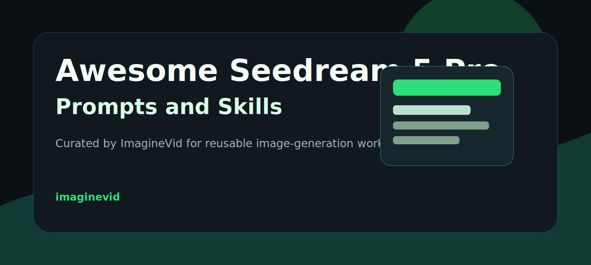
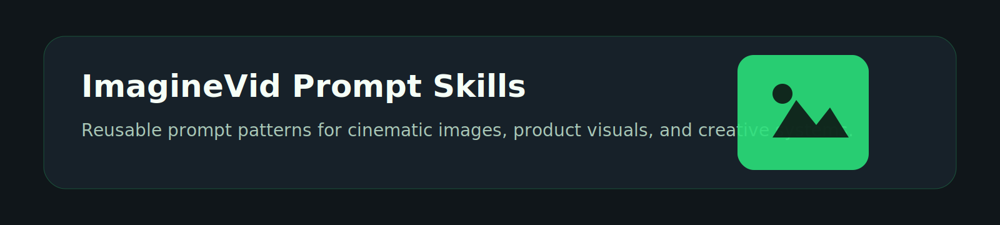
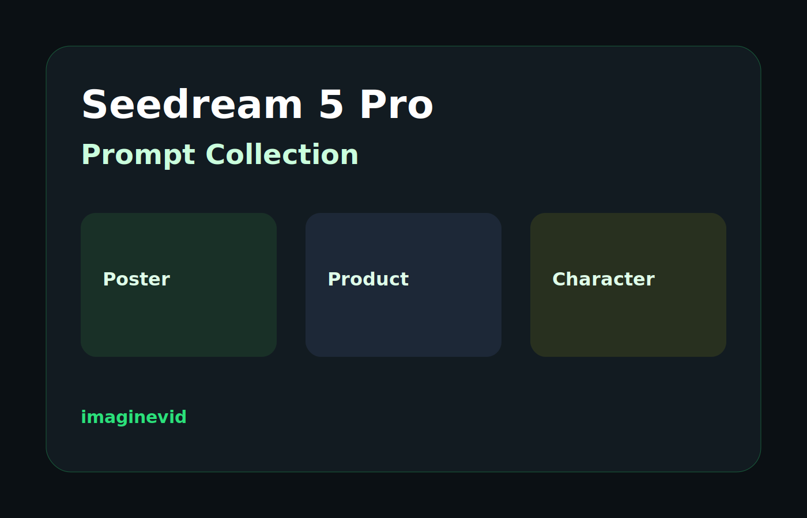
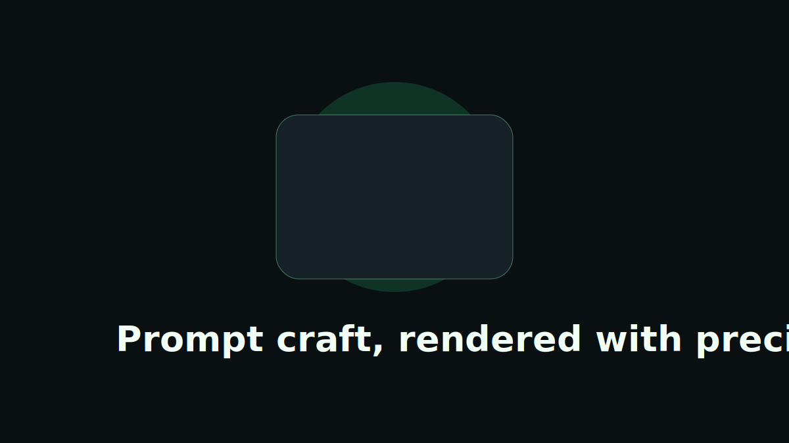
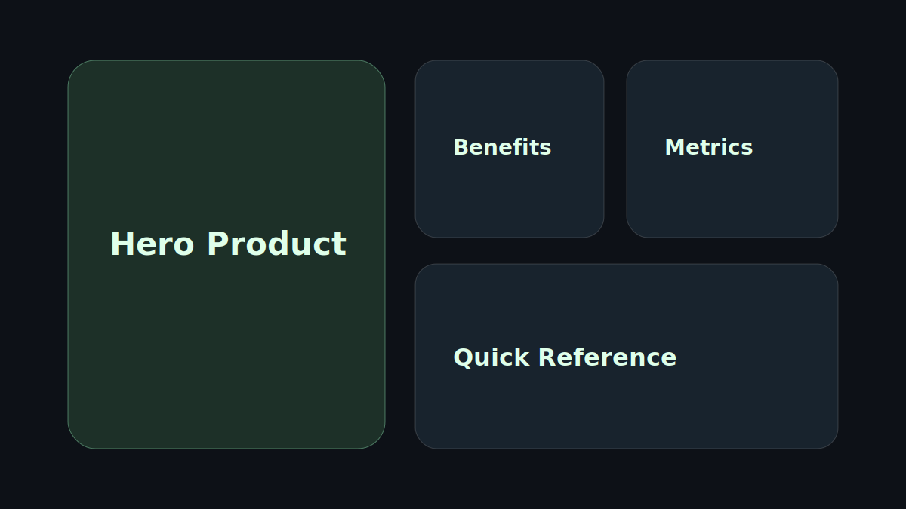
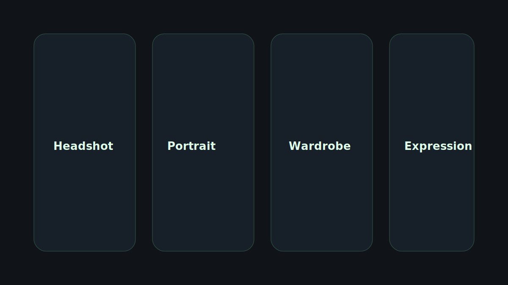

<a href="https://github.com/Nsmo-ai/-awesome-seedream-5-pro-prompts-and-skills">
  
</a>

<a href="https://imaginevid.com/ja-JP">
  
</a>

> Explore ImagineVid workflows for turning prompt craft into production-ready visuals.
# Awesome Seedream 5 Pro Prompts and Skills

[](https://github.com/sindresorhus/awesome)
[](https://github.com/Nsmo-ai/-awesome-seedream-5-pro-prompts-and-skills)
[](https://creativecommons.org/licenses/by/4.0/)
[](https://github.com/Nsmo-ai/-awesome-seedream-5-pro-prompts-and-skills/actions)
[](docs/CONTRIBUTING.md)

> A curated collection of Seedream 5 Pro prompts, reusable prompt skills, and visual examples by ImagineVid

> **Copyright Notice**: Prompts are collected or submitted for educational and creative reference with attribution. If any content should be removed, please open an issue and we will handle it promptly.

---

[](README.md) [](README_zh.md) [](README_zh-TW.md) [](README_ja-JP.md) [](README_ko-KR.md) [](README_th-TH.md) [](README_vi-VN.md) [](README_hi-IN.md) [](README_es-ES.md) [-Click%20to%20View-lightgrey)](README_es-419.md) [](README_de-DE.md) [](README_fr-FR.md) [](README_it-IT.md) [-Click%20to%20View-lightgrey)](README_pt-BR.md) [](README_pt-PT.md) [](README_tr-TR.md)

---

## View the Curated Collection

<div align="center">



</div>

**[Browse the ImagineVid Seedream 5 Pro prompt collection](https://github.com/Nsmo-ai/-awesome-seedream-5-pro-prompts-and-skills)**

Why use this collection?

| Feature | GitHub README | ImagineVid Collection |
|---------|--------------|---------------------|
| Visual Layout | Linear list | Curated visual sections |
| Search | Ctrl+F only | Structured categories |
| Prompt Workflow | - | Reusable prompt skills |
| Mobile | Basic | Readable in every README locale |
| Categories | - | Category browsing |


### Browse by Category

- **Use Cases**
  - <a id="cinematic-poster"></a>[Cinematic Poster](#cinematic-poster)
  - <a id="product-marketing"></a>[Product Marketing](#product-marketing)
  - <a id="character-design"></a>[Character Design](#character-design)
- **Style**
  - <a id="editorial-lighting"></a>[Editorial Lighting](#editorial-lighting)
  - <a id="liquid-glass"></a>[Liquid Glass](#liquid-glass)
- **Subjects**
  - <a id="human-portrait"></a>[Human Portrait](#human-portrait)
  - <a id="consumer-product"></a>[Consumer Product](#consumer-product)

---

## Table of Contents

- [View the Curated Collection](#view-the-curated-collection)
- [What is Seedream 5 Pro?](#what-is-seedream-5-pro)
- [Statistics](#statistics)
- [Featured Prompts](#featured-prompts)
- [All Prompts](#all-prompts)
- [How to Contribute](#how-to-contribute)
- [License](#license)
- [Acknowledgements](#acknowledgements)
- [Star History](#star-history)

---

## What is Seedream 5 Pro?

**Seedream 5 Pro** is a high-end image generation model family suited for structured creative production:

- **Prompt Understanding** - Follow detailed scene, style, camera, and layout instructions
- **High-Quality Generation** - Produce polished images for editorial, product, and concept work
- **Fast Iteration** - Adapt a prompt pattern across many creative directions
- **Diverse Styles** - Support cinematic, commercial, illustration, UI, and poster aesthetics
- **Precise Control** - Encode composition, typography, color, lighting, and subject constraints
- **Complex Scenes** - Handle multi-object, multi-panel, and workflow-style prompts

**Learn More:** follow the source links and examples collected in this repository.

### Prompt Skill Arguments

Some prompts support dynamic placeholders using Raycast Snippets-style `{argument ...}` syntax. Look for the Raycast Friendly badge.

**Example:**
```
A cinematic poster for "{argument name="product" default="a glass AI camera"}" with {argument name="mood" default="midnight studio lighting"}
```

Replace the arguments to reuse the prompt as a compact creative skill.

---

## Statistics

<div align="center">

| Metric | Count |
|--------|-------|
| Total Prompts | **3** |
| Featured | **2** |
| Last Updated | **2026年7月9日木曜日 14:23:12 UTC** |

</div>

---

## Featured Prompts

> Hand-picked for reusable structure, visual clarity, and creative range

### No. 1: Cinematic launch poster with modular prompt arguments


#### Description

A reusable poster prompt for launching a product, model, or creative campaign with cinematic lighting and replaceable subject, palette, and tagline arguments.

#### Prompt

```
Create a cinematic launch poster for {argument name="subject" default="Seedream 5 Pro creative engine"}. Use {argument name="palette" default="deep emerald, graphite black, warm silver"} as the dominant palette. The subject appears as a premium hero object in the center, surrounded by subtle interface panels, soft volumetric light, and high-end editorial shadows. Add a concise headline: {argument name="tagline" default="Prompt craft, rendered with precision"}. Aspect ratio 16:9, ultra-clean composition, no clutter, premium campaign finish.
```

#### Generated Images

##### Image 1

<div align="center">

</div>

#### Details

- **Author:** [ImagineVid Lab](https://imaginevid.com)
- **Source:** [Source](https://github.com/Nsmo-ai/-awesome-seedream-5-pro-prompts-and-skills)
- **Published:** 2026年7月9日
- **Languages:** en

**[Use this prompt](https://github.com/Nsmo-ai/-awesome-seedream-5-pro-prompts-and-skills)**

---

### No. 2: Liquid glass product bento grid


#### Description

A structured product-marketing prompt that creates a premium bento grid with a hero product, benefits, metrics, and practical notes.

#### Prompt

```
Design a premium liquid-glass bento grid for [product name]. Use a 16:9 layout with one large hero product card and seven supporting cards. The hero card shows the product as a real premium photograph. Supporting cards include: core benefits, how to use, key metrics, who it is for, important notes, quick reference, and did-you-know facts. Use translucent glass panels, thin borders, soft caustic reflections, product-derived accent colors, and crisp readable typography.
```

#### Generated Images

##### Image 1

<div align="center">

</div>

#### Details

- **Author:** [ImagineVid Lab](https://imaginevid.com)
- **Source:** [Source](https://github.com/Nsmo-ai/-awesome-seedream-5-pro-prompts-and-skills)
- **Published:** 2026年7月9日
- **Languages:** en

**[Use this prompt](https://github.com/Nsmo-ai/-awesome-seedream-5-pro-prompts-and-skills)**

---

## All Prompts

> Sorted by publish date and curation order

### No. 1: Character Design - Reference portrait to editorial character sheet


#### Description

A reference-image prompt for preserving facial identity while producing a clean character sheet with wardrobe, expression, and lighting variations.

#### Prompt

```
Use the uploaded portrait as the identity reference. Preserve the person's face shape, eye spacing, nose bridge, mouth shape, and natural skin texture. Create an editorial character sheet with four panels: neutral headshot, three-quarter cinematic portrait, full-body wardrobe concept, and close-up expression study. Use soft studio light, clean background, restrained color palette, and realistic proportions. No beauty-filter plastic skin, no exaggerated anatomy, no readable brand logos.
```

#### Generated Images

##### Image 1

<div align="center">

</div>

#### Details

- **Author:** [ImagineVid Lab](https://imaginevid.com)
- **Source:** [Source](https://github.com/Nsmo-ai/-awesome-seedream-5-pro-prompts-and-skills)
- **Published:** 2026年7月9日
- **Languages:** en

**[Use this prompt](https://github.com/Nsmo-ai/-awesome-seedream-5-pro-prompts-and-skills)**

---

## How to Contribute

We welcome high-quality prompt submissions through GitHub Issues.

### GitHub Issue

1. Click [**Submit New Prompt**](https://github.com/Nsmo-ai/-awesome-seedream-5-pro-prompts-and-skills/issues/new?template=submit-prompt.yml)
2. Fill in the form with prompt details and images
3. Submit and wait for maintainer review
4. If approved, the issue can be synced into local repository data
5. Your prompt will appear after the README generation workflow runs

**Note:** We keep submissions in a structured format so the README stays consistent.

See [CONTRIBUTING.md](docs/CONTRIBUTING.md) for detailed guidelines.

---

## License

Licensed under [CC BY 4.0](https://creativecommons.org/licenses/by/4.0/).

---

## Acknowledgements

- [ImagineVid](https://imaginevid.com)
- The creators whose public prompts are attributed in this collection

---

## Star History

[](https://star-history.com/#Nsmo-ai/-awesome-seedream-5-pro-prompts-and-skills&Date)

---

<div align="center">

**[View the Curated Collection](https://github.com/Nsmo-ai/-awesome-seedream-5-pro-prompts-and-skills)** •
**[Submit a Prompt](https://github.com/Nsmo-ai/-awesome-seedream-5-pro-prompts-and-skills/issues/new?template=submit-prompt.yml)** •
**[Star this repo](https://github.com/Nsmo-ai/-awesome-seedream-5-pro-prompts-and-skills)**

<sub>This README is automatically generated. Last updated: 2026-07-09T14:23:12.624Z</sub>

</div>
