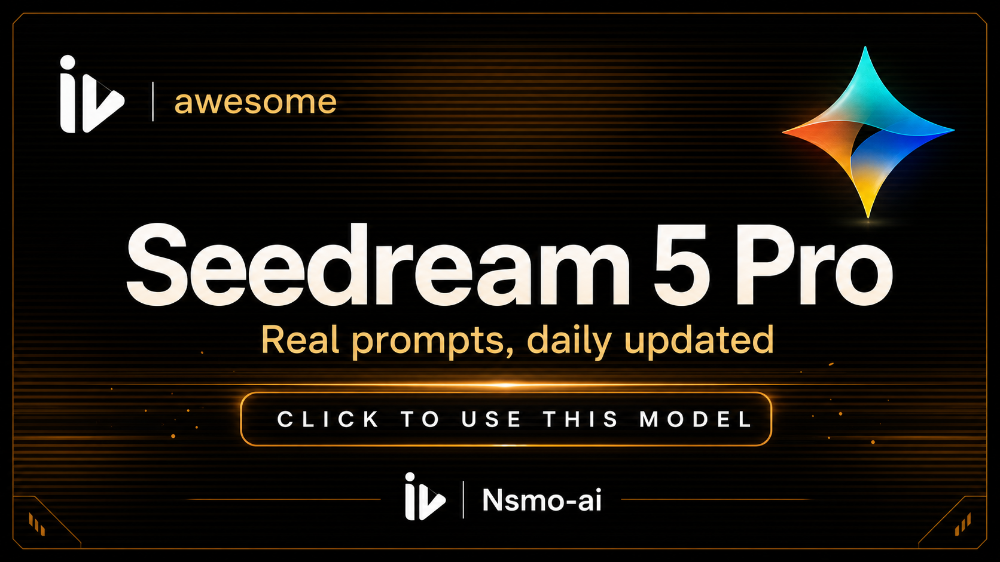

<a href="https://github.com/Nsmo-ai/Awesome-seedream-5-pro-prompts-and-skills">
  
</a>

<a href="https://imaginevid.com/ko-KR">
  
</a>

> Explore ImagineVid workflows for turning prompt craft into production-ready visuals.
# Awesome Seedream 5 Pro Prompts and Skills

[](https://github.com/sindresorhus/awesome)
[](https://github.com/Nsmo-ai/Awesome-seedream-5-pro-prompts-and-skills)
[](https://creativecommons.org/licenses/by/4.0/)
[](https://github.com/Nsmo-ai/Awesome-seedream-5-pro-prompts-and-skills/actions)
[](docs/CONTRIBUTING.md)

> A curated collection of Seedream 5 Pro prompts, reusable prompt skills, and visual examples by ImagineVid

> **Copyright Notice**: Prompts are collected or submitted for educational and creative reference with attribution. If any content should be removed, please open an issue and we will handle it promptly.

---

[](README.md) [](README_zh.md) [](README_zh-TW.md) [](README_ja-JP.md) [](README_ko-KR.md) [](README_th-TH.md) [](README_vi-VN.md) [](README_hi-IN.md) [](README_es-ES.md) [-Click%20to%20View-lightgrey)](README_es-419.md) [](README_de-DE.md) [](README_fr-FR.md) [](README_it-IT.md) [-Click%20to%20View-lightgrey)](README_pt-BR.md) [](README_pt-PT.md) [](README_tr-TR.md)

---

## View the Curated Collection

<div align="center">


</div>

**[Browse the ImagineVid Seedream 5 Pro prompt collection](https://github.com/Nsmo-ai/Awesome-seedream-5-pro-prompts-and-skills)**

Why use this collection?

| Feature | GitHub README | ImagineVid Collection |
|---------|--------------|---------------------|
| Visual Layout | Linear list | Curated visual sections |
| Search | Ctrl+F only | Structured categories |
| Prompt Workflow | - | Reusable prompt skills |
| Mobile | Basic | Readable in every README locale |
| Categories | - | Category browsing |


### Browse by Category

- **Use Cases**
  - <a id="cinematic-film-still"></a>[Cinematic Film Still](#cinematic-film-still)
  - <a id="character-design"></a>[Character Design](#character-design)
  - <a id="reference-image-edit"></a>[Reference Image Edit](#reference-image-edit)
  - <a id="travel-visual"></a>[Travel Visual](#travel-visual)
- **Style**
  - <a id="cinematic-realism"></a>[Cinematic Realism](#cinematic-realism)
  - <a id="anime-splash-art"></a>[Anime Splash Art](#anime-splash-art)
  - <a id="editorial-fashion"></a>[Editorial Fashion](#editorial-fashion)
  - <a id="tropical-photography"></a>[Tropical Photography](#tropical-photography)
- **Subjects**
  - <a id="human-portrait"></a>[Human Portrait](#human-portrait)
  - <a id="astronaut"></a>[Astronaut](#astronaut)
  - <a id="fashion-creator"></a>[Fashion Creator](#fashion-creator)
  - <a id="landscape"></a>[Landscape](#landscape)

---

## Table of Contents

- [View the Curated Collection](#view-the-curated-collection)
- [What is Seedream 5 Pro?](#what-is-seedream-5-pro)
- [Statistics](#statistics)
- [Featured Prompts](#featured-prompts)
- [All Prompts](#all-prompts)
- [How to Contribute](#how-to-contribute)
- [License](#license)
- [Acknowledgements](#acknowledgements)
- [Star History](#star-history)

---

## What is Seedream 5 Pro?

**Seedream 5 Pro** is a high-end image generation model family suited for structured creative production:

- **Prompt Understanding** - Follow detailed scene, style, camera, and layout instructions
- **High-Quality Generation** - Produce polished images for editorial, product, and concept work
- **Fast Iteration** - Adapt a prompt pattern across many creative directions
- **Diverse Styles** - Support cinematic, commercial, illustration, UI, and poster aesthetics
- **Precise Control** - Encode composition, typography, color, lighting, and subject constraints
- **Complex Scenes** - Handle multi-object, multi-panel, and workflow-style prompts

**Learn More:** follow the source links and examples collected in this repository.

### Prompt Skill Arguments

Some prompts support dynamic placeholders using Raycast Snippets-style `{argument ...}` syntax. Look for the Raycast Friendly badge.

**Example:**
```
A cinematic poster for "{argument name="product" default="a glass AI camera"}" with {argument name="mood" default="midnight studio lighting"}
```

Replace the arguments to reuse the prompt as a compact creative skill.

---

## Statistics

<div align="center">

| Metric | Count |
|--------|-------|
| Total Prompts | **6** |
| Featured | **3** |
| Last Updated | **2026년 7월 9일 목요일 PM 2시 48분 5초 UTC** |

</div>

---

## Featured Prompts

> Hand-picked for reusable structure, visual clarity, and creative range

### No. 1: Hard sci-fi airlock film still


#### Description

A high-negative-space cinematic still pattern, normalized from a public X prompt, for testing scale, isolation, black voids, and hard solar lighting.

#### Prompt

```
Create a hard sci-fi movie still titled AIRLOCK. Frame one white EVA-suit astronaut drifting far from a tiny space station, with a loose tether trailing behind and the body angled as if slowly rotating. Let near-total black space dominate the composition, with no stars or nebulae. Use one harsh solar key light that burns the lit side of the suit white-silver while the opposite side drops into deep shadow. Keep the palette cold and desaturated, add subtle 35mm film grain, and compose in an anamorphic 2.39:1 frame with overwhelming negative space and realistic photographic detail.
```

#### Generated Images

##### Image 1

<div align="center">

</div>

#### Details

- **Author:** [@karim_yourself](https://x.com/karim_yourself)
- **Source:** [Source](https://x.com/karim_yourself/status/2075165434827989207)
- **Published:** 2026년 7월 9일
- **Languages:** en

**[Use this prompt](https://x.com/karim_yourself/status/2075165434827989207)**

---

### No. 2: 1970s Dutch romantic drama camera memory


#### Description

A cinematic language pattern, normalized from a public X prompt, that turns mood, lens behavior, and exposure notes into coherent film stills.

#### Prompt

```
Generate a 1970s European romantic-drama still set inside a tense private moment. Use handheld framing that feels reactive and imperfect: close shots when the emotion tightens, wider distance when the scene fractures. Mix harsh daylight, blown windows, uneven room exposure, and very little artificial fill. Start with warm intimate golds but let the palette cool and desaturate as the mood becomes unstable. Preserve tactile skin, hair, and fabric texture, soft film grain, imperfect glass, and a documentary sense of emotional volatility.
```

#### Generated Images

##### Image 1

<div align="center">

</div>

##### Image 2

<div align="center">

</div>

##### Image 3

<div align="center">

</div>

#### Details

- **Author:** [@UnityEagle](https://x.com/UnityEagle)
- **Source:** [Source](https://x.com/UnityEagle/status/2075191214601572606)
- **Published:** 2026년 7월 9일
- **Languages:** en

**[Use this prompt](https://x.com/UnityEagle/status/2075191214601572606)**

---

### No. 3: Anime kunoichi portrait with fine identity details


#### Description

A Seedream 5 Pro portrait pattern, normalized from public ALT text, focused on facial details, pose, costume, and clean splash-art style.

#### Prompt

```
Create a half-body modern anime splash-art portrait of a young woman in a black kunoichi-inspired outfit without a headband. Give her short black hair, dark eyes, a confident narrowed-eye expression, subtle red eyeliner, and a small beauty mark under the right eye. Pose one hand on the hip and the other making a victory sign. Use a clean white background, crisp illustration lines, polished character-art finish, and enough facial detail to test whether the model preserves small identity cues.
```

#### Generated Images

##### Image 1

<div align="center">

</div>

#### Details

- **Author:** [@characternexus](https://x.com/characternexus)
- **Source:** [Source](https://x.com/characternexus/status/2074920654751592583)
- **Published:** 2026년 7월 9일
- **Languages:** en

**[Use this prompt](https://x.com/characternexus/status/2074920654751592583)**

---

## All Prompts

> Sorted by publish date and curation order

### No. 1: Character Design - Avant-garde streetwear creator sheet


#### Description

A character design sheet pattern, normalized from a public X comparison post, useful for full-body turnaround, techwear, and studio render tests.

#### Prompt

```
Design a full-body character sheet for a male creator in avant-garde streetwear. Build the look around an oversized asymmetrical matte-black tech jacket, dark turtleneck, tactical cargo trousers with hardware straps, chunky futuristic shoes, geometric tinted smart glasses, and a small neon-green piping accent. Place the figure on a minimal ash-grey studio background. Use high-contrast cinematic lighting, sleek editorial styling, clean turnaround readability, ultra-detailed materials, and a 16:9 composition.
```

#### Generated Images

##### Image 1

<div align="center">

</div>

##### Image 2

<div align="center">

</div>

##### Image 3

<div align="center">

</div>

##### Image 4

<div align="center">

</div>

#### Details

- **Author:** [@Boluwatifeolad7](https://x.com/Boluwatifeolad7)
- **Source:** [Source](https://x.com/Boluwatifeolad7/status/2075191098184442310)
- **Published:** 2026년 7월 9일
- **Languages:** en

**[Use this prompt](https://x.com/Boluwatifeolad7/status/2075191098184442310)**

---

### No. 2: Reference Image Edit - Y2K reference selfie coffee-shop edit


#### Description

A reference-image editing pattern, normalized from a public X prompt, that keeps facial identity and makeup while changing styling and setting.

#### Prompt

```
Use the uploaded selfie only as the facial-identity and makeup reference. Keep face geometry recognizable, but replace the hairstyle with glossy side-parted blonde hair. Restyle the subject in a pale blue denim tube top, red bead necklace, and gold hoop earrings at an outdoor coffee-shop table on a bright New York summer morning around the year 2000. Shoot from a low phone-camera angle pointed toward the face, with one arm extending toward the edge of frame and the other near a half-empty coffee cup. Make the foreground candid, detailed, and lightly smiling, with blue sky and distant city architecture in the background.
```

#### Generated Images

##### Image 1

<div align="center">

</div>

#### Details

- **Author:** [@asheem01](https://x.com/asheem01)
- **Source:** [Source](https://x.com/asheem01/status/2074941260863811644)
- **Published:** 2026년 7월 9일
- **Languages:** en

**[Use this prompt](https://x.com/asheem01/status/2074941260863811644)**

---

### No. 3: Travel Visual - Maldives tropical paradise visual


#### Description

A compact landscape pattern, normalized from public ALT text in a Seedream 5.0 Pro comparison post, focused on clean tropical travel imagery.

#### Prompt

```
Create a tranquil Maldives travel visual with clear turquoise water, bright white sand, shallow coral reefs, and a calm exotic-resort atmosphere. Keep the scene clean, luminous, and inviting, with high detail in the water surface, reef color, beach texture, and distant horizon. Use premium travel-photography polish and avoid cluttered foreground objects.
```

#### Generated Images

##### Image 1

<div align="center">

</div>

##### Image 2

<div align="center">

</div>

#### Details

- **Author:** [@Bic_Revelation](https://x.com/Bic_Revelation)
- **Source:** [Source](https://x.com/Bic_Revelation/status/2074959714366922857)
- **Published:** 2026년 7월 9일
- **Languages:** en

**[Use this prompt](https://x.com/Bic_Revelation/status/2074959714366922857)**

---

## How to Contribute

We welcome high-quality prompt submissions through GitHub Issues.

### GitHub Issue

1. Click [**Submit New Prompt**](https://github.com/Nsmo-ai/Awesome-seedream-5-pro-prompts-and-skills/issues/new?template=submit-prompt.yml)
2. Fill in the form with prompt details and images
3. Submit and wait for maintainer review
4. If approved, the issue can be synced into local repository data
5. Your prompt will appear after the README generation workflow runs

**Note:** We keep submissions in a structured format so the README stays consistent.

See [CONTRIBUTING.md](docs/CONTRIBUTING.md) for detailed guidelines.

---

## License

Licensed under [CC BY 4.0](https://creativecommons.org/licenses/by/4.0/).

---

## Acknowledgements

- [ImagineVid](https://imaginevid.com)
- The creators whose public prompts are attributed in this collection

---

## Star History

[](https://star-history.com/#Nsmo-ai/Awesome-seedream-5-pro-prompts-and-skills&Date)

---

<div align="center">

**[View the Curated Collection](https://github.com/Nsmo-ai/Awesome-seedream-5-pro-prompts-and-skills)** •
**[Submit a Prompt](https://github.com/Nsmo-ai/Awesome-seedream-5-pro-prompts-and-skills/issues/new?template=submit-prompt.yml)** •
**[Star this repo](https://github.com/Nsmo-ai/Awesome-seedream-5-pro-prompts-and-skills)**

<sub>This README is automatically generated. Last updated: 2026-07-09T14:48:05.590Z</sub>

</div>
