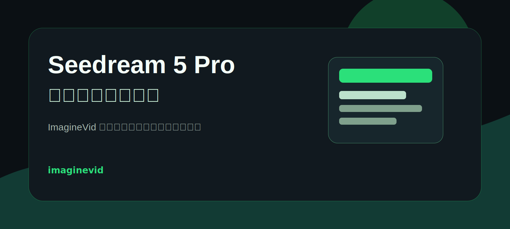
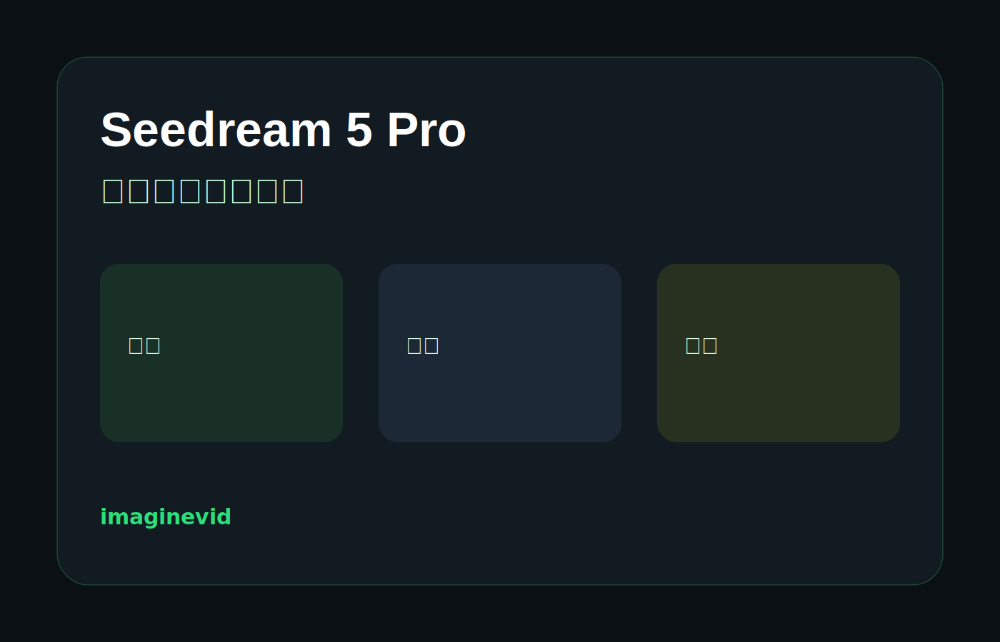

<a href="https://github.com/Nsmo-ai/-awesome-seedream-5-pro-prompts-and-skills">
  
</a>

<a href="https://imaginevid.com/zh-CN">
  
</a>

> 探索 ImagineVid 工作流，把提示词能力变成可复用的视觉生产方法。
# Seedream 5 Pro 提示词与技能大全

[](https://github.com/sindresorhus/awesome)
[](https://github.com/Nsmo-ai/-awesome-seedream-5-pro-prompts-and-skills)
[](https://creativecommons.org/licenses/by/4.0/)
[](https://github.com/Nsmo-ai/-awesome-seedream-5-pro-prompts-and-skills/actions)
[](docs/CONTRIBUTING.md)

> 由 ImagineVid 整理的 Seedream 5 Pro 提示词、提示词技能与视觉案例集合

> **版权声明**：本仓库内容用于教育与创作参考，并保留来源署名。如需移除任何内容，请提交 issue，我们会及时处理。

---

[](README.md) [](README_zh.md) [](README_zh-TW.md) [](README_ja-JP.md) [](README_ko-KR.md) [](README_th-TH.md) [](README_vi-VN.md) [](README_hi-IN.md) [](README_es-ES.md) [-Click%20to%20View-lightgrey)](README_es-419.md) [](README_de-DE.md) [](README_fr-FR.md) [](README_it-IT.md) [-Click%20to%20View-lightgrey)](README_pt-BR.md) [](README_pt-PT.md) [](README_tr-TR.md)

---

## 查看精选集合

<div align="center">



</div>

**[浏览 ImagineVid Seedream 5 Pro 提示词集合](https://github.com/Nsmo-ai/-awesome-seedream-5-pro-prompts-and-skills)**

为什么使用这个集合？

| Feature | GitHub README | ImagineVid 集合 |
|---------|--------------|---------------------|
| Visual Layout | Linear list | 精选视觉分区 |
| Search | Ctrl+F only | 结构化分类 |
| Prompt Workflow | - | 可复用提示词技能 |
| Mobile | Basic | 每个 README 语言版本都可阅读 |
| Categories | - | Category browsing |


### 按分类浏览

- **使用场景**
  - <a id="cinematic-poster"></a>[电影感海报](#cinematic-poster)
  - <a id="product-marketing"></a>[产品营销](#product-marketing)
  - <a id="character-design"></a>[角色设计](#character-design)
- **风格**
  - <a id="editorial-lighting"></a>[编辑级灯光](#editorial-lighting)
  - <a id="liquid-glass"></a>[液态玻璃](#liquid-glass)
- **主体**
  - <a id="human-portrait"></a>[人物肖像](#human-portrait)
  - <a id="consumer-product"></a>[消费产品](#consumer-product)

---

## 目录

- [查看精选集合](#)
- [什么是 Seedream 5 Pro？](#seedream-5-pro)
- [统计数据](#)
- [精选提示词](#)
- [全部提示词](#)
- [如何贡献](#)
- [License](#license)
- [Acknowledgements](#acknowledgements)
- [Star History](#star-history)

---

## 什么是 Seedream 5 Pro？

**Seedream 5 Pro** 适合高质量图像生成与结构化创意生产：

- **提示词理解** - 跟随场景、风格、镜头和版式细节
- **高质量生成** - 适合海报、产品、概念和编辑视觉
- **快速迭代** - 将同一提示词模式扩展到多个方向
- **多样风格** - 支持电影感、商业、插画、UI 和海报美学
- **精确控制** - 描述构图、字体、色彩、灯光和主体约束
- **复杂场景** - 支持多对象、多分镜和工作流式提示词

**Learn More:** follow the source links and examples collected in this repository.

### 提示词技能参数

部分提示词支持 Raycast Snippets 风格的 `{argument ...}` 动态参数。看到 Raycast Friendly 标记即可复用。

**Example:**
```
A cinematic poster for "{argument name="product" default="a glass AI camera"}" with {argument name="mood" default="midnight studio lighting"}
```

替换参数即可把提示词当成小型创意技能使用。

---

## 统计数据

<div align="center">

| 指标 | 数量 |
|--------|-------|
| 提示词总数 | **3** |
| 精选 | **2** |
| 最后更新 | **2026年7月9日星期四 UTC 14:23:12** |

</div>

---

## 精选提示词

> 按可复用结构、视觉清晰度和创意覆盖度精选

### No. 1: 带动态参数的电影感发布海报


#### 描述

一个可复用的发布海报提示词，适合产品、模型或创意活动，支持替换主体、色彩和标语。

#### 提示词

```
为 {argument name="subject" default="Seedream 5 Pro 创意引擎"} 生成一张电影感发布海报。主色使用 {argument name="palette" default="深祖母绿、石墨黑、暖银色"}。主体位于画面中央，呈现高级英雄物体质感，周围有克制的界面面板、柔和体积光和编辑级阴影。加入简短标题：{argument name="tagline" default="让提示词工艺被精准渲染"}。16:9，构图极简，高级商业视觉。
```

#### 生成图片

##### Image 1

<div align="center">

</div>

#### 详情

- **作者:** [ImagineVid Lab](https://imaginevid.com)
- **来源:** [来源](https://github.com/Nsmo-ai/-awesome-seedream-5-pro-prompts-and-skills)
- **发布时间:** 2026年7月9日
- **Languages:** en

**[使用这个提示词](https://github.com/Nsmo-ai/-awesome-seedream-5-pro-prompts-and-skills)**

---

### No. 2: 液态玻璃产品 Bento 信息图


#### 描述

结构化产品营销提示词，用 Bento 网格呈现主视觉、核心卖点、关键指标和使用提示。

#### 提示词

```
为 [产品名称] 设计一张高级液态玻璃 Bento 信息图。16:9 横图，一个大型主产品卡片加七个辅助卡片。主卡片展示真实高级产品摄影。辅助卡片包括：核心卖点、使用方法、关键指标、适合人群、重要提示、快速参考、冷知识。使用半透明玻璃面板、细边框、柔和焦散反光、来自产品的强调色和清晰可读字体。
```

#### 生成图片

##### Image 1

<div align="center">

</div>

#### 详情

- **作者:** [ImagineVid Lab](https://imaginevid.com)
- **来源:** [来源](https://github.com/Nsmo-ai/-awesome-seedream-5-pro-prompts-and-skills)
- **发布时间:** 2026年7月9日
- **Languages:** en

**[使用这个提示词](https://github.com/Nsmo-ai/-awesome-seedream-5-pro-prompts-and-skills)**

---

## 全部提示词

> 按发布时间和精选顺序排列

### No. 1: 角色设计 - 参考肖像转编辑级角色设定图


#### 描述

需要参考图的肖像提示词，在保持身份一致的同时生成服装、表情和灯光变化的角色设定图。

#### 提示词

```
使用上传肖像作为身份参考。保持人物脸型、眼距、鼻梁、嘴型和自然皮肤质感。生成四格编辑级角色设定图：正面头像、三分之四电影感肖像、全身服装概念、表情近景研究。使用柔和棚拍灯光、干净背景、克制配色和真实比例。不要塑料感磨皮，不要夸张人体，不要可读品牌标识。
```

#### 生成图片

##### Image 1

<div align="center">

</div>

#### 详情

- **作者:** [ImagineVid Lab](https://imaginevid.com)
- **来源:** [来源](https://github.com/Nsmo-ai/-awesome-seedream-5-pro-prompts-and-skills)
- **发布时间:** 2026年7月9日
- **Languages:** en

**[使用这个提示词](https://github.com/Nsmo-ai/-awesome-seedream-5-pro-prompts-and-skills)**

---

## 如何贡献

欢迎通过 GitHub Issues 提交高质量提示词。

### GitHub Issue

1. Click [**Submit New Prompt**](https://github.com/Nsmo-ai/-awesome-seedream-5-pro-prompts-and-skills/issues/new?template=submit-prompt.yml)
2. 填写提示词、说明和图片信息
3. 提交后等待维护者审核
4. 审核通过后可以同步到本地结构化数据
5. README 生成流程运行后会展示你的提示词

**注意：** 我们用结构化格式维护提交内容，保证 README 展示一致。

详见 [CONTRIBUTING.md](docs/CONTRIBUTING.md)。

---

## License

Licensed under [CC BY 4.0](https://creativecommons.org/licenses/by/4.0/).

---

## Acknowledgements

- [ImagineVid](https://imaginevid.com)
- The creators whose public prompts are attributed in this collection

---

## Star History

[](https://star-history.com/#Nsmo-ai/-awesome-seedream-5-pro-prompts-and-skills&Date)

---

<div align="center">

**[查看精选集合](https://github.com/Nsmo-ai/-awesome-seedream-5-pro-prompts-and-skills)** •
**[Submit a Prompt](https://github.com/Nsmo-ai/-awesome-seedream-5-pro-prompts-and-skills/issues/new?template=submit-prompt.yml)** •
**[Star this repo](https://github.com/Nsmo-ai/-awesome-seedream-5-pro-prompts-and-skills)**

<sub>This README is automatically generated. Last updated: 2026-07-09T14:23:12.621Z</sub>

</div>
